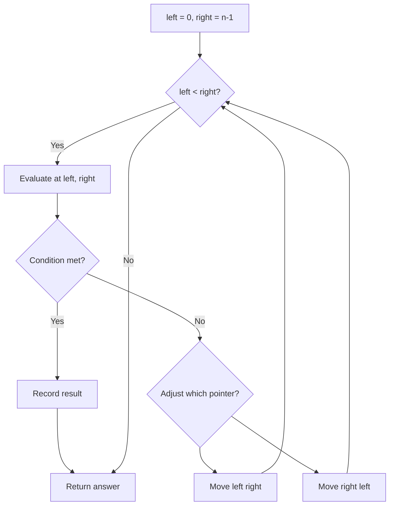
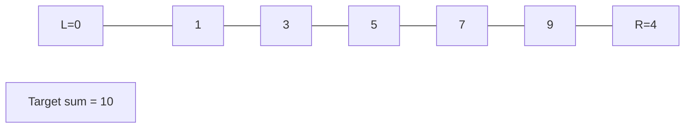
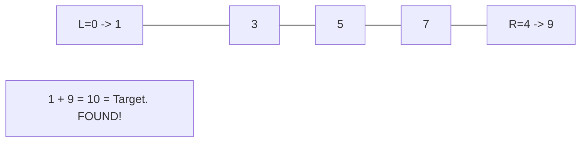

# Problem 1961: Check If String Is a Prefix of Array

**Difficulty:** Easy  
**Tags:** Array, Two Pointers, String  
**Pattern:** Two Pointers  
**Link:** [leetcode.com/problems/check-if-string-is-a-prefix-of-array](https://leetcode.com/problems/check-if-string-is-a-prefix-of-array/)

## Description

Given a string `s` and an array of strings `words`, determine whether `s` is a **prefix string** of `words`.

A string `s` is a **prefix string** of `words` if `s` can be made by concatenating the first `k` strings in `words` for some **positive** `k` no larger than `words.length`.

Return `true`* if *`s`* is a **prefix string** of *`words`*, or *`false`* otherwise*.

 

Example 1:

```

**Input:** s = "iloveleetcode", words = ["i","love","leetcode","apples"]
**Output:** true
**Explanation:**
s can be made by concatenating "i", "love", and "leetcode" together.

```

Example 2:

```

**Input:** s = "iloveleetcode", words = ["apples","i","love","leetcode"]
**Output:** false
**Explanation:**
It is impossible to make s using a prefix of arr.
```

 

**Constraints:**

	- `1 <= words.length <= 100`
	- `1 <= words[i].length <= 20`
	- `1 <= s.length <= 1000`
	- `words[i]` and `s` consist of only lowercase English letters.

## Approach: Two Pointers

Use two pointers moving through the data structure. Depending on the problem, pointers may move toward each other (converging), in the same direction (fast/slow), or independently.

## Pseudocode

```
1. Initialize left = 0, right = n-1 (or two independent pointers)
2. While pointers haven't crossed:
   a. Evaluate condition at pointer positions
   b. Move left pointer right or right pointer left
3. Return result
```

## Algorithm Flow



## Visual State Transitions

**Two Pointer Convergence:**

**Frame 1: Initialize pointers**


**Frame 2: Sum = 1+9 = 10, found!**



## Complexity Analysis

- **Time:** O(n)
- **Space:** O(1)

## Solution (Python3)

```python
class Solution:
    def isPrefixString(self, s: str, words: List[str]) -> bool:
        # Two pointer approach - O(n) time, O(1) space
        left, right = 0, len(s) - 1
        while left < right:
            curr = s[left] + s[right]
            if curr == words:
                return [left, right]
            elif curr < words:
                left += 1
            else:
                right -= 1
        return False
```

## Solution (C++)

```cpp
#include <string>
#include <vector>
using namespace std;

class Solution {
public:
    bool isPrefixString(string& s, vector<string>& words) {
        // Two pointer approach - O(n) time, O(1) space
        int left = 0, right = s.size() - 1;
        while (left < right) {
            int curr = s[left] + s[right];
            if (curr == words) {
                return {left, right};
            } else if (curr < words) {
                left++;
            } else {
                right--;
            }
        }
        return false;
    }
};
```
