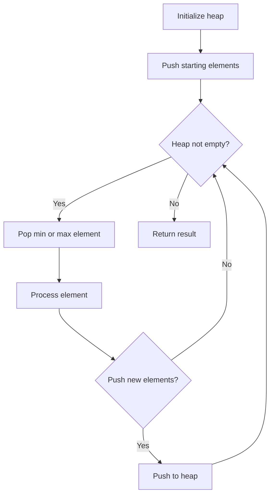
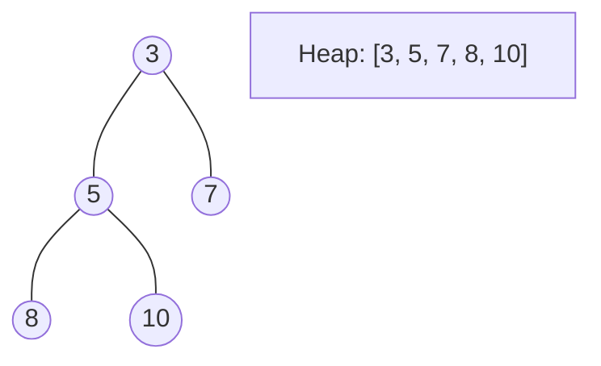
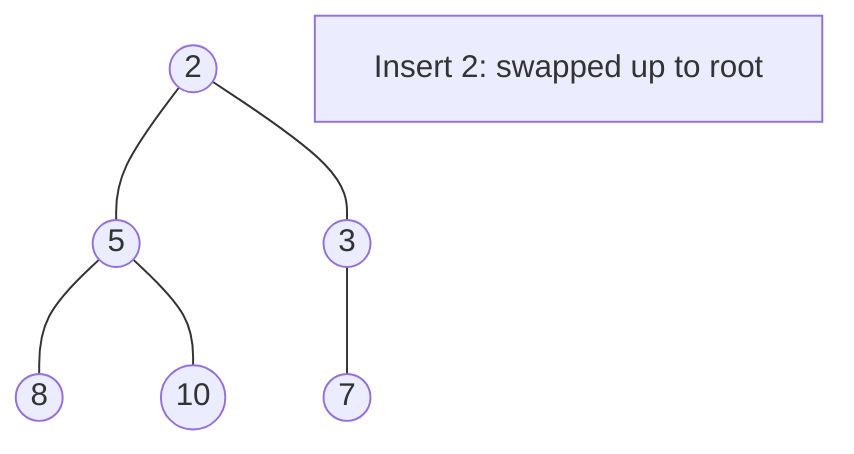
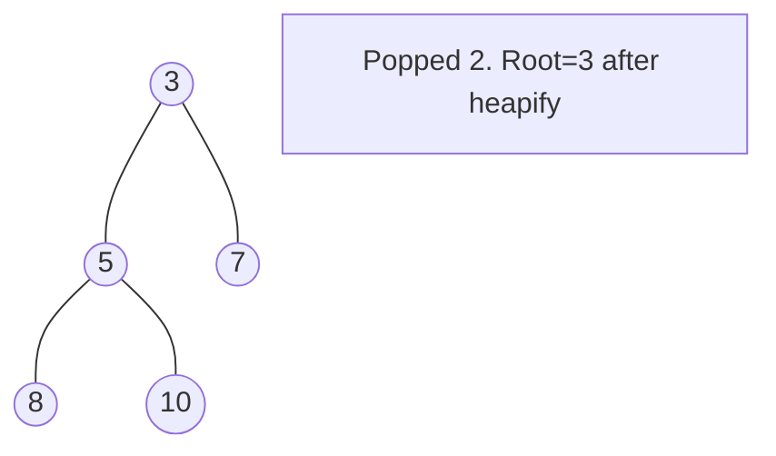

# Problem 1962: Remove Stones to Minimize the Total

**Difficulty:** Medium  
**Tags:** Array, Greedy, Heap (Priority Queue)  
**Pattern:** Heap / Priority Queue  
**Link:** [leetcode.com/problems/remove-stones-to-minimize-the-total](https://leetcode.com/problems/remove-stones-to-minimize-the-total/)

## Description

You are given a **0-indexed** integer array `piles`, where `piles[i]` represents the number of stones in the `i^th` pile, and an integer `k`. You should apply the following operation **exactly** `k` times:

	- Choose any `piles[i]` and **remove** `floor(piles[i] / 2)` stones from it.

**Notice** that you can apply the operation on the **same** pile more than once.

Return *the **minimum** possible total number of stones remaining after applying the *`k`* operations*.

`floor(x)` is the **largest** integer that is **smaller** than or **equal** to `x` (i.e., rounds `x` down).

 

Example 1:

```

**Input:** piles = [5,4,9], k = 2
**Output:** 12
**Explanation:** Steps of a possible scenario are:
- Apply the operation on pile 2. The resulting piles are [5,4,5].
- Apply the operation on pile 0. The resulting piles are [3,4,5].
The total number of stones in [3,4,5] is 12.

```

Example 2:

```

**Input:** piles = [4,3,6,7], k = 3
**Output:** 12
**Explanation:** Steps of a possible scenario are:
- Apply the operation on pile 2. The resulting piles are [4,3,3,7].
- Apply the operation on pile 3. The resulting piles are [4,3,3,4].
- Apply the operation on pile 0. The resulting piles are [2,3,3,4].
The total number of stones in [2,3,3,4] is 12.

```

 

**Constraints:**

	- `1 <= piles.length <= 10^5`
	- `1 <= piles[i] <= 10^4`
	- `1 <= k <= 10^5`

## Approach: Heap / Priority Queue

Use a min-heap or max-heap to efficiently access the smallest/largest element. Push elements and pop the top to process in priority order.

## Pseudocode

```
1. Initialize heap (min or max)
2. Push initial elements onto heap
3. While heap not empty and condition:
   a. Pop top element (min or max)
   b. Process element
   c. Push new elements if needed
4. Return result
```

## Algorithm Flow



## Visual State Transitions

**Heap Operations (Min-Heap):**

**Frame 1: Initial heap**


**Frame 2: Insert 2 - bubble up**


**Frame 3: Pop minimum (2) - heapify down**



## Complexity Analysis

- **Time:** O(n log n)
- **Space:** O(n)

## Solution (Python3)

```python
class Solution:
    def minStoneSum(self, piles: List[int], k: int) -> int:
        # Heap/Priority Queue - O(n log k) time
        import heapq
        if not piles:
            return 0
        # Min heap (negate for max heap)
        heap = []
        for val in piles:
            heapq.heappush(heap, val)
            if len(heap) > (k if isinstance(k, int) else len(piles)):
                heapq.heappop(heap)
        return heap[0] if heap else 0
```

## Solution (C++)

```cpp
#include <queue>
#include <string>
#include <vector>
using namespace std;

class Solution {
public:
    int minStoneSum(vector<int>& piles, int k) {
        // Heap/Priority Queue - O(n log k) time
        priority_queue<int, vector<int>, greater<int>> pq;
        for (int val : piles) {
            pq.push(val);
            if ((int)pq.size() > k)
                pq.pop();
        }
        return pq.empty() ? 0 : pq.top();
    }
};
```
