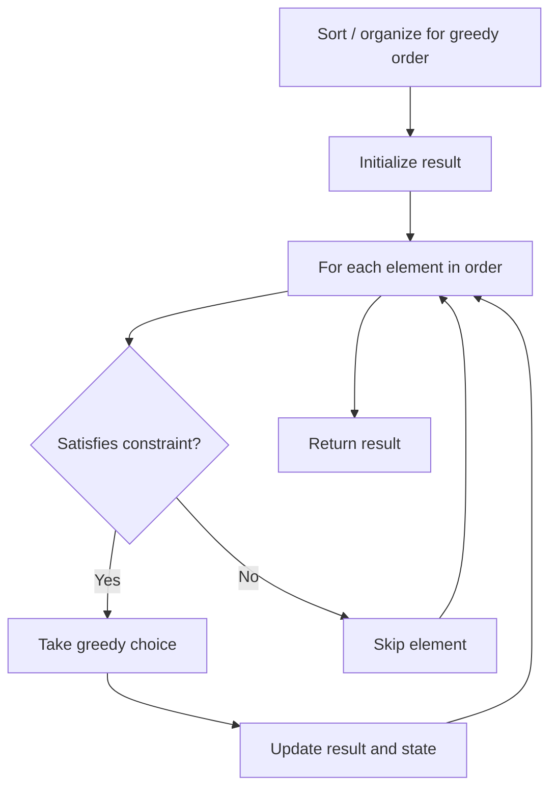

# Problem 1963: Minimum Number of Swaps to Make the String Balanced

**Difficulty:** Medium  
**Tags:** Two Pointers, String, Stack, Greedy  
**Pattern:** Greedy  
**Link:** [leetcode.com/problems/minimum-number-of-swaps-to-make-the-string-balanced](https://leetcode.com/problems/minimum-number-of-swaps-to-make-the-string-balanced/)

## Description

You are given a **0-indexed** string `s` of **even** length `n`. The string consists of **exactly** `n / 2` opening brackets `'['` and `n / 2` closing brackets `']'`.

A string is called **balanced** if and only if:

	- It is the empty string, or
	- It can be written as `AB`, where both `A` and `B` are **balanced** strings, or
	- It can be written as `[C]`, where `C` is a **balanced** string.

You may swap the brackets at **any** two indices **any** number of times.

Return *the **minimum** number of swaps to make *`s` ***balanced***.

 

Example 1:

```

**Input:** s = "][]["
**Output:** 1
**Explanation:** You can make the string balanced by swapping index 0 with index 3.
The resulting string is "[[]]".

```

Example 2:

```

**Input:** s = "]]][[["
**Output:** 2
**Explanation:** You can do the following to make the string balanced:
- Swap index 0 with index 4. s = "[]][][".
- Swap index 1 with index 5. s = "[[][]]".
The resulting string is "[[][]]".

```

Example 3:

```

**Input:** s = "[]"
**Output:** 0
**Explanation:** The string is already balanced.

```

 

**Constraints:**

	- `n == s.length`
	- `2 <= n <= 10^6`
	- `n` is even.
	- `s[i]` is either `'[' `or `']'`.
	- The number of opening brackets `'['` equals `n / 2`, and the number of closing brackets `']'` equals `n / 2`.

## Approach: Greedy

Make the locally optimal choice at each step, trusting it leads to a global optimum. Greedy works when the problem has the greedy-choice property and optimal substructure.

## Pseudocode

```
1. Sort or organize data for greedy ordering
2. Initialize result
3. For each element in greedy order:
   a. If element satisfies constraint:
      - Take the greedy choice
      - Update result and state
4. Return result
```

## Algorithm Flow



## Complexity Analysis

- **Time:** O(n log n)
- **Space:** O(1)

## Solution (Python3)

```python
class Solution:
    def minSwaps(self, s: str) -> int:
        # Greedy approach - O(n) time
        result = 0
        curr_max = 0
        for i in range(len(s)):
            if isinstance(s[i], int):
                curr_max = max(curr_max, s[i])
                result = max(result, curr_max)
            else:
                result += 1
        return result
```

## Solution (C++)

```cpp
#include <algorithm>
#include <string>
#include <vector>
using namespace std;

class Solution {
public:
    int minSwaps(string& s) {
        // Greedy approach - O(n) time
        int result = 0, curr_max = 0;
        for (int i = 0; i < (int)s.size(); i++) {
            curr_max = max(curr_max, s[i]);
            result = max(result, curr_max);
        }
        return result;
    }
};
```
