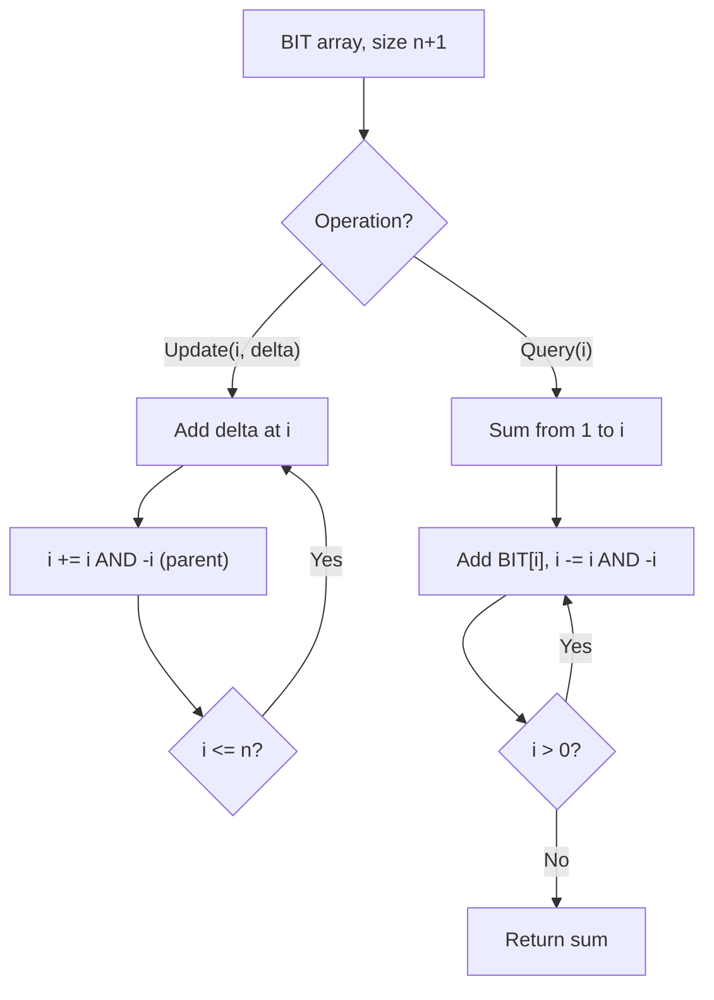

# Problem 1964: Find the Longest Valid Obstacle Course at Each Position

**Difficulty:** Hard  
**Tags:** Array, Binary Search, Binary Indexed Tree  
**Pattern:** Binary Indexed Tree / Fenwick Tree  
**Link:** [leetcode.com/problems/find-the-longest-valid-obstacle-course-at-each-position](https://leetcode.com/problems/find-the-longest-valid-obstacle-course-at-each-position/)

## Description

You want to build some obstacle courses. You are given a **0-indexed** integer array `obstacles` of length `n`, where `obstacles[i]` describes the height of the `i^th` obstacle.

For every index `i` between `0` and `n - 1` (**inclusive**), find the length of the **longest obstacle course** in `obstacles` such that:

	- You choose any number of obstacles between `0` and `i` **inclusive**.
	- You must include the `i^th` obstacle in the course.
	- You must put the chosen obstacles in the **same order** as they appear in `obstacles`.
	- Every obstacle (except the first) is **taller** than or the **same height** as the obstacle immediately before it.

Return *an array* `ans` *of length* `n`, *where* `ans[i]` *is the length of the **longest obstacle course** for index* `i`* as described above*.

 

Example 1:

```

**Input:** obstacles = [1,2,3,2]
**Output:** [1,2,3,3]
**Explanation:** The longest valid obstacle course at each position is:
- i = 0: [1], [1] has length 1.
- i = 1: [1,2], [1,2] has length 2.
- i = 2: [1,2,3], [1,2,3] has length 3.
- i = 3: [1,2,3,2], [1,2,2] has length 3.

```

Example 2:

```

**Input:** obstacles = [2,2,1]
**Output:** [1,2,1]
**Explanation: **The longest valid obstacle course at each position is:
- i = 0: [2], [2] has length 1.
- i = 1: [2,2], [2,2] has length 2.
- i = 2: [2,2,1], [1] has length 1.

```

Example 3:

```

**Input:** obstacles = [3,1,5,6,4,2]
**Output:** [1,1,2,3,2,2]
**Explanation:** The longest valid obstacle course at each position is:
- i = 0: [3], [3] has length 1.
- i = 1: [3,1], [1] has length 1.
- i = 2: [3,1,5], [3,5] has length 2. [1,5] is also valid.
- i = 3: [3,1,5,6], [3,5,6] has length 3. [1,5,6] is also valid.
- i = 4: [3,1,5,6,4], [3,4] has length 2. [1,4] is also valid.
- i = 5: [3,1,5,6,4,2], [1,2] has length 2.

```

 

**Constraints:**

	- `n == obstacles.length`
	- `1 <= n <= 10^5`
	- `1 <= obstacles[i] <= 10^7`

## Approach: Binary Indexed Tree / Fenwick Tree

Efficient prefix sum queries and point updates using a BIT. Each index stores a partial sum determined by the lowest set bit.

## Pseudocode

```
1. Initialize BIT array of size n+1
2. Update(i, delta): add delta to index i, propagate (i += i & -i)
3. Query(i): sum from 1 to i, traverse (i -= i & -i)
4. Range sum(l, r) = query(r) - query(l-1)
```

## Algorithm Flow



## Complexity Analysis

- **Time:** O(n log n) build, O(log n) query/update
- **Space:** O(n)

## Solution (Python3)

```python
class Solution:
    def longestObstacleCourseAtEachPosition(self, obstacles: List[int]) -> List[int]:
        # Binary Indexed Tree (Fenwick) - O(log n) update/query
        n = len(obstacles)
        bit = [0] * (n + 1)
        
        def update(i, delta):
            i += 1
            while i <= n:
                bit[i] += delta
                i += i & (-i)
        
        def query(i):
            i += 1
            s = 0
            while i > 0:
                s += bit[i]
                i -= i & (-i)
            return s
        
        for i, val in enumerate(obstacles):
            update(i, val)
        return []
```

## Solution (C++)

```cpp
#include <string>
#include <vector>
using namespace std;

class Solution {
public:
    vector<int> longestObstacleCourseAtEachPosition(vector<int>& obstacles) {
        // Binary Indexed Tree (Fenwick) - O(log n) update/query
        int n = obstacles.size();
        vector<int> bit(n + 1, 0);
        auto update = [&](int i, int delta) {
            for (i++; i <= n; i += i & (-i))
                bit[i] += delta;
        };
        auto query = [&](int i) -> int {
            int s = 0;
            for (i++; i > 0; i -= i & (-i))
                s += bit[i];
            return s;
        };
        for (int i = 0; i < n; i++) update(i, obstacles[i]);
        return {};
    }
};
```
