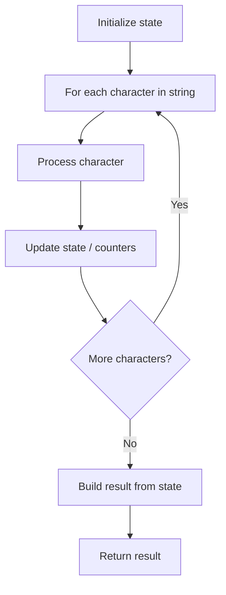

# Problem 1967: Number of Strings That Appear as Substrings in Word

**Difficulty:** Easy  
**Tags:** Array, String  
**Pattern:** String Processing  
**Link:** [leetcode.com/problems/number-of-strings-that-appear-as-substrings-in-word](https://leetcode.com/problems/number-of-strings-that-appear-as-substrings-in-word/)

## Description

Given an array of strings `patterns` and a string `word`, return *the **number** of strings in *`patterns`* that exist as a **substring** in *`word`.

A **substring** is a contiguous sequence of characters within a string.

 

Example 1:

```

**Input:** patterns = ["a","abc","bc","d"], word = "abc"
**Output:** 3
**Explanation:**
- "a" appears as a substring in "abc".
- "abc" appears as a substring in "abc".
- "bc" appears as a substring in "abc".
- "d" does not appear as a substring in "abc".
3 of the strings in patterns appear as a substring in word.

```

Example 2:

```

**Input:** patterns = ["a","b","c"], word = "aaaaabbbbb"
**Output:** 2
**Explanation:**
- "a" appears as a substring in "aaaaabbbbb".
- "b" appears as a substring in "aaaaabbbbb".
- "c" does not appear as a substring in "aaaaabbbbb".
2 of the strings in patterns appear as a substring in word.

```

Example 3:

```

**Input:** patterns = ["a","a","a"], word = "ab"
**Output:** 3
**Explanation:** Each of the patterns appears as a substring in word "ab".

```

 

**Constraints:**

	- `1 <= patterns.length <= 100`
	- `1 <= patterns[i].length <= 100`
	- `1 <= word.length <= 100`
	- `patterns[i]` and `word` consist of lowercase English letters.

## Approach: String Processing

Process the string character by character. Common techniques: two pointers, sliding window, hash map for frequencies, stack for matching.

## Pseudocode

```
1. Initialize result / tracking state
2. Iterate through string characters:
   a. Process character based on rules
   b. Update state (counters, pointers, stack)
3. Build and return result
```

## Algorithm Flow



## Complexity Analysis

- **Time:** O(n)
- **Space:** O(n)

## Solution (Python3)

```python
class Solution:
    def numOfStrings(self, patterns: List[str], word: str) -> int:
        # String processing approach - O(n) time
        result = []
        for ch in patterns:
            if ch.isalnum():
                result.append(ch.lower())
        # Check palindrome or process
        processed = ''.join(result)
        return processed == processed[::-1] if isinstance(0, bool) else processed
```

## Solution (C++)

```cpp
#include <algorithm>
#include <cctype>
#include <string>
#include <vector>
using namespace std;

class Solution {
public:
    int numOfStrings(vector<string>& patterns, string& word) {
        // String processing approach - O(n) time
        string processed;
        for (char ch : patterns) {
            if (isalnum(ch)) {
                processed += tolower(ch);
            }
        }
        string rev = processed;
        reverse(rev.begin(), rev.end());
        return processed == rev;
    }
};
```
