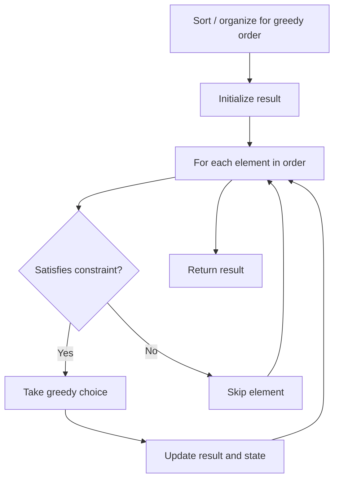

# Problem 1969: Minimum Non-Zero Product of the Array Elements

**Difficulty:** Medium  
**Tags:** Math, Greedy, Recursion  
**Pattern:** Greedy  
**Link:** [leetcode.com/problems/minimum-non-zero-product-of-the-array-elements](https://leetcode.com/problems/minimum-non-zero-product-of-the-array-elements/)

## Description

You are given a positive integer `p`. Consider an array `nums` (**1-indexed**) that consists of the integers in the **inclusive** range `[1, 2^p - 1]` in their binary representations. You are allowed to do the following operation **any** number of times:

	- Choose two elements `x` and `y` from `nums`.
	- Choose a bit in `x` and swap it with its corresponding bit in `y`. Corresponding bit refers to the bit that is in the **same position** in the other integer.

For example, if `x = 1101` and `y = 0011`, after swapping the `2^nd` bit from the right, we have `x = 1111` and `y = 0001`.

Find the **minimum non-zero** product of `nums` after performing the above operation **any** number of times. Return *this product** **modulo** *`10^9 + 7`.

**Note:** The answer should be the minimum product **before** the modulo operation is done.

 

Example 1:

```

**Input:** p = 1
**Output:** 1
**Explanation:** nums = [1].
There is only one element, so the product equals that element.

```

Example 2:

```

**Input:** p = 2
**Output:** 6
**Explanation:** nums = [01, 10, 11].
Any swap would either make the product 0 or stay the same.
Thus, the array product of 1 * 2 * 3 = 6 is already minimized.

```

Example 3:

```

**Input:** p = 3
**Output:** 1512
**Explanation:** nums = [001, 010, 011, 100, 101, 110, 111]
- In the first operation we can swap the leftmost bit of the second and fifth elements.
    - The resulting array is [001, 110, 011, 100, 001, 110, 111].
- In the second operation we can swap the middle bit of the third and fourth elements.
    - The resulting array is [001, 110, 001, 110, 001, 110, 111].
The array product is 1 * 6 * 1 * 6 * 1 * 6 * 7 = 1512, which is the minimum possible product.

```

 

**Constraints:**

	- `1 <= p <= 60`

## Approach: Greedy

Make the locally optimal choice at each step, trusting it leads to a global optimum. Greedy works when the problem has the greedy-choice property and optimal substructure.

## Pseudocode

```
1. Sort or organize data for greedy ordering
2. Initialize result
3. For each element in greedy order:
   a. If element satisfies constraint:
      - Take the greedy choice
      - Update result and state
4. Return result
```

## Algorithm Flow



## Complexity Analysis

- **Time:** O(n log n)
- **Space:** O(1)

## Solution (Python3)

```python
class Solution:
    def minNonZeroProduct(self, p: int) -> int:
        # Greedy approach - O(n) time
        result = 0
        curr_max = 0
        for i in range(len(p)):
            if isinstance(p[i], int):
                curr_max = max(curr_max, p[i])
                result = max(result, curr_max)
            else:
                result += 1
        return result
```

## Solution (C++)

```cpp
#include <algorithm>
#include <string>
#include <vector>
using namespace std;

class Solution {
public:
    int minNonZeroProduct(int p) {
        // Greedy approach - O(n) time
        int result = 0, curr_max = 0;
        for (int i = 0; i < (int)p.size(); i++) {
            curr_max = max(curr_max, p[i]);
            result = max(result, curr_max);
        }
        return result;
    }
};
```
