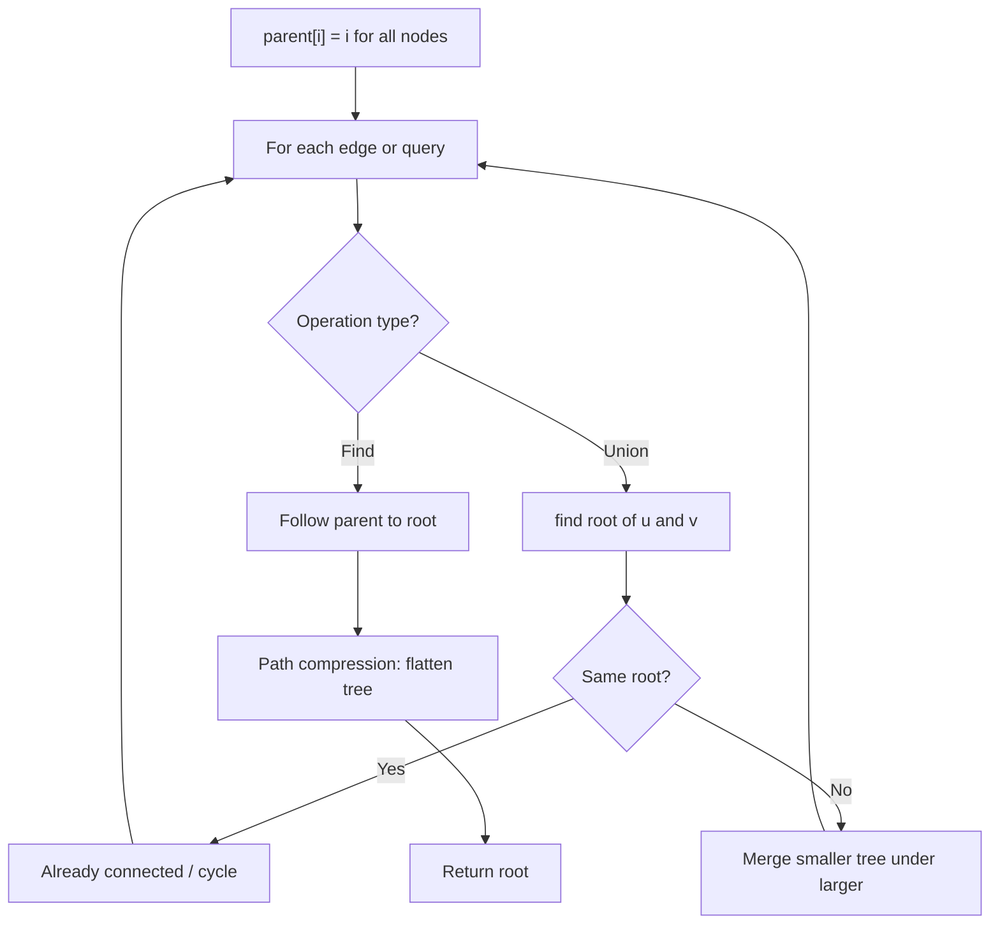
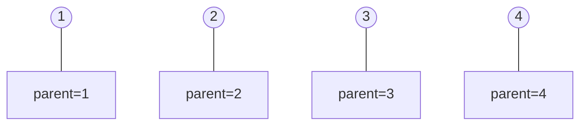
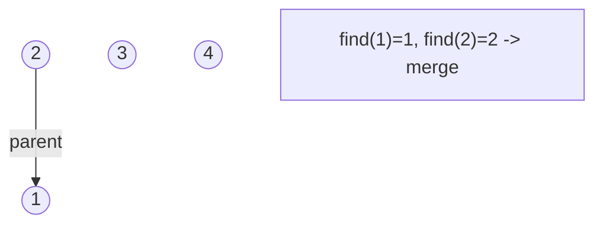
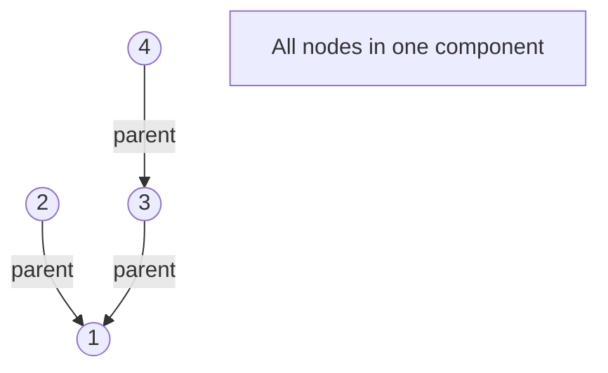
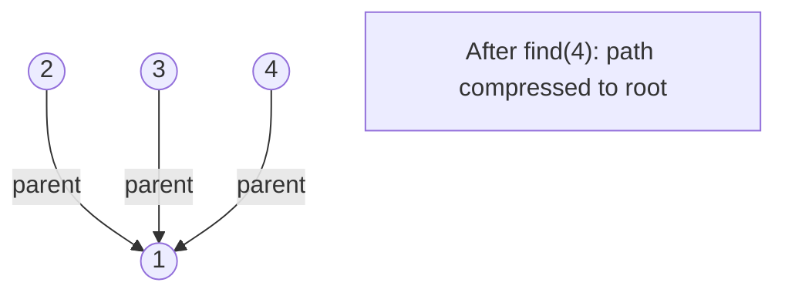

# Problem 1970: Last Day Where You Can Still Cross

**Difficulty:** Hard  
**Tags:** Array, Binary Search, Depth-First Search, Breadth-First Search, Union-Find, Matrix  
**Pattern:** Union-Find / Disjoint Set  
**Link:** [leetcode.com/problems/last-day-where-you-can-still-cross](https://leetcode.com/problems/last-day-where-you-can-still-cross/)

## Description

There is a **1-based** binary matrix where `0` represents land and `1` represents water. You are given integers `row` and `col` representing the number of rows and columns in the matrix, respectively.

Initially on day `0`, the **entire** matrix is **land**. However, each day a new cell becomes flooded with **water**. You are given a **1-based** 2D array `cells`, where `cells[i] = [ri, ci]` represents that on the `i^th` day, the cell on the `ri^th` row and `ci^th` column (**1-based** coordinates) will be covered with **water** (i.e., changed to `1`).

You want to find the **last** day that it is possible to walk from the **top** to the **bottom** by only walking on land cells. You can start from **any** cell in the top row and end at **any** cell in the bottom row. You can only travel in the** four** cardinal directions (left, right, up, and down).

Return *the **last** day where it is possible to walk from the **top** to the **bottom** by only walking on land cells*.

 

Example 1:

```

**Input:** row = 2, col = 2, cells = [[1,1],[2,1],[1,2],[2,2]]
**Output:** 2
**Explanation:** The above image depicts how the matrix changes each day starting from day 0.
The last day where it is possible to cross from top to bottom is on day 2.

```

Example 2:

```

**Input:** row = 2, col = 2, cells = [[1,1],[1,2],[2,1],[2,2]]
**Output:** 1
**Explanation:** The above image depicts how the matrix changes each day starting from day 0.
The last day where it is possible to cross from top to bottom is on day 1.

```

Example 3:

```

**Input:** row = 3, col = 3, cells = [[1,2],[2,1],[3,3],[2,2],[1,1],[1,3],[2,3],[3,2],[3,1]]
**Output:** 3
**Explanation:** The above image depicts how the matrix changes each day starting from day 0.
The last day where it is possible to cross from top to bottom is on day 3.

```

 

**Constraints:**

	- `2 <= row, col <= 2 * 10^4`
	- `4 <= row * col <= 2 * 10^4`
	- `cells.length == row * col`
	- `1 <= ri <= row`
	- `1 <= ci <= col`
	- All the values of `cells` are **unique**.

## Approach: Union-Find / Disjoint Set

Use Union-Find with path compression and union by rank to efficiently manage connected components. Find(x) returns the root of x's component; Union(x,y) merges two components.

## Pseudocode

```
1. parent[i] = i for all nodes (each is its own set)
2. find(x): follow parent pointers to root (with path compression)
3. union(x, y): merge sets of x and y by rank
4. Process edges/operations:
   a. For each edge (u, v): union(u, v)
5. Answer queries using find()
```

## Algorithm Flow



## Visual State Transitions

**Union-Find Step-by-Step:**

**Frame 1: Initial - each node is own parent**


**Frame 2: Union(1,2) - merge components**


**Frame 3: Union(3,4) then Union(2,3)**


**Frame 4: Path compression on find(4)**



## Complexity Analysis

- **Time:** O(n * alpha(n))
- **Space:** O(n)

## Solution (Python3)

```python
class Solution:
    def latestDayToCross(self, row: int, col: int, cells: List[List[int]]) -> int:
        # Union Find (Disjoint Set Union) - O(n * alpha(n))
        parent = list(range(len(row) + 1 if isinstance(row, list) else row + 1))
        rank = [0] * len(parent)
        
        def find(x):
            if parent[x] != x:
                parent[x] = find(parent[x])
            return parent[x]
        
        def union(x, y):
            px, py = find(x), find(y)
            if px == py:
                return False
            if rank[px] < rank[py]:
                px, py = py, px
            parent[py] = px
            if rank[px] == rank[py]:
                rank[px] += 1
            return True
        
        components = len(parent)
        # Process edges/connections
        return components
```

## Solution (C++)

```cpp
#include <functional>
#include <numeric>
#include <string>
#include <vector>
using namespace std;

class Solution {
public:
    int latestDayToCross(int row, int col, vector<vector<int>>& cells) {
        // Union Find (DSU) - O(n * alpha(n))
        int n = row.size();
        vector<int> parent(n + 1), rnk(n + 1, 0);
        iota(parent.begin(), parent.end(), 0);
        function<int(int)> find = [&](int x) -> int {
            return parent[x] == x ? x : parent[x] = find(parent[x]);
        };
        auto unite = [&](int x, int y) -> bool {
            int px = find(x), py = find(y);
            if (px == py) return false;
            if (rnk[px] < rnk[py]) swap(px, py);
            parent[py] = px;
            if (rnk[px] == rnk[py]) rnk[px]++;
            return true;
        };
        int components = n;
        return components;
    }
};
```
