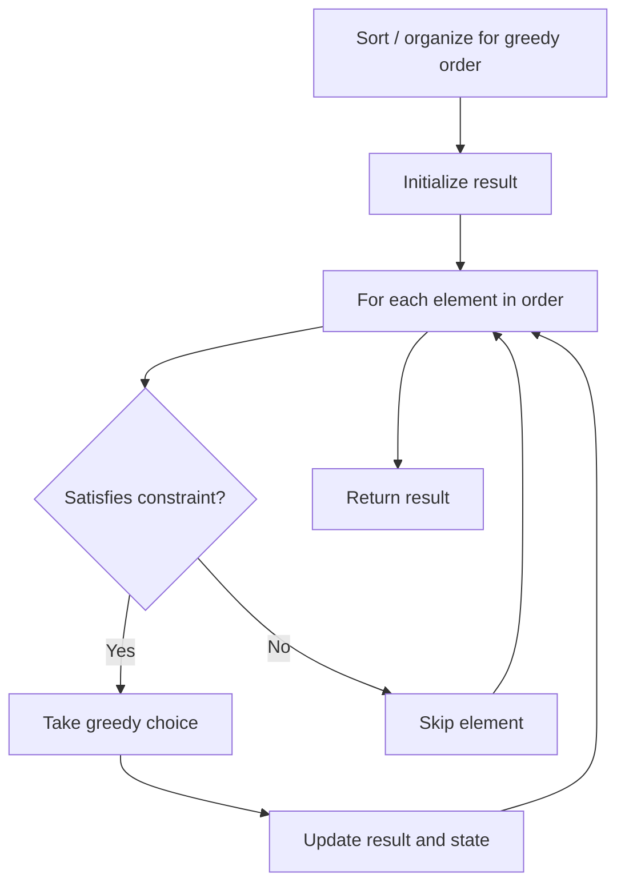

# Problem 1974: Minimum Time to Type Word Using Special Typewriter

**Difficulty:** Easy  
**Tags:** String, Greedy  
**Pattern:** Greedy  
**Link:** [leetcode.com/problems/minimum-time-to-type-word-using-special-typewriter](https://leetcode.com/problems/minimum-time-to-type-word-using-special-typewriter/)

## Description

There is a special typewriter with lowercase English letters `'a'` to `'z'` arranged in a **circle** with a **pointer**. A character can **only** be typed if the pointer is pointing to that character. The pointer is **initially** pointing to the character `'a'`.

Each second, you may perform one of the following operations:

	- Move the pointer one character **counterclockwise** or **clockwise**.
	- Type the character the pointer is **currently** on.

Given a string `word`, return the** minimum** number of seconds to type out the characters in `word`.

 

Example 1:

```

**Input:** word = "abc"
**Output:** 5
Explanation: 
The characters are printed as follows:
- Type the character 'a' in 1 second since the pointer is initially on 'a'.
- Move the pointer clockwise to 'b' in 1 second.
- Type the character 'b' in 1 second.
- Move the pointer clockwise to 'c' in 1 second.
- Type the character 'c' in 1 second.

```

Example 2:

```

**Input:** word = "bza"
**Output:** 7
Explanation:
The characters are printed as follows:
- Move the pointer clockwise to 'b' in 1 second.
- Type the character 'b' in 1 second.
- Move the pointer counterclockwise to 'z' in 2 seconds.
- Type the character 'z' in 1 second.
- Move the pointer clockwise to 'a' in 1 second.
- Type the character 'a' in 1 second.

```

Example 3:

```

**Input:** word = "zjpc"
**Output:** 34
**Explanation:**
The characters are printed as follows:
- Move the pointer counterclockwise to 'z' in 1 second.
- Type the character 'z' in 1 second.
- Move the pointer clockwise to 'j' in 10 seconds.
- Type the character 'j' in 1 second.
- Move the pointer clockwise to 'p' in 6 seconds.
- Type the character 'p' in 1 second.
- Move the pointer counterclockwise to 'c' in 13 seconds.
- Type the character 'c' in 1 second.

```

 

**Constraints:**

	- `1 <= word.length <= 100`
	- `word` consists of lowercase English letters.

## Approach: Greedy

Make the locally optimal choice at each step, trusting it leads to a global optimum. Greedy works when the problem has the greedy-choice property and optimal substructure.

## Pseudocode

```
1. Sort or organize data for greedy ordering
2. Initialize result
3. For each element in greedy order:
   a. If element satisfies constraint:
      - Take the greedy choice
      - Update result and state
4. Return result
```

## Algorithm Flow



## Complexity Analysis

- **Time:** O(n log n)
- **Space:** O(1)

## Solution (Python3)

```python
class Solution:
    def minTimeToType(self, word: str) -> int:
        # Greedy approach - O(n) time
        result = 0
        curr_max = 0
        for i in range(len(word)):
            if isinstance(word[i], int):
                curr_max = max(curr_max, word[i])
                result = max(result, curr_max)
            else:
                result += 1
        return result
```

## Solution (C++)

```cpp
#include <algorithm>
#include <string>
#include <vector>
using namespace std;

class Solution {
public:
    int minTimeToType(string& word) {
        // Greedy approach - O(n) time
        int result = 0, curr_max = 0;
        for (int i = 0; i < (int)word.size(); i++) {
            curr_max = max(curr_max, word[i]);
            result = max(result, curr_max);
        }
        return result;
    }
};
```
