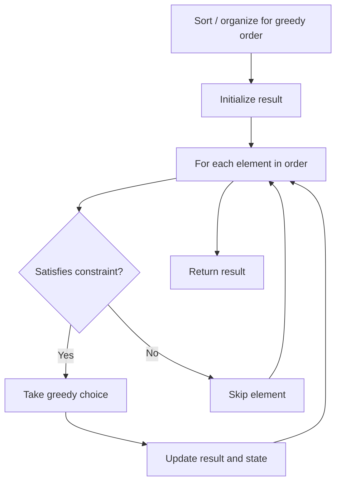

# Problem 1975: Maximum Matrix Sum

**Difficulty:** Medium  
**Tags:** Array, Greedy, Matrix  
**Pattern:** Greedy  
**Link:** [leetcode.com/problems/maximum-matrix-sum](https://leetcode.com/problems/maximum-matrix-sum/)

## Description

You are given an `n x n` integer `matrix`. You can do the following operation **any** number of times:

	- Choose any two **adjacent** elements of `matrix` and **multiply** each of them by `-1`.

Two elements are considered **adjacent** if and only if they share a **border**.

Your goal is to **maximize** the summation of the matrix's elements. Return *the **maximum** sum of the matrix's elements using the operation mentioned above.*

 

Example 1:

```

**Input:** matrix = [[1,-1],[-1,1]]
**Output:** 4
**Explanation:** We can follow the following steps to reach sum equals 4:
- Multiply the 2 elements in the first row by -1.
- Multiply the 2 elements in the first column by -1.

```

Example 2:

```

**Input:** matrix = [[1,2,3],[-1,-2,-3],[1,2,3]]
**Output:** 16
**Explanation:** We can follow the following step to reach sum equals 16:
- Multiply the 2 last elements in the second row by -1.

```

 

**Constraints:**

	- `n == matrix.length == matrix[i].length`
	- `2 <= n <= 250`
	- `-10^5 <= matrix[i][j] <= 10^5`

## Approach: Greedy

Make the locally optimal choice at each step, trusting it leads to a global optimum. Greedy works when the problem has the greedy-choice property and optimal substructure.

## Pseudocode

```
1. Sort or organize data for greedy ordering
2. Initialize result
3. For each element in greedy order:
   a. If element satisfies constraint:
      - Take the greedy choice
      - Update result and state
4. Return result
```

## Algorithm Flow



## Complexity Analysis

- **Time:** O(n log n)
- **Space:** O(1)

## Solution (Python3)

```python
class Solution:
    def maxMatrixSum(self, matrix: List[List[int]]) -> int:
        # Greedy approach - O(n) time
        result = 0
        curr_max = 0
        for i in range(len(matrix)):
            if isinstance(matrix[i], int):
                curr_max = max(curr_max, matrix[i])
                result = max(result, curr_max)
            else:
                result += 1
        return result
```

## Solution (C++)

```cpp
#include <algorithm>
#include <string>
#include <vector>
using namespace std;

class Solution {
public:
    int maxMatrixSum(vector<vector<int>>& matrix) {
        // Greedy approach - O(n) time
        int result = 0, curr_max = 0;
        for (int i = 0; i < (int)matrix.size(); i++) {
            curr_max = max(curr_max, matrix[i]);
            result = max(result, curr_max);
        }
        return result;
    }
};
```
