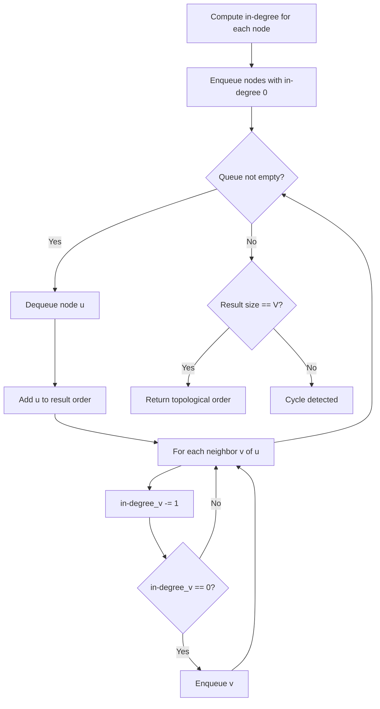
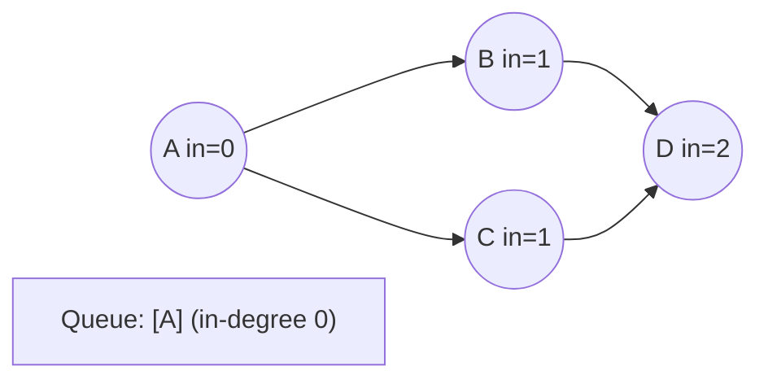
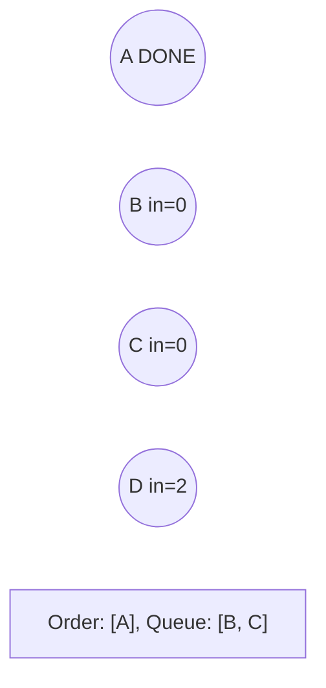
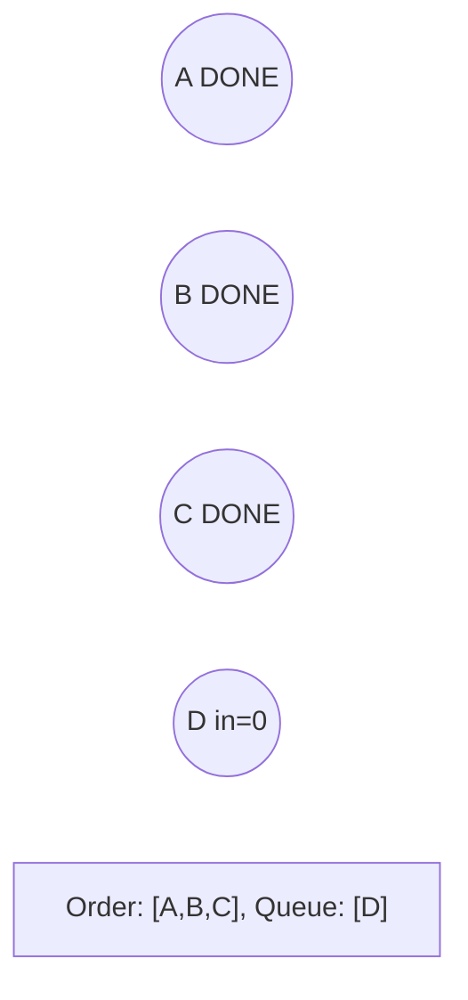
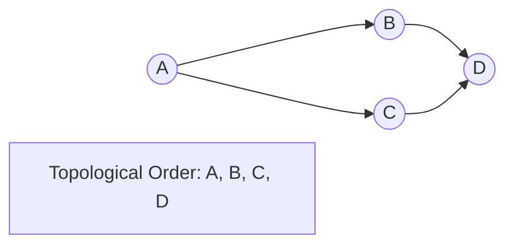

# Problem 1976: Number of Ways to Arrive at Destination

**Difficulty:** Medium  
**Tags:** Dynamic Programming, Graph Theory, Topological Sort, Shortest Path  
**Pattern:** Topological Sort  
**Link:** [leetcode.com/problems/number-of-ways-to-arrive-at-destination](https://leetcode.com/problems/number-of-ways-to-arrive-at-destination/)

## Description

You are in a city that consists of `n` intersections numbered from `0` to `n - 1` with **bi-directional** roads between some intersections. The inputs are generated such that you can reach any intersection from any other intersection and that there is at most one road between any two intersections.

You are given an integer `n` and a 2D integer array `roads` where `roads[i] = [ui, vi, timei]` means that there is a road between intersections `ui` and `vi` that takes `timei` minutes to travel. You want to know in how many ways you can travel from intersection `0` to intersection `n - 1` in the **shortest amount of time**.

Return *the **number of ways** you can arrive at your destination in the **shortest amount of time***. Since the answer may be large, return it **modulo** `10^9 + 7`.

 

Example 1:

```

**Input:** n = 7, roads = [[0,6,7],[0,1,2],[1,2,3],[1,3,3],[6,3,3],[3,5,1],[6,5,1],[2,5,1],[0,4,5],[4,6,2]]
**Output:** 4
**Explanation:** The shortest amount of time it takes to go from intersection 0 to intersection 6 is 7 minutes.
The four ways to get there in 7 minutes are:
- 0 ➝ 6
- 0 ➝ 4 ➝ 6
- 0 ➝ 1 ➝ 2 ➝ 5 ➝ 6
- 0 ➝ 1 ➝ 3 ➝ 5 ➝ 6

```

Example 2:

```

**Input:** n = 2, roads = [[1,0,10]]
**Output:** 1
**Explanation:** There is only one way to go from intersection 0 to intersection 1, and it takes 10 minutes.

```

 

**Constraints:**

	- `1 <= n <= 200`
	- `n - 1 <= roads.length <= n * (n - 1) / 2`
	- `roads[i].length == 3`
	- `0 <= ui, vi <= n - 1`
	- `1 <= timei <= 10^9`
	- `ui != vi`
	- There is at most one road connecting any two intersections.
	- You can reach any intersection from any other intersection.

## Approach: Topological Sort

Order nodes in a DAG so every edge u->v has u before v. Use Kahn's algorithm (BFS with in-degree tracking) or DFS-based ordering.

## Pseudocode

```
1. Compute in-degree for every node
2. Enqueue all nodes with in-degree 0
3. While queue not empty:
   a. Dequeue node u, add to result order
   b. For each neighbor v of u:
      - Decrease in-degree of v
      - If in-degree becomes 0: enqueue v
4. If result size != V: cycle exists
5. Return topological order
```

## Algorithm Flow



## Visual State Transitions

**Topological Sort (Kahn's Algorithm):**

**Frame 1: Compute in-degrees**


**Frame 2: Process A, reduce neighbors**


**Frame 3: Process B and C**


**Frame 4: Complete**



## Complexity Analysis

- **Time:** O(V + E)
- **Space:** O(V + E)

## Solution (Python3)

```python
class Solution:
    def countPaths(self, n: int, roads: List[List[int]]) -> int:
        # Topological sort (Kahn's algorithm) - O(V+E)
        from collections import deque, defaultdict
        graph = defaultdict(list)
        n = n if isinstance(n, int) else len(n)
        indegree = [0] * n
        # Build graph from prerequisites
        prereqs = roads if isinstance(roads, list) else n
        for edge in prereqs:
            if isinstance(edge, (list, tuple)) and len(edge) >= 2:
                graph[edge[1]].append(edge[0])
                indegree[edge[0]] += 1
        queue = deque([i for i in range(n) if indegree[i] == 0])
        order = []
        while queue:
            node = queue.popleft()
            order.append(node)
            for neighbor in graph[node]:
                indegree[neighbor] -= 1
                if indegree[neighbor] == 0:
                    queue.append(neighbor)
        return len(order) == n if isinstance(0, bool) else order
```

## Solution (C++)

```cpp
#include <queue>
#include <string>
#include <vector>
using namespace std;

class Solution {
public:
    int countPaths(int n, vector<vector<int>>& roads) {
        // Topological sort (Kahn's) - O(V+E)
        int n = n;
        vector<vector<int>> graph(n);
        vector<int> indegree(n, 0);
        for (auto& edge : roads) {
            graph[edge[1]].push_back(edge[0]);
            indegree[edge[0]]++;
        }
        queue<int> q;
        for (int i = 0; i < n; i++)
            if (indegree[i] == 0) q.push(i);
        vector<int> order;
        while (!q.empty()) {
            int node = q.front(); q.pop();
            order.push_back(node);
            for (int neighbor : graph[node]) {
                if (--indegree[neighbor] == 0) q.push(neighbor);
            }
        }
        return order.size() == n;
    }
};
```
