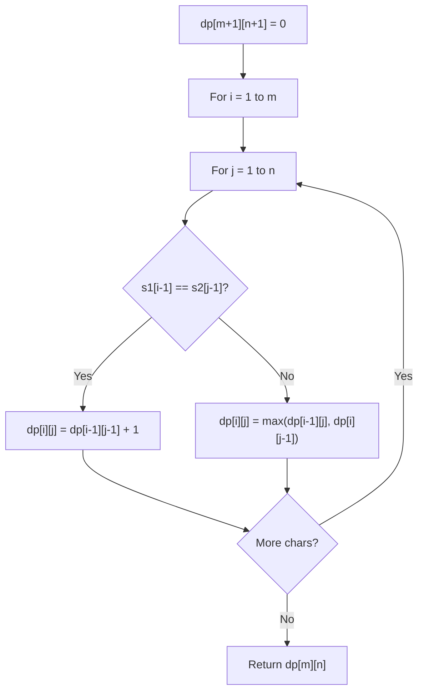

# Problem 1977: Number of Ways to Separate Numbers

**Difficulty:** Hard  
**Tags:** String, Dynamic Programming, Suffix Array  
**Pattern:** Dynamic Programming (String)  
**Link:** [leetcode.com/problems/number-of-ways-to-separate-numbers](https://leetcode.com/problems/number-of-ways-to-separate-numbers/)

## Description

You wrote down many **positive** integers in a string called `num`. However, you realized that you forgot to add commas to seperate the different numbers. You remember that the list of integers was **non-decreasing** and that **no** integer had leading zeros.

Return *the **number of possible lists of integers** that you could have written down to get the string *`num`. Since the answer may be large, return it **modulo** `10^9 + 7`.

 

Example 1:

```

**Input:** num = "327"
**Output:** 2
**Explanation:** You could have written down the numbers:
3, 27
327

```

Example 2:

```

**Input:** num = "094"
**Output:** 0
**Explanation:** No numbers can have leading zeros and all numbers must be positive.

```

Example 3:

```

**Input:** num = "0"
**Output:** 0
**Explanation:** No numbers can have leading zeros and all numbers must be positive.

```

 

**Constraints:**

	- `1 <= num.length <= 3500`
	- `num` consists of digits `'0'` through `'9'`.

## Approach: Dynamic Programming (String)

Compare or match two strings using a 2D DP table. dp[i][j] represents the answer for substrings s1[0..i-1] and s2[0..j-1]. Common patterns: LCS, edit distance, regex matching.

## Pseudocode

```
1. Create dp[m+1][n+1]
2. Initialize base cases
3. For i from 1 to m:
   For j from 1 to n:
     If s1[i-1] == s2[j-1]: dp[i][j] = dp[i-1][j-1] + 1
     Else: dp[i][j] = best of (dp[i-1][j], dp[i][j-1], dp[i-1][j-1])
4. Return dp[m][n]
```

## Algorithm Flow



## Complexity Analysis

- **Time:** O(m * n)
- **Space:** O(m * n)

## Solution (Python3)

```python
class Solution:
    def numberOfCombinations(self, num: str) -> int:
        # String DP - O(m*n) time and space
        m, n = len(num), len(num)
        dp = [[0] * (n + 1) for _ in range(m + 1)]
        for i in range(1, m + 1):
            for j in range(1, n + 1):
                if num[i-1] == num[j-1]:
                    dp[i][j] = dp[i-1][j-1] + 1
                else:
                    dp[i][j] = max(dp[i-1][j], dp[i][j-1])
        return dp[m][n]
```

## Solution (C++)

```cpp
#include <algorithm>
#include <string>
#include <vector>
using namespace std;

class Solution {
public:
    int numberOfCombinations(string& num) {
        // String DP - O(m*n) time and space
        int m = num.size(), n = num.size();
        vector<vector<int>> dp(m + 1, vector<int>(n + 1, 0));
        for (int i = 1; i <= m; i++) {
            for (int j = 1; j <= n; j++) {
                if (num[i-1] == num[j-1])
                    dp[i][j] = dp[i-1][j-1] + 1;
                else
                    dp[i][j] = max(dp[i-1][j], dp[i][j-1]);
            }
        }
        return dp[m][n];
    }
};
```
