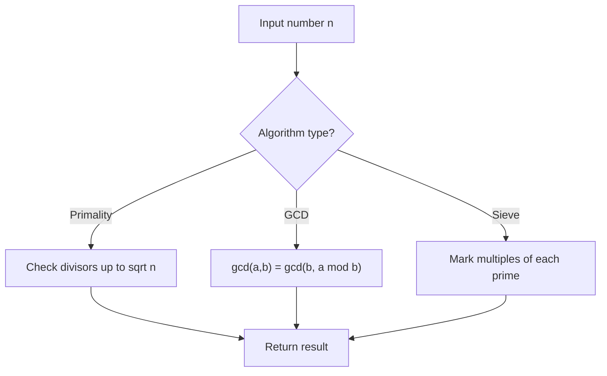

# Problem 1979: Find Greatest Common Divisor of Array

**Difficulty:** Easy  
**Tags:** Array, Math, Number Theory  
**Pattern:** Number Theory  
**Link:** [leetcode.com/problems/find-greatest-common-divisor-of-array](https://leetcode.com/problems/find-greatest-common-divisor-of-array/)

## Description

Given an integer array `nums`, return** ***the **greatest common divisor** of the smallest number and largest number in *`nums`.

The **greatest common divisor** of two numbers is the largest positive integer that evenly divides both numbers.

 

Example 1:

```

**Input:** nums = [2,5,6,9,10]
**Output:** 2
**Explanation:**
The smallest number in nums is 2.
The largest number in nums is 10.
The greatest common divisor of 2 and 10 is 2.

```

Example 2:

```

**Input:** nums = [7,5,6,8,3]
**Output:** 1
**Explanation:**
The smallest number in nums is 3.
The largest number in nums is 8.
The greatest common divisor of 3 and 8 is 1.

```

Example 3:

```

**Input:** nums = [3,3]
**Output:** 3
**Explanation:**
The smallest number in nums is 3.
The largest number in nums is 3.
The greatest common divisor of 3 and 3 is 3.

```

 

**Constraints:**

	- `2 <= nums.length <= 1000`
	- `1 <= nums[i] <= 1000`

## Approach: Number Theory

Apply number theory: prime checking, factorization, GCD, modular exponentiation, sieve of Eratosthenes, or Euler's totient.

## Pseudocode

```
1. Apply number-theoretic algorithm:
   - Sieve for primes up to n
   - GCD via Euclidean algorithm
   - Modular exponentiation
2. Process results
3. Return answer
```

## Algorithm Flow



## Complexity Analysis

- **Time:** O(sqrt(n)) or O(n log log n)
- **Space:** O(n)

## Solution (Python3)

```python
class Solution:
    def findGCD(self, nums: List[int]) -> int:
        # Number theory approach
        def gcd(a, b):
            while b:
                a, b = b, a % b
            return a
        
        result = nums[0] if isinstance(nums, list) else nums
        if isinstance(nums, list):
            for val in nums[1:]:
                result = gcd(result, val)
        return result
```

## Solution (C++)

```cpp
#include <string>
#include <vector>
using namespace std;

class Solution {
public:
    int findGCD(vector<int>& nums) {
        // Number theory approach
        auto gcd_func = [](int a, int b) -> int {
            while (b) { int t = b; b = a % b; a = t; }
            return a;
        };
        int result = nums[0];
        for (int i = 1; i < (int)nums.size(); i++) {
            result = gcd_func(result, nums[i]);
        }
        return result;
    }
};
```
