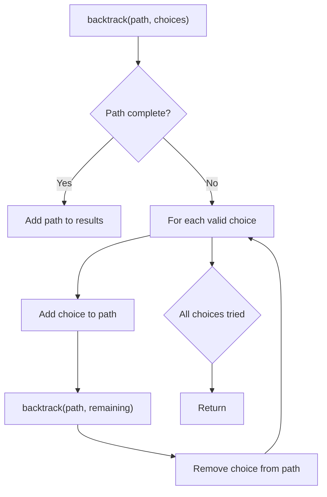
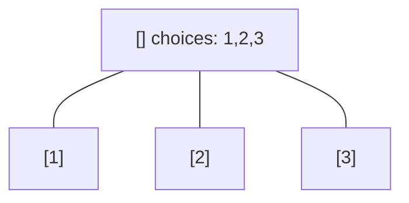
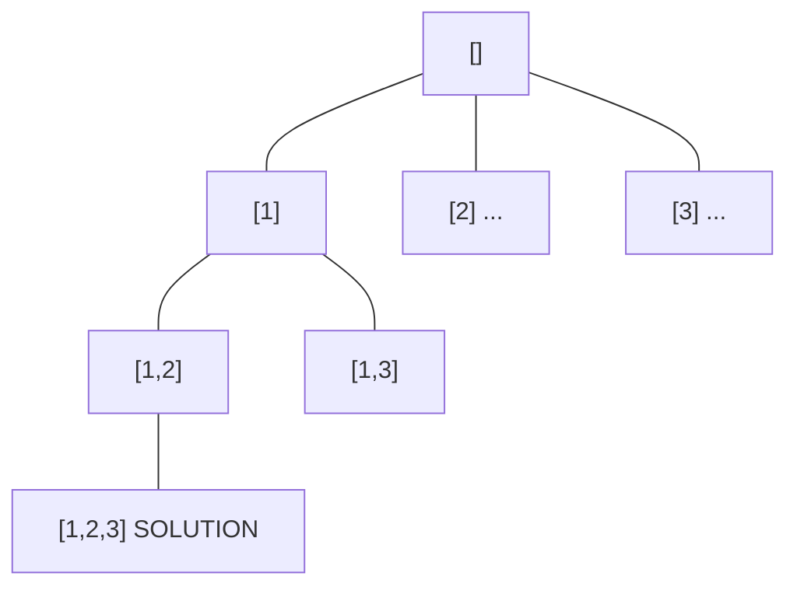
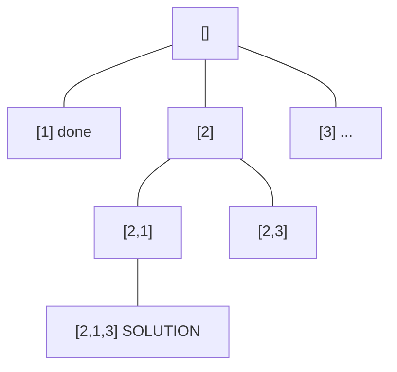
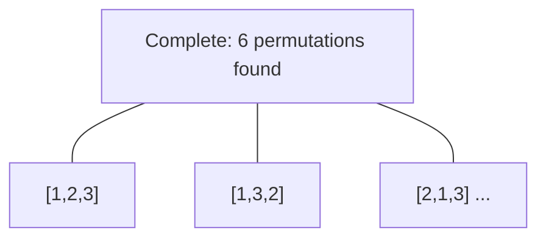

# Problem 1980: Find Unique Binary String

**Difficulty:** Medium  
**Tags:** Array, Hash Table, String, Backtracking  
**Pattern:** Backtracking  
**Link:** [leetcode.com/problems/find-unique-binary-string](https://leetcode.com/problems/find-unique-binary-string/)

## Description

Given an array of strings `nums` containing `n` **unique** binary strings each of length `n`, return *a binary string of length *`n`* that **does not appear** in *`nums`*. If there are multiple answers, you may return **any** of them*.

 

Example 1:

```

**Input:** nums = ["01","10"]
**Output:** "11"
**Explanation:** "11" does not appear in nums. "00" would also be correct.

```

Example 2:

```

**Input:** nums = ["00","01"]
**Output:** "11"
**Explanation:** "11" does not appear in nums. "10" would also be correct.

```

Example 3:

```

**Input:** nums = ["111","011","001"]
**Output:** "101"
**Explanation:** "101" does not appear in nums. "000", "010", "100", and "110" would also be correct.

```

 

**Constraints:**

	- `n == nums.length`
	- `1 <= n <= 16`
	- `nums[i].length == n`
	- `nums[i] `is either `'0'` or `'1'`.
	- All the strings of `nums` are **unique**.

## Approach: Backtracking

Explore all possible solutions by building candidates incrementally. At each step, make a choice and recurse. If the choice leads to a dead end, undo the choice (backtrack) and try the next option.

## Pseudocode

```
1. Define backtrack(path, choices):
   a. If path is a complete solution: add to results
   b. For each choice in choices:
      - If choice is valid:
        * Add choice to path
        * backtrack(path, remaining_choices)
        * Remove choice from path (backtrack)
2. Call backtrack([], all_choices)
```

## Algorithm Flow



## Visual State Transitions

**Backtracking Decision Tree:**

**Frame 1: Root - start with empty path**


**Frame 2: Explore branch [1]**


**Frame 3: Backtrack, explore [2]**


**Frame 4: All solutions found**



## Complexity Analysis

- **Time:** O(k^n) or O(n!)
- **Space:** O(n)

## Solution (Python3)

```python
class Solution:
    def findDifferentBinaryString(self, nums: List[str]) -> str:
        # Backtracking - O(2^n) or O(n!) time
        result = []
        
        def backtrack(path, start):
            result.append(path[:])
            for i in range(start, len(nums)):
                path.append(nums[i])
                backtrack(path, i + 1)
                path.pop()
        
        backtrack([], 0)
        return result
```

## Solution (C++)

```cpp
#include <functional>
#include <string>
#include <vector>
using namespace std;

class Solution {
public:
    string findDifferentBinaryString(vector<string>& nums) {
        // Backtracking - O(2^n) or O(n!) time
        vector<vector<int>> result;
        vector<int> path;
        function<void(int)> backtrack = [&](int start) {
            result.push_back(path);
            for (int i = start; i < (int)nums.size(); i++) {
                path.push_back(nums[i]);
                backtrack(i + 1);
                path.pop_back();
            }
        };
        backtrack(0);
        return result;
    }
};
```
