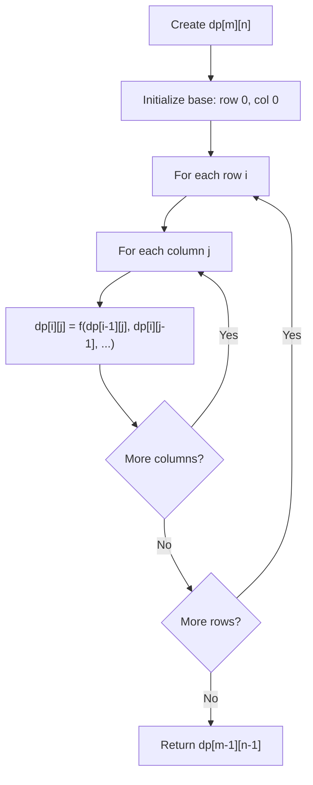
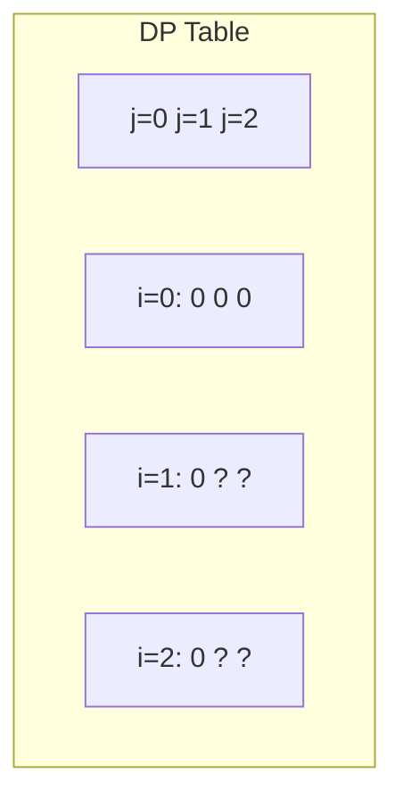
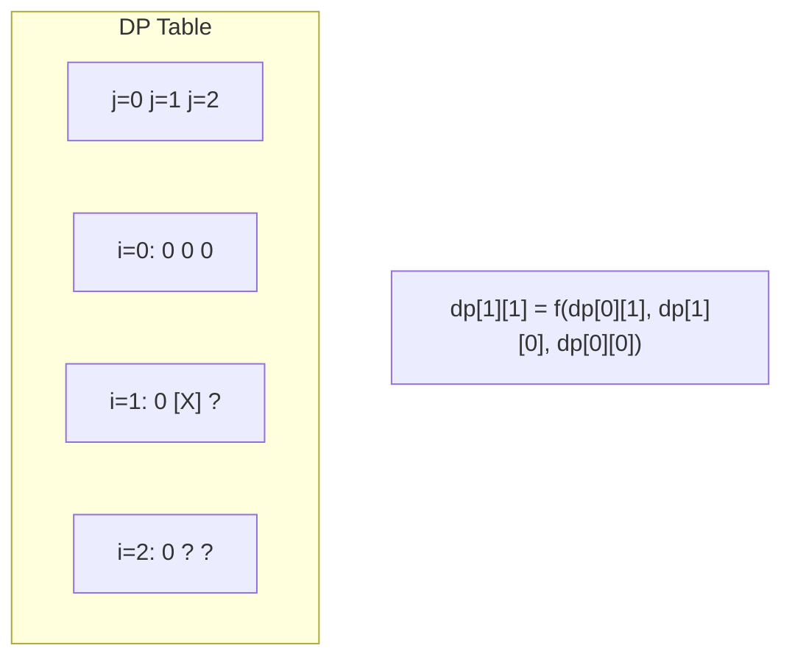
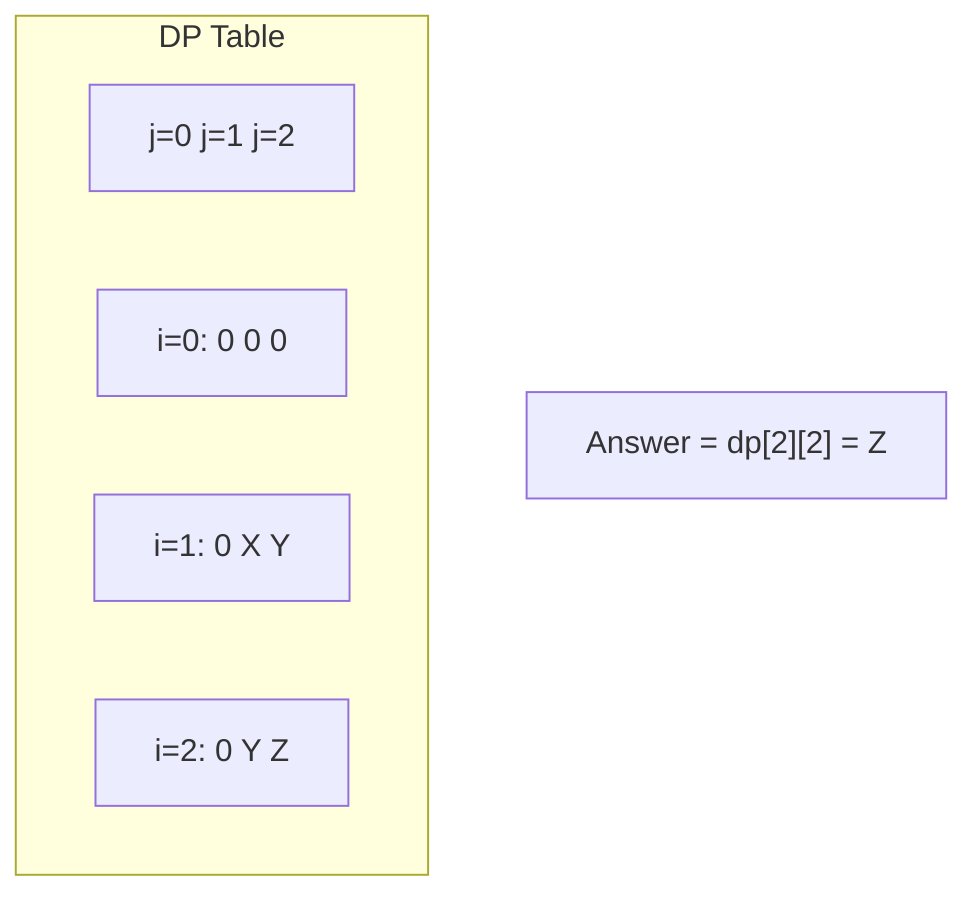

# Problem 1981: Minimize the Difference Between Target and Chosen Elements

**Difficulty:** Medium  
**Tags:** Array, Dynamic Programming, Matrix  
**Pattern:** Dynamic Programming (2D Grid/Matrix)  
**Link:** [leetcode.com/problems/minimize-the-difference-between-target-and-chosen-elements](https://leetcode.com/problems/minimize-the-difference-between-target-and-chosen-elements/)

## Description

You are given an `m x n` integer matrix `mat` and an integer `target`.

Choose one integer from **each row** in the matrix such that the **absolute difference** between `target` and the **sum** of the chosen elements is **minimized**.

Return *the **minimum absolute difference***.

The **absolute difference** between two numbers `a` and `b` is the absolute value of `a - b`.

 

Example 1:

```

**Input:** mat = [[1,2,3],[4,5,6],[7,8,9]], target = 13
**Output:** 0
**Explanation:** One possible choice is to:
- Choose 1 from the first row.
- Choose 5 from the second row.
- Choose 7 from the third row.
The sum of the chosen elements is 13, which equals the target, so the absolute difference is 0.

```

Example 2:

```

**Input:** mat = [[1],[2],[3]], target = 100
**Output:** 94
**Explanation:** The best possible choice is to:
- Choose 1 from the first row.
- Choose 2 from the second row.
- Choose 3 from the third row.
The sum of the chosen elements is 6, and the absolute difference is 94.

```

Example 3:

```

**Input:** mat = [[1,2,9,8,7]], target = 6
**Output:** 1
**Explanation:** The best choice is to choose 7 from the first row.
The absolute difference is 1.

```

 

**Constraints:**

	- `m == mat.length`
	- `n == mat[i].length`
	- `1 <= m, n <= 70`
	- `1 <= mat[i][j] <= 70`
	- `1 <= target <= 800`

## Approach: Dynamic Programming (2D Grid/Matrix)

Use a 2D DP table where dp[i][j] represents the optimal value for the subproblem defined by rows 0..i and columns 0..j. Fill row by row or column by column.

## Pseudocode

```
1. Create dp[m][n] table
2. Initialize base cases (first row, first column)
3. For i from 1 to m-1:
   For j from 1 to n-1:
     dp[i][j] = recurrence(dp[i-1][j], dp[i][j-1], dp[i-1][j-1])
4. Return dp[m-1][n-1]
```

## Algorithm Flow



## Visual State Transitions

**2D DP Table Build:**

**Frame 1: Initialize borders**


**Frame 2: Fill cell by cell**


**Frame 3: Table complete**



## Complexity Analysis

- **Time:** O(m * n)
- **Space:** O(m * n)

## Solution (Python3)

```python
class Solution:
    def minimizeTheDifference(self, mat: List[List[int]], target: int) -> int:
        # Dynamic programming (2D) - O(m*n) time and space
        if not mat:
            return 0
        m, n = len(mat), len(mat[0])
        dp = [[0] * (n + 1) for _ in range(m + 1)]
        for i in range(1, m + 1):
            for j in range(1, n + 1):
                dp[i][j] = max(dp[i-1][j], dp[i][j-1])
                # Add problem-specific transition
        return dp[m][n]
```

## Solution (C++)

```cpp
#include <algorithm>
#include <string>
#include <vector>
using namespace std;

class Solution {
public:
    int minimizeTheDifference(vector<vector<int>>& mat, int target) {
        // Dynamic programming (2D) - O(m*n) time and space
        if (mat.empty()) return 0;
        int m = mat.size(), n = mat[0].size();
        vector<vector<int>> dp(m + 1, vector<int>(n + 1, 0));
        for (int i = 1; i <= m; i++) {
            for (int j = 1; j <= n; j++) {
                dp[i][j] = max(dp[i-1][j], dp[i][j-1]);
            }
        }
        return dp[m][n];
    }
};
```
