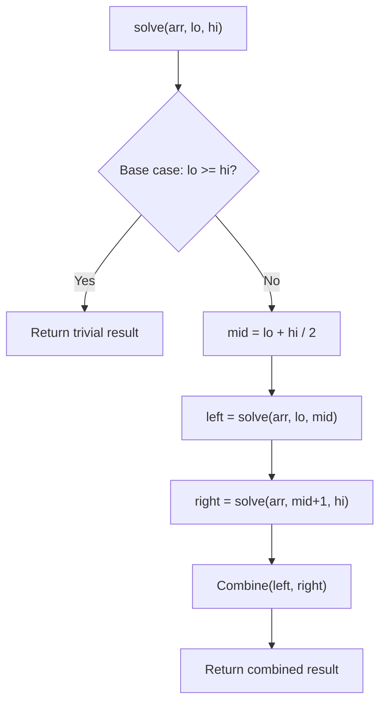

# Problem 1982: Find Array Given Subset Sums

**Difficulty:** Hard  
**Tags:** Array, Divide and Conquer  
**Pattern:** Divide and Conquer  
**Link:** [leetcode.com/problems/find-array-given-subset-sums](https://leetcode.com/problems/find-array-given-subset-sums/)

## Description

You are given an integer `n` representing the length of an unknown array that you are trying to recover. You are also given an array `sums` containing the values of all `2^n` **subset sums** of the unknown array (in no particular order).

Return *the array *`ans`* of length *`n`* representing the unknown array. If **multiple** answers exist, return **any** of them*.

An array `sub` is a **subset** of an array `arr` if `sub` can be obtained from `arr` by deleting some (possibly zero or all) elements of `arr`. The sum of the elements in `sub` is one possible **subset sum** of `arr`. The sum of an empty array is considered to be `0`.

**Note:** Test cases are generated such that there will **always** be at least one correct answer.

 

Example 1:

```

**Input:** n = 3, sums = [-3,-2,-1,0,0,1,2,3]
**Output:** [1,2,-3]
**Explanation: **[1,2,-3] is able to achieve the given subset sums:
- []: sum is 0
- [1]: sum is 1
- [2]: sum is 2
- [1,2]: sum is 3
- [-3]: sum is -3
- [1,-3]: sum is -2
- [2,-3]: sum is -1
- [1,2,-3]: sum is 0
Note that any permutation of [1,2,-3] and also any permutation of [-1,-2,3] will also be accepted.

```

Example 2:

```

**Input:** n = 2, sums = [0,0,0,0]
**Output:** [0,0]
**Explanation:** The only correct answer is [0,0].

```

Example 3:

```

**Input:** n = 4, sums = [0,0,5,5,4,-1,4,9,9,-1,4,3,4,8,3,8]
**Output:** [0,-1,4,5]
**Explanation:** [0,-1,4,5] is able to achieve the given subset sums.

```

 

**Constraints:**

	- `1 <= n <= 15`
	- `sums.length == 2^n`
	- `-10^4 <= sums[i] <= 10^4`

## Approach: Divide and Conquer

Split the problem into smaller subproblems, solve them recursively, and combine the results. The key is the merge/combine step.

## Pseudocode

```
1. Base case: if input size <= 1, return trivial answer
2. Divide: split input into two halves
3. Conquer: recursively solve left and right
4. Combine: merge solutions from left and right
5. Return combined result
```

## Algorithm Flow



## Complexity Analysis

- **Time:** O(n log n)
- **Space:** O(n)

## Solution (Python3)

```python
class Solution:
    def recoverArray(self, n: int, sums: List[int]) -> List[int]:
        # Divide and conquer approach - O(n log n) time
        def solve(left, right):
            if left >= right:
                return n[left] if left < len(n) else 0
            mid = (left + right) // 2
            left_result = solve(left, mid)
            right_result = solve(mid + 1, right)
            return max(left_result, right_result)  # merge step
        
        return solve(0, len(n) - 1) if n else []
```

## Solution (C++)

```cpp
#include <algorithm>
#include <functional>
#include <string>
#include <vector>
using namespace std;

class Solution {
public:
    vector<int> recoverArray(int n, vector<int>& sums) {
        // Divide and conquer - O(n log n) time
        function<int(int, int)> solve = [&](int left, int right) -> int {
            if (left >= right) return left < (int)n.size() ? n[left] : 0;
            int mid = (left + right) / 2;
            int leftRes = solve(left, mid);
            int rightRes = solve(mid + 1, right);
            return max(leftRes, rightRes);
        };
        return n.empty() ? {} : solve(0, n.size() - 1);
    }
};
```
