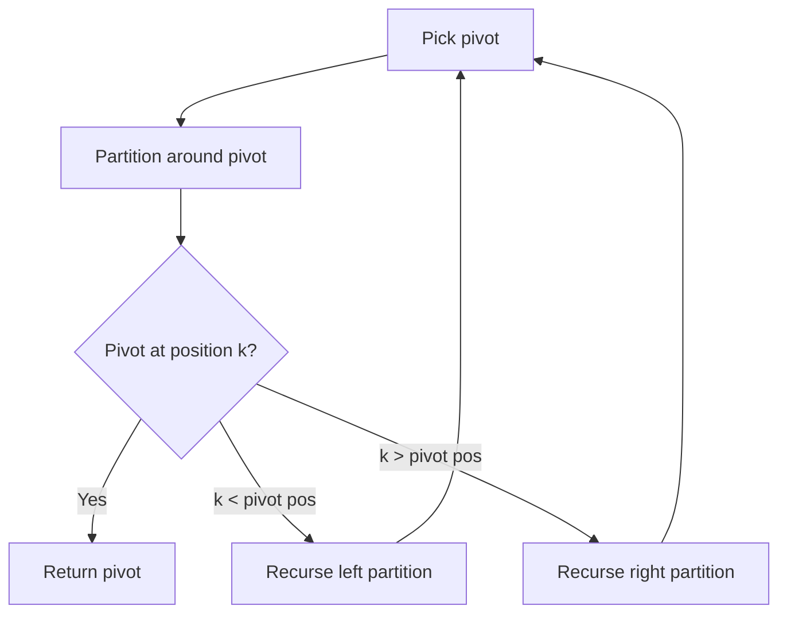

# Problem 1985: Find the Kth Largest Integer in the Array

**Difficulty:** Medium  
**Tags:** Array, String, Divide and Conquer, Sorting, Heap (Priority Queue), Quickselect  
**Pattern:** Quickselect  
**Link:** [leetcode.com/problems/find-the-kth-largest-integer-in-the-array](https://leetcode.com/problems/find-the-kth-largest-integer-in-the-array/)

## Description

You are given an array of strings `nums` and an integer `k`. Each string in `nums` represents an integer without leading zeros.

Return *the string that represents the *`k^th`*** largest integer** in *`nums`.

**Note**: Duplicate numbers should be counted distinctly. For example, if `nums` is `["1","2","2"]`, `"2"` is the first largest integer, `"2"` is the second-largest integer, and `"1"` is the third-largest integer.

 

Example 1:

```

**Input:** nums = ["3","6","7","10"], k = 4
**Output:** "3"
**Explanation:**
The numbers in nums sorted in non-decreasing order are ["3","6","7","10"].
The 4th largest integer in nums is "3".

```

Example 2:

```

**Input:** nums = ["2","21","12","1"], k = 3
**Output:** "2"
**Explanation:**
The numbers in nums sorted in non-decreasing order are ["1","2","12","21"].
The 3rd largest integer in nums is "2".

```

Example 3:

```

**Input:** nums = ["0","0"], k = 2
**Output:** "0"
**Explanation:**
The numbers in nums sorted in non-decreasing order are ["0","0"].
The 2nd largest integer in nums is "0".

```

 

**Constraints:**

	- `1 <= k <= nums.length <= 10^4`
	- `1 <= nums[i].length <= 100`
	- `nums[i]` consists of only digits.
	- `nums[i]` will not have any leading zeros.

## Approach: Quickselect

Find the kth element by partitioning: pick a pivot, partition elements around it, then recurse only into the partition containing kth position.

## Pseudocode

```
1. Pick pivot element
2. Partition: elements < pivot | pivot | elements > pivot
3. If pivot is at position k: return pivot
4. If k < pivot position: recurse left
5. If k > pivot position: recurse right
```

## Algorithm Flow



## Complexity Analysis

- **Time:** O(n) average
- **Space:** O(1)

## Solution (Python3)

```python
class Solution:
    def kthLargestNumber(self, nums: List[str], k: int) -> str:
        # Quickselect - O(n) average time
        import random
        def quickselect(arr, k):
            if len(arr) == 1:
                return arr[0]
            pivot = random.choice(arr)
            lows = [x for x in arr if x < pivot]
            highs = [x for x in arr if x > pivot]
            pivots = [x for x in arr if x == pivot]
            if k < len(lows):
                return quickselect(lows, k)
            elif k < len(lows) + len(pivots):
                return pivot
            else:
                return quickselect(highs, k - len(lows) - len(pivots))
        
        k = k if isinstance(k, int) else 1
        return quickselect(nums, len(nums) - k)
```

## Solution (C++)

```cpp
#include <algorithm>
#include <string>
#include <vector>
using namespace std;

class Solution {
public:
    string kthLargestNumber(vector<string>& nums, int k) {
        // Quickselect - O(n) average time
        int k = k;
        nth_element(nums.begin(), nums.begin() + nums.size() - k, nums.end());
        return nums[nums.size() - k];
    }
};
```
