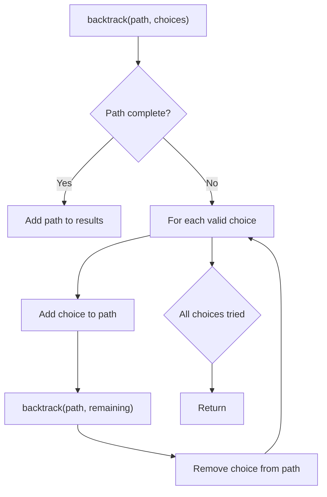
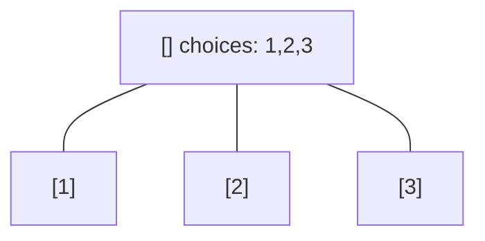
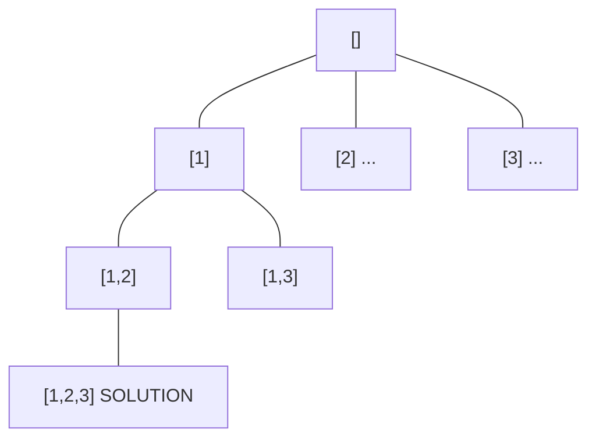
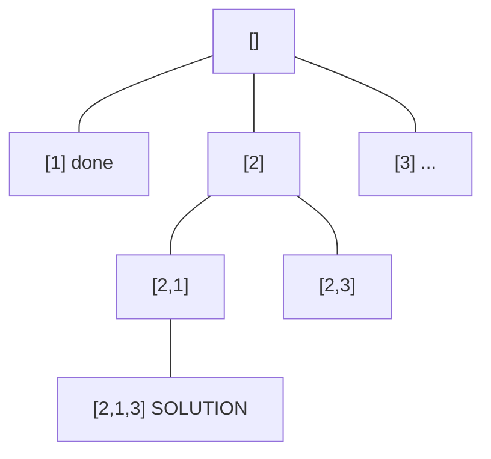
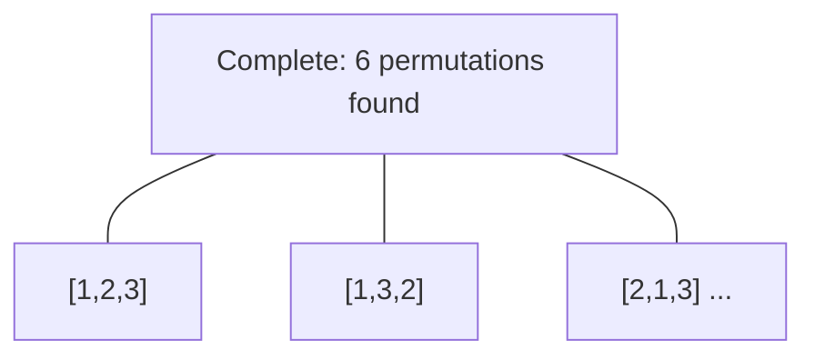

# Problem 1986: Minimum Number of Work Sessions to Finish the Tasks

**Difficulty:** Medium  
**Tags:** Array, Dynamic Programming, Backtracking, Bit Manipulation, Bitmask  
**Pattern:** Backtracking  
**Link:** [leetcode.com/problems/minimum-number-of-work-sessions-to-finish-the-tasks](https://leetcode.com/problems/minimum-number-of-work-sessions-to-finish-the-tasks/)

## Description

There are `n` tasks assigned to you. The task times are represented as an integer array `tasks` of length `n`, where the `i^th` task takes `tasks[i]` hours to finish. A **work session** is when you work for **at most** `sessionTime` consecutive hours and then take a break.

You should finish the given tasks in a way that satisfies the following conditions:

	- If you start a task in a work session, you must complete it in the **same** work session.
	- You can start a new task **immediately** after finishing the previous one.
	- You may complete the tasks in **any order**.

Given `tasks` and `sessionTime`, return *the **minimum** number of **work sessions** needed to finish all the tasks following the conditions above.*

The tests are generated such that `sessionTime` is **greater** than or **equal** to the **maximum** element in `tasks[i]`.

 

Example 1:

```

**Input:** tasks = [1,2,3], sessionTime = 3
**Output:** 2
**Explanation:** You can finish the tasks in two work sessions.
- First work session: finish the first and the second tasks in 1 + 2 = 3 hours.
- Second work session: finish the third task in 3 hours.

```

Example 2:

```

**Input:** tasks = [3,1,3,1,1], sessionTime = 8
**Output:** 2
**Explanation:** You can finish the tasks in two work sessions.
- First work session: finish all the tasks except the last one in 3 + 1 + 3 + 1 = 8 hours.
- Second work session: finish the last task in 1 hour.

```

Example 3:

```

**Input:** tasks = [1,2,3,4,5], sessionTime = 15
**Output:** 1
**Explanation:** You can finish all the tasks in one work session.

```

 

**Constraints:**

	- `n == tasks.length`
	- `1 <= n <= 14`
	- `1 <= tasks[i] <= 10`
	- `max(tasks[i]) <= sessionTime <= 15`

## Approach: Backtracking

Explore all possible solutions by building candidates incrementally. At each step, make a choice and recurse. If the choice leads to a dead end, undo the choice (backtrack) and try the next option.

## Pseudocode

```
1. Define backtrack(path, choices):
   a. If path is a complete solution: add to results
   b. For each choice in choices:
      - If choice is valid:
        * Add choice to path
        * backtrack(path, remaining_choices)
        * Remove choice from path (backtrack)
2. Call backtrack([], all_choices)
```

## Algorithm Flow



## Visual State Transitions

**Backtracking Decision Tree:**

**Frame 1: Root - start with empty path**


**Frame 2: Explore branch [1]**


**Frame 3: Backtrack, explore [2]**


**Frame 4: All solutions found**



## Complexity Analysis

- **Time:** O(k^n) or O(n!)
- **Space:** O(n)

## Solution (Python3)

```python
class Solution:
    def minSessions(self, tasks: List[int], sessionTime: int) -> int:
        # Backtracking - O(2^n) or O(n!) time
        result = []
        
        def backtrack(path, start):
            result.append(path[:])
            for i in range(start, len(tasks)):
                path.append(tasks[i])
                backtrack(path, i + 1)
                path.pop()
        
        backtrack([], 0)
        return result
```

## Solution (C++)

```cpp
#include <functional>
#include <string>
#include <vector>
using namespace std;

class Solution {
public:
    int minSessions(vector<int>& tasks, int sessionTime) {
        // Backtracking - O(2^n) or O(n!) time
        vector<vector<int>> result;
        vector<int> path;
        function<void(int)> backtrack = [&](int start) {
            result.push_back(path);
            for (int i = start; i < (int)tasks.size(); i++) {
                path.push_back(tasks[i]);
                backtrack(i + 1);
                path.pop_back();
            }
        };
        backtrack(0);
        return result;
    }
};
```
