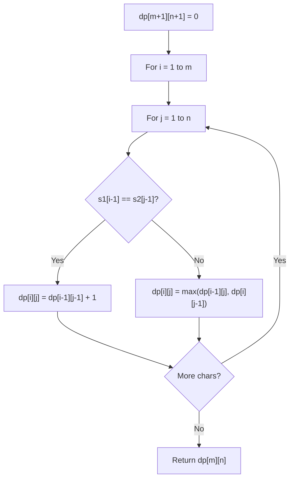

# Problem 1987: Number of Unique Good Subsequences

**Difficulty:** Hard  
**Tags:** String, Dynamic Programming  
**Pattern:** Dynamic Programming (String)  
**Link:** [leetcode.com/problems/number-of-unique-good-subsequences](https://leetcode.com/problems/number-of-unique-good-subsequences/)

## Description

You are given a binary string `binary`. A **subsequence** of `binary` is considered **good** if it is **not empty** and has **no leading zeros** (with the exception of `"0"`).

Find the number of **unique good subsequences** of `binary`.

	- For example, if `binary = "001"`, then all the **good** subsequences are `["0", "0", "1"]`, so the **unique** good subsequences are `"0"` and `"1"`. Note that subsequences `"00"`, `"01"`, and `"001"` are not good because they have leading zeros.

Return *the number of **unique good subsequences** of *`binary`. Since the answer may be very large, return it **modulo** `10^9 + 7`.

A **subsequence** is a sequence that can be derived from another sequence by deleting some or no elements without changing the order of the remaining elements.

 

Example 1:

```

**Input:** binary = "001"
**Output:** 2
**Explanation:** The good subsequences of binary are ["0", "0", "1"].
The unique good subsequences are "0" and "1".

```

Example 2:

```

**Input:** binary = "11"
**Output:** 2
**Explanation:** The good subsequences of binary are ["1", "1", "11"].
The unique good subsequences are "1" and "11".
```

Example 3:

```

**Input:** binary = "101"
**Output:** 5
**Explanation:** The good subsequences of binary are ["1", "0", "1", "10", "11", "101"]. 
The unique good subsequences are "0", "1", "10", "11", and "101".

```

 

**Constraints:**

	- `1 <= binary.length <= 10^5`
	- `binary` consists of only `'0'`s and `'1'`s.

## Approach: Dynamic Programming (String)

Compare or match two strings using a 2D DP table. dp[i][j] represents the answer for substrings s1[0..i-1] and s2[0..j-1]. Common patterns: LCS, edit distance, regex matching.

## Pseudocode

```
1. Create dp[m+1][n+1]
2. Initialize base cases
3. For i from 1 to m:
   For j from 1 to n:
     If s1[i-1] == s2[j-1]: dp[i][j] = dp[i-1][j-1] + 1
     Else: dp[i][j] = best of (dp[i-1][j], dp[i][j-1], dp[i-1][j-1])
4. Return dp[m][n]
```

## Algorithm Flow



## Complexity Analysis

- **Time:** O(m * n)
- **Space:** O(m * n)

## Solution (Python3)

```python
class Solution:
    def numberOfUniqueGoodSubsequences(self, binary: str) -> int:
        # String DP - O(m*n) time and space
        m, n = len(binary), len(binary)
        dp = [[0] * (n + 1) for _ in range(m + 1)]
        for i in range(1, m + 1):
            for j in range(1, n + 1):
                if binary[i-1] == binary[j-1]:
                    dp[i][j] = dp[i-1][j-1] + 1
                else:
                    dp[i][j] = max(dp[i-1][j], dp[i][j-1])
        return dp[m][n]
```

## Solution (C++)

```cpp
#include <algorithm>
#include <string>
#include <vector>
using namespace std;

class Solution {
public:
    int numberOfUniqueGoodSubsequences(string& binary) {
        // String DP - O(m*n) time and space
        int m = binary.size(), n = binary.size();
        vector<vector<int>> dp(m + 1, vector<int>(n + 1, 0));
        for (int i = 1; i <= m; i++) {
            for (int j = 1; j <= n; j++) {
                if (binary[i-1] == binary[j-1])
                    dp[i][j] = dp[i-1][j-1] + 1;
                else
                    dp[i][j] = max(dp[i-1][j], dp[i][j-1]);
            }
        }
        return dp[m][n];
    }
};
```
