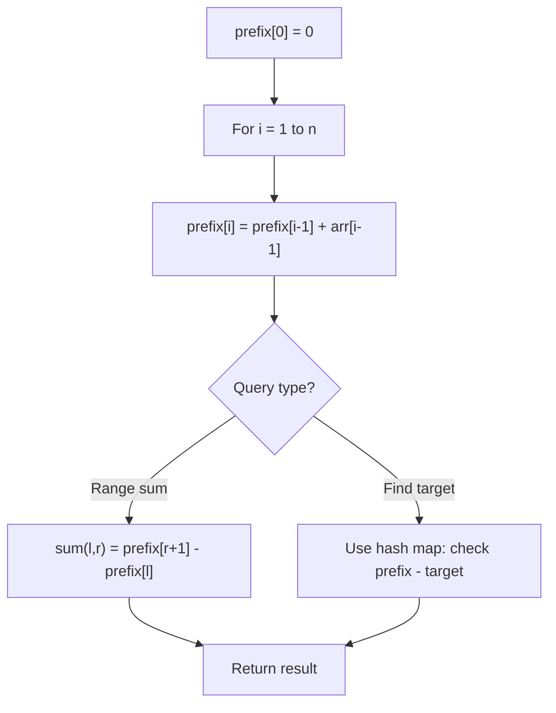

# Problem 1991: Find the Middle Index in Array

**Difficulty:** Easy  
**Tags:** Array, Prefix Sum  
**Pattern:** Prefix Sum  
**Link:** [leetcode.com/problems/find-the-middle-index-in-array](https://leetcode.com/problems/find-the-middle-index-in-array/)

## Description

Given a **0-indexed** integer array `nums`, find the **leftmost** `middleIndex` (i.e., the smallest amongst all the possible ones).

A `middleIndex` is an index where `nums[0] + nums[1] + ... + nums[middleIndex-1] == nums[middleIndex+1] + nums[middleIndex+2] + ... + nums[nums.length-1]`.

If `middleIndex == 0`, the left side sum is considered to be `0`. Similarly, if `middleIndex == nums.length - 1`, the right side sum is considered to be `0`.

Return *the **leftmost** *`middleIndex`* that satisfies the condition, or *`-1`* if there is no such index*.

 

Example 1:

```

**Input:** nums = [2,3,-1,8,4]
**Output:** 3
**Explanation:** The sum of the numbers before index 3 is: 2 + 3 + -1 = 4
The sum of the numbers after index 3 is: 4 = 4

```

Example 2:

```

**Input:** nums = [1,-1,4]
**Output:** 2
**Explanation:** The sum of the numbers before index 2 is: 1 + -1 = 0
The sum of the numbers after index 2 is: 0

```

Example 3:

```

**Input:** nums = [2,5]
**Output:** -1
**Explanation:** There is no valid middleIndex.

```

 

**Constraints:**

	- `1 <= nums.length <= 100`
	- `-1000 <= nums[i] <= 1000`

 

**Note:** This question is the same as 724: https://leetcode.com/problems/find-pivot-index/

## Approach: Prefix Sum

Build a prefix sum array where prefix[i] = sum of elements 0..i-1. Any subarray sum [l..r] = prefix[r+1] - prefix[l]. Combine with hash map for O(n) subarray sum queries.

## Pseudocode

```
1. Build prefix sum array: prefix[0]=0, prefix[i]=prefix[i-1]+arr[i-1]
2. Use prefix sums to answer queries:
   - Subarray sum [l..r] = prefix[r+1] - prefix[l]
   - Or use hash map to find prefix[j]-prefix[i] == target
3. Return result
```

## Algorithm Flow



## Complexity Analysis

- **Time:** O(n)
- **Space:** O(n)

## Solution (Python3)

```python
class Solution:
    def findMiddleIndex(self, nums: List[int]) -> int:
        # Prefix sum approach - O(n) time, O(n) space
        prefix = {0: -1}
        curr_sum = 0
        result = 0
        target = nums if isinstance(nums, int) else 0
        for i, val in enumerate(nums):
            curr_sum += val
            if curr_sum - target in prefix:
                result = max(result, i - prefix[curr_sum - target])
            if curr_sum not in prefix:
                prefix[curr_sum] = i
        return result
```

## Solution (C++)

```cpp
#include <algorithm>
#include <string>
#include <unordered_map>
#include <vector>
using namespace std;

class Solution {
public:
    int findMiddleIndex(vector<int>& nums) {
        // Prefix sum approach - O(n) time, O(n) space
        unordered_map<int, int> prefix;
        prefix[0] = -1;
        int curr_sum = 0, result = 0;
        int target = nums;
        for (int i = 0; i < (int)nums.size(); i++) {
            curr_sum += nums[i];
            if (prefix.count(curr_sum - target)) {
                result = max(result, i - prefix[curr_sum - target]);
            }
            if (!prefix.count(curr_sum)) {
                prefix[curr_sum] = i;
            }
        }
        return result;
    }
};
```
