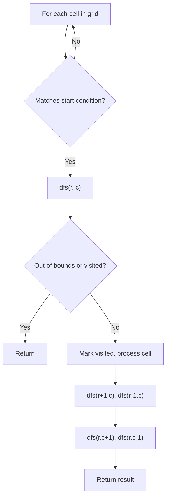
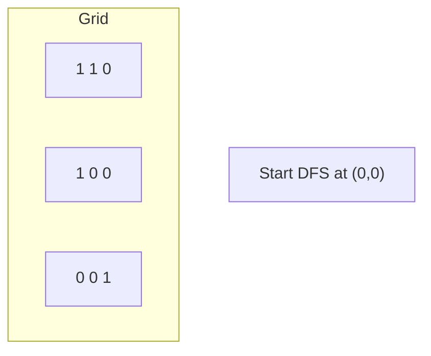
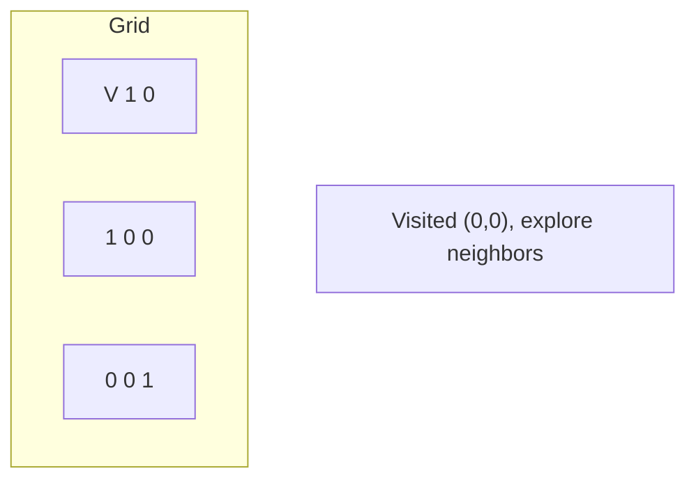
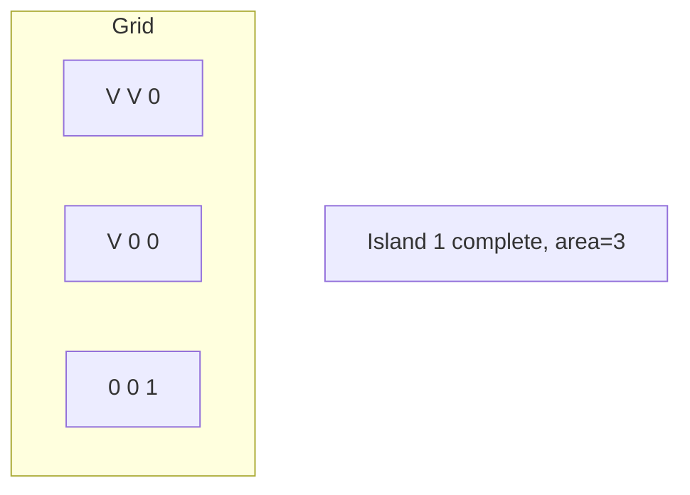
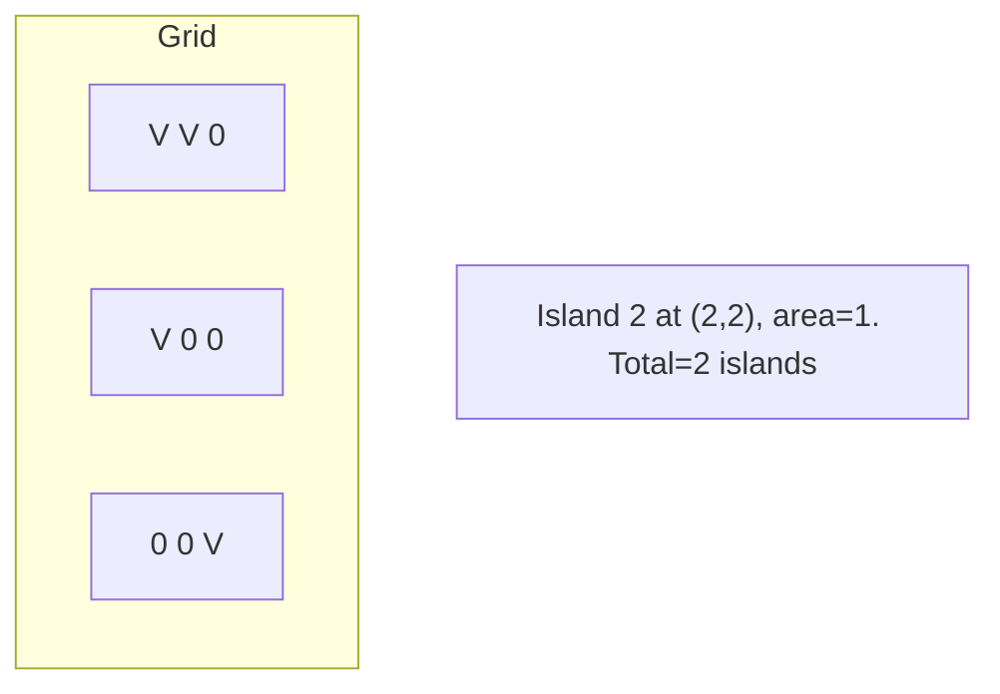

# Problem 1992: Find All Groups of Farmland

**Difficulty:** Medium  
**Tags:** Array, Depth-First Search, Breadth-First Search, Matrix  
**Pattern:** DFS on Matrix / Grid  
**Link:** [leetcode.com/problems/find-all-groups-of-farmland](https://leetcode.com/problems/find-all-groups-of-farmland/)

## Description

You are given a **0-indexed** `m x n` binary matrix `land` where a `0` represents a hectare of forested land and a `1` represents a hectare of farmland.

To keep the land organized, there are designated rectangular areas of hectares that consist **entirely** of farmland. These rectangular areas are called **groups**. No two groups are adjacent, meaning farmland in one group is **not** four-directionally adjacent to another farmland in a different group.

`land` can be represented by a coordinate system where the top left corner of `land` is `(0, 0)` and the bottom right corner of `land` is `(m-1, n-1)`. Find the coordinates of the top left and bottom right corner of each **group** of farmland. A **group** of farmland with a top left corner at `(r1, c1)` and a bottom right corner at `(r2, c2)` is represented by the 4-length array `[r1, c1, r2, c2].`

Return *a 2D array containing the 4-length arrays described above for each **group** of farmland in *`land`*. If there are no groups of farmland, return an empty array. You may return the answer in **any order***.

 

Example 1:

```

**Input:** land = [[1,0,0],[0,1,1],[0,1,1]]
**Output:** [[0,0,0,0],[1,1,2,2]]
**Explanation:**
The first group has a top left corner at land[0][0] and a bottom right corner at land[0][0].
The second group has a top left corner at land[1][1] and a bottom right corner at land[2][2].

```

Example 2:

```

**Input:** land = [[1,1],[1,1]]
**Output:** [[0,0,1,1]]
**Explanation:**
The first group has a top left corner at land[0][0] and a bottom right corner at land[1][1].

```

Example 3:

```

**Input:** land = [[0]]
**Output:** []
**Explanation:**
There are no groups of farmland.

```

 

**Constraints:**

	- `m == land.length`
	- `n == land[i].length`
	- `1 <= m, n <= 300`
	- `land` consists of only `0`'s and `1`'s.
	- Groups of farmland are **rectangular** in shape.

## Approach: DFS on Matrix / Grid

Treat the grid as a graph where each cell connects to its 4 (or 8) neighbors. DFS from target cells, marking visited to avoid revisiting.

## Pseudocode

```
1. For each cell (r, c) in grid:
   a. If cell meets start condition:
      - Call dfs(r, c)
2. dfs(r, c):
   a. If out of bounds or visited or invalid: return
   b. Mark cell visited
   c. Recurse on 4 neighbors: up, down, left, right
3. Return result
```

## Algorithm Flow



## Visual State Transitions

**DFS on Grid (Island/Flood Fill):**

**Frame 1: Find first land cell**


**Frame 2: DFS explores connected cells**


**Frame 3: Mark entire island**


**Frame 4: Find second island**



## Complexity Analysis

- **Time:** O(m * n)
- **Space:** O(m * n)

## Solution (Python3)

```python
class Solution:
    def findFarmland(self, land: List[List[int]]) -> List[List[int]]:
        # DFS on grid - O(m*n) time
        if not land:
            return 0
        rows, cols = len(land), len(land[0])
        count = 0
        
        def dfs(r, c):
            if r < 0 or r >= rows or c < 0 or c >= cols:
                return
            if land[r][c] == '0' or land[r][c] == 0:
                return
            land[r][c] = '0'
            dfs(r+1, c); dfs(r-1, c)
            dfs(r, c+1); dfs(r, c-1)
        
        for r in range(rows):
            for c in range(cols):
                if land[r][c] == '1' or land[r][c] == 1:
                    dfs(r, c)
                    count += 1
        return count
```

## Solution (C++)

```cpp
#include <functional>
#include <string>
#include <vector>
using namespace std;

class Solution {
public:
    vector<vector<int>> findFarmland(vector<vector<int>>& land) {
        // DFS on grid - O(m*n) time
        if (land.empty()) return 0;
        int rows = land.size(), cols = land[0].size();
        int count = 0;
        function<void(int, int)> dfs = [&](int r, int c) {
            if (r < 0 || r >= rows || c < 0 || c >= cols) return;
            if (land[r][c] == '0') return;
            land[r][c] = '0';
            dfs(r+1, c); dfs(r-1, c);
            dfs(r, c+1); dfs(r, c-1);
        };
        for (int r = 0; r < rows; r++) {
            for (int c = 0; c < cols; c++) {
                if (land[r][c] == '1') {
                    dfs(r, c);
                    count++;
                }
            }
        }
        return count;
    }
};
```
