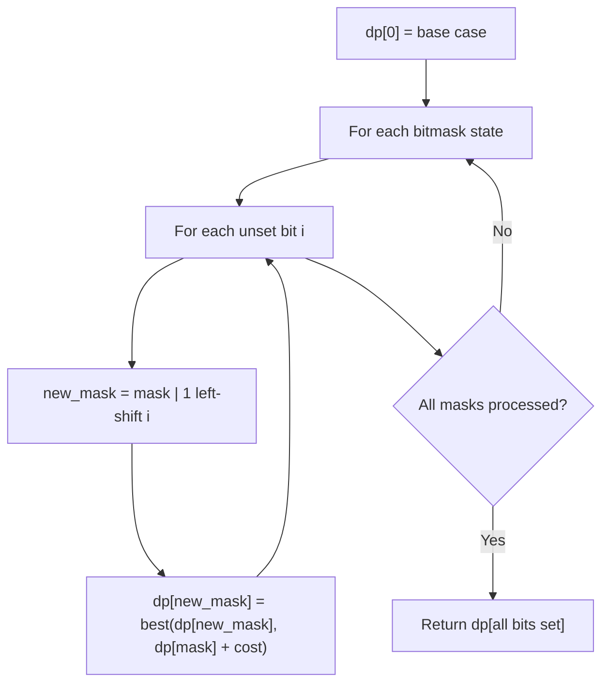

# Problem 1994: The Number of Good Subsets

**Difficulty:** Hard  
**Tags:** Array, Hash Table, Math, Dynamic Programming, Bit Manipulation, Counting, Number Theory, Bitmask  
**Pattern:** Dynamic Programming (Bitmask)  
**Link:** [leetcode.com/problems/the-number-of-good-subsets](https://leetcode.com/problems/the-number-of-good-subsets/)

## Description

You are given an integer array `nums`. We call a subset of `nums` **good** if its product can be represented as a product of one or more **distinct prime** numbers.

	- For example, if `nums = [1, 2, 3, 4]`:

	
		`[2, 3]`, `[1, 2, 3]`, and `[1, 3]` are **good** subsets with products `6 = 2*3`, `6 = 2*3`, and `3 = 3` respectively.
		- `[1, 4]` and `[4]` are not **good** subsets with products `4 = 2*2` and `4 = 2*2` respectively.
	
	

Return *the number of different **good** subsets in *`nums`* **modulo** *`10^9 + 7`.

A **subset** of `nums` is any array that can be obtained by deleting some (possibly none or all) elements from `nums`. Two subsets are different if and only if the chosen indices to delete are different.

 

Example 1:

```

**Input:** nums = [1,2,3,4]
**Output:** 6
**Explanation:** The good subsets are:
- [1,2]: product is 2, which is the product of distinct prime 2.
- [1,2,3]: product is 6, which is the product of distinct primes 2 and 3.
- [1,3]: product is 3, which is the product of distinct prime 3.
- [2]: product is 2, which is the product of distinct prime 2.
- [2,3]: product is 6, which is the product of distinct primes 2 and 3.
- [3]: product is 3, which is the product of distinct prime 3.

```

Example 2:

```

**Input:** nums = [4,2,3,15]
**Output:** 5
**Explanation:** The good subsets are:
- [2]: product is 2, which is the product of distinct prime 2.
- [2,3]: product is 6, which is the product of distinct primes 2 and 3.
- [2,15]: product is 30, which is the product of distinct primes 2, 3, and 5.
- [3]: product is 3, which is the product of distinct prime 3.
- [15]: product is 15, which is the product of distinct primes 3 and 5.

```

 

**Constraints:**

	- `1 <= nums.length <= 10^5`
	- `1 <= nums[i] <= 30`

## Approach: Dynamic Programming (Bitmask)

Use bitmask to represent subsets of n elements. dp[mask] = optimal value when the selected subset is represented by mask. Iterate over all masks and transitions.

## Pseudocode

```
1. dp[0] = base case
2. For mask from 0 to 2^n - 1:
   a. For each bit i not set in mask:
      - new_mask = mask | (1 << i)
      - dp[new_mask] = best of dp[new_mask], dp[mask] + cost(i)
3. Return dp[(1 << n) - 1]
```

## Algorithm Flow



## Complexity Analysis

- **Time:** O(2^n * n)
- **Space:** O(2^n)

## Solution (Python3)

```python
class Solution:
    def numberOfGoodSubsets(self, nums: List[int]) -> int:
        # Bitmask DP - O(2^n * n) time
        n = len(nums)
        dp = [float('inf')] * (1 << n)
        dp[0] = 0
        for mask in range(1 << n):
            bits = bin(mask).count('1')
            for i in range(n):
                if mask & (1 << i):
                    continue
                new_mask = mask | (1 << i)
                dp[new_mask] = min(dp[new_mask], dp[mask] + 1)
        return dp[(1 << n) - 1]
```

## Solution (C++)

```cpp
#include <algorithm>
#include <climits>
#include <string>
#include <vector>
using namespace std;

class Solution {
public:
    int numberOfGoodSubsets(vector<int>& nums) {
        // Bitmask DP - O(2^n * n) time
        int n = nums.size();
        vector<int> dp(1 << n, INT_MAX);
        dp[0] = 0;
        for (int mask = 0; mask < (1 << n); mask++) {
            for (int i = 0; i < n; i++) {
                if (mask & (1 << i)) continue;
                int new_mask = mask | (1 << i);
                dp[new_mask] = min(dp[new_mask], dp[mask] + 1);
            }
        }
        return dp[(1 << n) - 1];
    }
};
```
