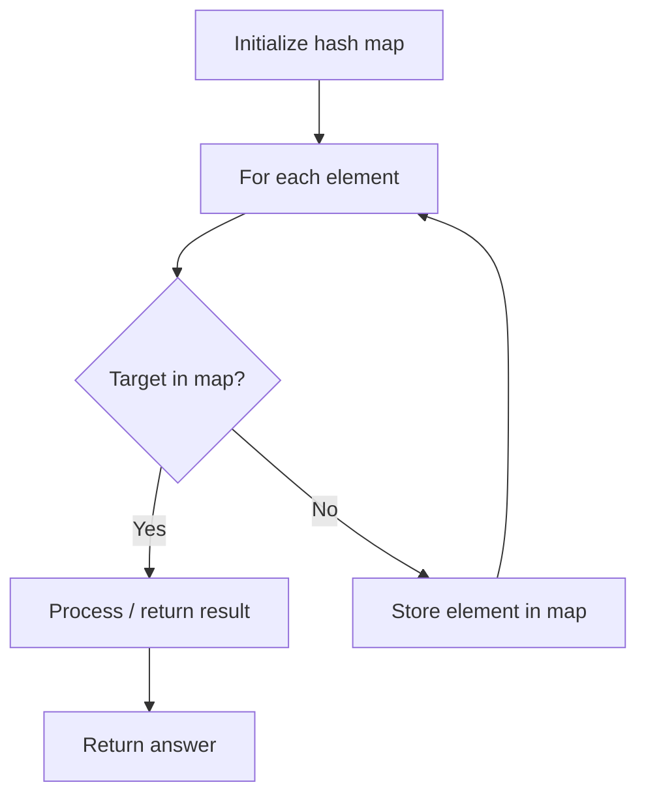

# Problem 1995: Count Special Quadruplets

**Difficulty:** Easy  
**Tags:** Array, Hash Table, Enumeration  
**Pattern:** Hash Map Lookup  
**Link:** [leetcode.com/problems/count-special-quadruplets](https://leetcode.com/problems/count-special-quadruplets/)

## Description

Given a **0-indexed** integer array `nums`, return *the number of **distinct** quadruplets* `(a, b, c, d)` *such that:*

	- `nums[a] + nums[b] + nums[c] == nums[d]`, and
	- `a < b < c < d`

 

Example 1:

```

**Input:** nums = [1,2,3,6]
**Output:** 1
**Explanation:** The only quadruplet that satisfies the requirement is (0, 1, 2, 3) because 1 + 2 + 3 == 6.

```

Example 2:

```

**Input:** nums = [3,3,6,4,5]
**Output:** 0
**Explanation:** There are no such quadruplets in [3,3,6,4,5].

```

Example 3:

```

**Input:** nums = [1,1,1,3,5]
**Output:** 4
**Explanation:** The 4 quadruplets that satisfy the requirement are:
- (0, 1, 2, 3): 1 + 1 + 1 == 3
- (0, 1, 3, 4): 1 + 1 + 3 == 5
- (0, 2, 3, 4): 1 + 1 + 3 == 5
- (1, 2, 3, 4): 1 + 1 + 3 == 5

```

 

**Constraints:**

	- `4 <= nums.length <= 50`
	- `1 <= nums[i] <= 100`

## Approach: Hash Map Lookup

Use a hash map (dictionary) to store elements for O(1) lookup. Iterate through the input, checking membership or counting frequencies in the map.

## Pseudocode

```
1. Initialize hash map
2. Iterate through elements:
   a. Check if target/complement exists in map
   b. If found: process result
   c. Otherwise: store element in map
3. Return result
```

## Algorithm Flow



## Complexity Analysis

- **Time:** O(n)
- **Space:** O(n)

## Solution (Python3)

```python
class Solution:
    def countQuadruplets(self, nums: List[int]) -> int:
        # Hash map approach - O(n) time, O(n) space
        seen = {}
        for i, val in enumerate(nums):
            complement = nums - val
            if complement in seen:
                return [seen[complement], i]
            seen[val] = i
        return 0
```

## Solution (C++)

```cpp
#include <string>
#include <unordered_map>
#include <vector>
using namespace std;

class Solution {
public:
    int countQuadruplets(vector<int>& nums) {
        // Hash map approach - O(n) time, O(n) space
        unordered_map<int, int> seen;
        for (int i = 0; i < nums.size(); i++) {
            int complement = nums - nums[i];
            if (seen.count(complement)) {
                return {seen[complement], i};
            }
            seen[nums[i]] = i;
        }
        return 0;
    }
};
```
