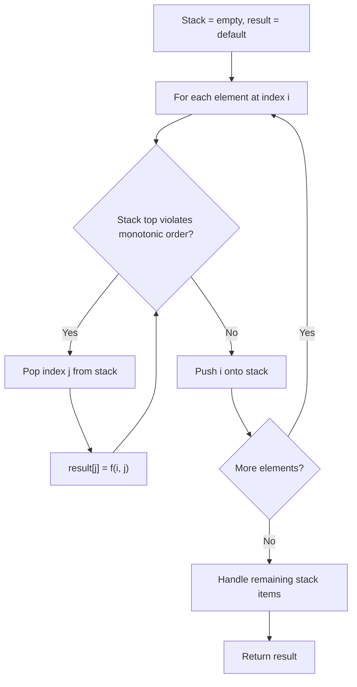
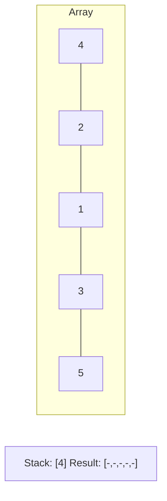
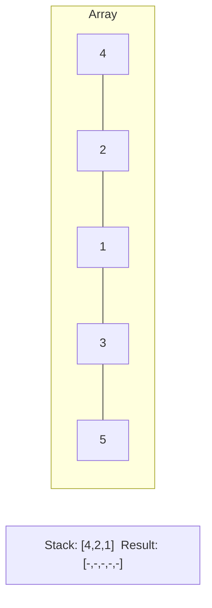
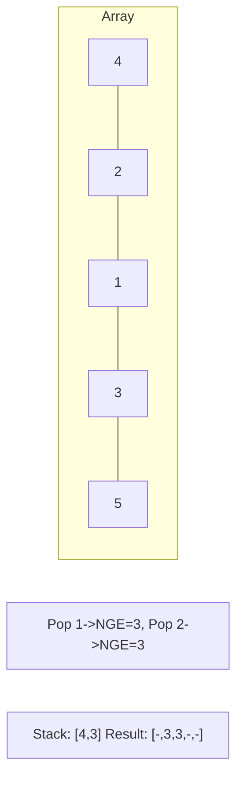
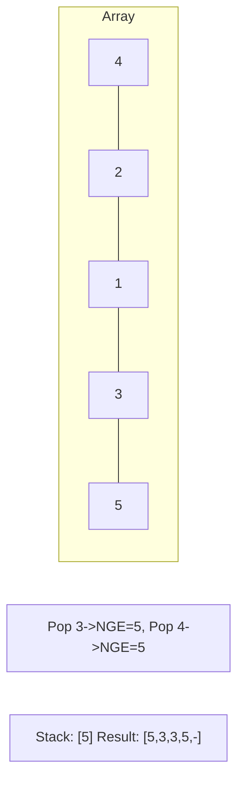

# Problem 1996: The Number of Weak Characters in the Game

**Difficulty:** Medium  
**Tags:** Array, Stack, Greedy, Sorting, Monotonic Stack  
**Pattern:** Monotonic Stack  
**Link:** [leetcode.com/problems/the-number-of-weak-characters-in-the-game](https://leetcode.com/problems/the-number-of-weak-characters-in-the-game/)

## Description

You are playing a game that contains multiple characters, and each of the characters has **two** main properties: **attack** and **defense**. You are given a 2D integer array `properties` where `properties[i] = [attacki, defensei]` represents the properties of the `i^th` character in the game.

A character is said to be **weak** if any other character has **both** attack and defense levels **strictly greater** than this character's attack and defense levels. More formally, a character `i` is said to be **weak** if there exists another character `j` where `attackj > attacki` and `defensej > defensei`.

Return *the number of **weak** characters*.

 

Example 1:

```

**Input:** properties = [[5,5],[6,3],[3,6]]
**Output:** 0
**Explanation:** No character has strictly greater attack and defense than the other.

```

Example 2:

```

**Input:** properties = [[2,2],[3,3]]
**Output:** 1
**Explanation:** The first character is weak because the second character has a strictly greater attack and defense.

```

Example 3:

```

**Input:** properties = [[1,5],[10,4],[4,3]]
**Output:** 1
**Explanation:** The third character is weak because the second character has a strictly greater attack and defense.

```

 

**Constraints:**

	- `2 <= properties.length <= 10^5`
	- `properties[i].length == 2`
	- `1 <= attacki, defensei <= 10^5`

## Approach: Monotonic Stack

Maintain a stack where elements are always in monotonic order (increasing or decreasing). When a new element violates the monotonic property, pop elements and compute results (e.g., next greater/smaller element, spans, areas).

## Pseudocode

```
1. Initialize empty stack, result array
2. For each element (index i):
   a. While stack not empty and arr[i] breaks monotonic order:
      - Pop index j from stack
      - result[j] = compute(i, j)
   b. Push i onto stack
3. Handle remaining elements in stack
4. Return result
```

## Algorithm Flow



## Visual State Transitions

**Monotonic Stack (Next Greater Element):**

**Frame 1: Process first elements**


**Frame 2: Push smaller elements**


**Frame 3: Element 3 pops 1 and 2**


**Frame 4: Element 5 pops all**



## Complexity Analysis

- **Time:** O(n)
- **Space:** O(n)

## Solution (Python3)

```python
class Solution:
    def numberOfWeakCharacters(self, properties: List[List[int]]) -> int:
        # Monotonic stack - O(n) time, O(n) space
        n = len(properties)
        result = [0] * n
        stack = []  # indices
        for i in range(n):
            while stack and properties[i] > properties[stack[-1]]:
                idx = stack.pop()
                result[idx] = i - idx
            stack.append(i)
        return result
```

## Solution (C++)

```cpp
#include <stack>
#include <string>
#include <vector>
using namespace std;

class Solution {
public:
    int numberOfWeakCharacters(vector<vector<int>>& properties) {
        // Monotonic stack - O(n) time, O(n) space
        int n = properties.size();
        vector<int> result(n, 0);
        stack<int> st;
        for (int i = 0; i < n; i++) {
            while (!st.empty() && properties[i] > properties[st.top()]) {
                int idx = st.top(); st.pop();
                result[idx] = i - idx;
            }
            st.push(i);
        }
        return result;
    }
};
```
