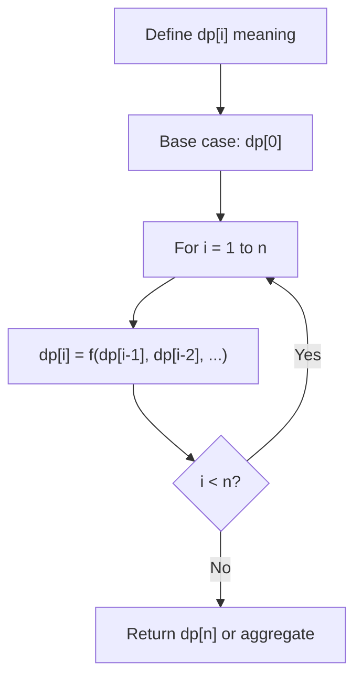
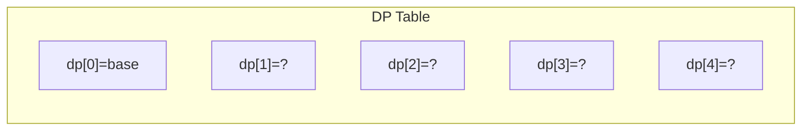
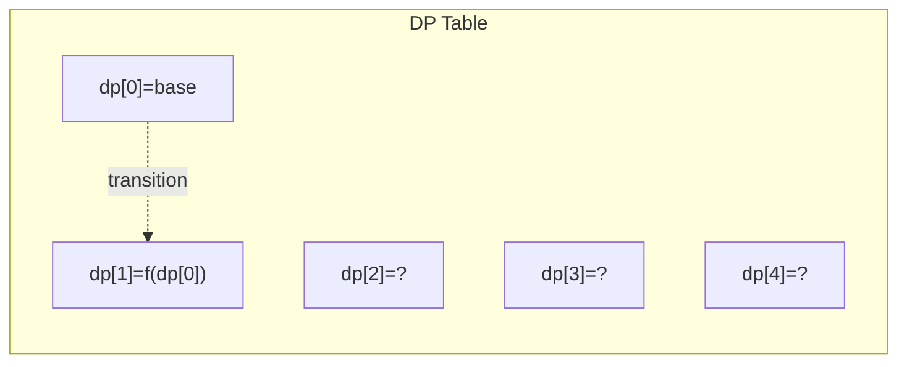
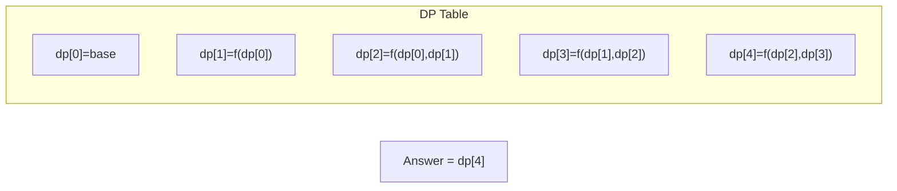

# Problem 1997: First Day Where You Have Been in All the Rooms

**Difficulty:** Medium  
**Tags:** Array, Dynamic Programming  
**Pattern:** Dynamic Programming (1D)  
**Link:** [leetcode.com/problems/first-day-where-you-have-been-in-all-the-rooms](https://leetcode.com/problems/first-day-where-you-have-been-in-all-the-rooms/)

## Description

There are `n` rooms you need to visit, labeled from `0` to `n - 1`. Each day is labeled, starting from `0`. You will go in and visit one room a day.

Initially on day `0`, you visit room `0`. The **order** you visit the rooms for the coming days is determined by the following **rules** and a given **0-indexed** array `nextVisit` of length `n`:

	- Assuming that on a day, you visit room `i`,
	- if you have been in room `i` an **odd** number of times (**including** the current visit), on the **next** day you will visit a room with a **lower or equal room number** specified by `nextVisit[i]` where `0 <= nextVisit[i] <= i`;
	- if you have been in room `i` an **even** number of times (**including** the current visit), on the **next** day you will visit room `(i + 1) mod n`.

Return *the label of the **first** day where you have been in **all** the rooms*. It can be shown that such a day exists. Since the answer may be very large, return it **modulo** `10^9 + 7`.

 

Example 1:

```

**Input:** nextVisit = [0,0]
**Output:** 2
**Explanation:**
- On day 0, you visit room 0. The total times you have been in room 0 is 1, which is odd.
  On the next day you will visit room nextVisit[0] = 0
- On day 1, you visit room 0, The total times you have been in room 0 is 2, which is even.
  On the next day you will visit room (0 + 1) mod 2 = 1
- On day 2, you visit room 1. This is the first day where you have been in all the rooms.

```

Example 2:

```

**Input:** nextVisit = [0,0,2]
**Output:** 6
**Explanation:**
Your room visiting order for each day is: [0,0,1,0,0,1,2,...].
Day 6 is the first day where you have been in all the rooms.

```

Example 3:

```

**Input:** nextVisit = [0,1,2,0]
**Output:** 6
**Explanation:**
Your room visiting order for each day is: [0,0,1,1,2,2,3,...].
Day 6 is the first day where you have been in all the rooms.

```

 

**Constraints:**

	- `n == nextVisit.length`
	- `2 <= n <= 10^5`
	- `0 <= nextVisit[i] <= i`

## Approach: Dynamic Programming (1D)

Break the problem into overlapping subproblems. Define dp[i] as the optimal value for the subproblem ending at or considering index i. Build the solution bottom-up, using previously computed dp values.

## Pseudocode

```
1. Define dp[i] = optimal value for subproblem i
2. Base case: dp[0] = initial value
3. For i from 1 to n:
   a. dp[i] = recurrence(dp[i-1], dp[i-2], ...)
4. Return dp[n] or max/min of dp
```

## Algorithm Flow



## Visual State Transitions

**1D Dynamic Programming Table Build:**

**Frame 1: Initialize base cases**


**Frame 2: Fill dp[1] from dp[0]**


**Frame 3: Fill remaining cells**



## Complexity Analysis

- **Time:** O(n)
- **Space:** O(n)

## Solution (Python3)

```python
class Solution:
    def firstDayBeenInAllRooms(self, nextVisit: List[int]) -> int:
        # Dynamic programming (1D) - O(n) time, O(n) space
        if not nextVisit:
            return 0
        n = len(nextVisit) if isinstance(nextVisit, list) else nextVisit
        dp = [0] * (n + 1)
        dp[0] = 1  # base case
        for i in range(1, n + 1):
            dp[i] = dp[i-1]  # transition (customize per problem)
            if i >= 2:
                dp[i] += dp[i-2]
        return dp[n]
```

## Solution (C++)

```cpp
#include <string>
#include <vector>
using namespace std;

class Solution {
public:
    int firstDayBeenInAllRooms(vector<int>& nextVisit) {
        // Dynamic programming (1D) - O(n) time, O(n) space
        int n = nextVisit;
        if (n <= 0) return 0;
        vector<int> dp(n + 1, 0);
        dp[0] = 1;
        for (int i = 1; i <= n; i++) {
            dp[i] = dp[i-1];
            if (i >= 2) dp[i] += dp[i-2];
        }
        return dp[n];
    }
};
```
