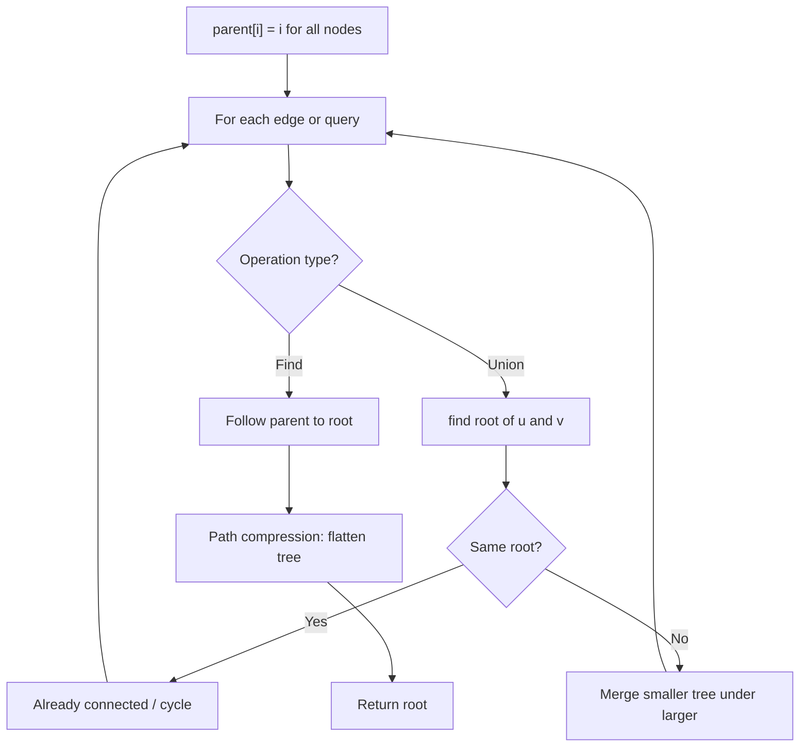
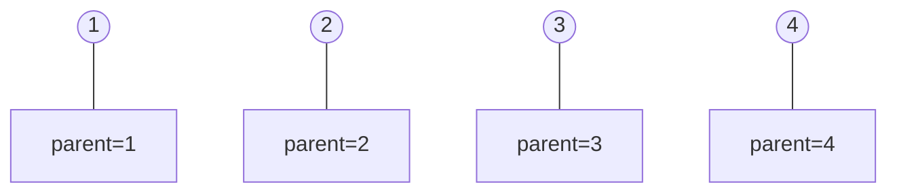
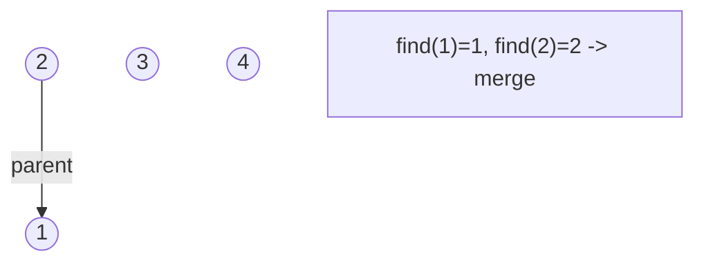
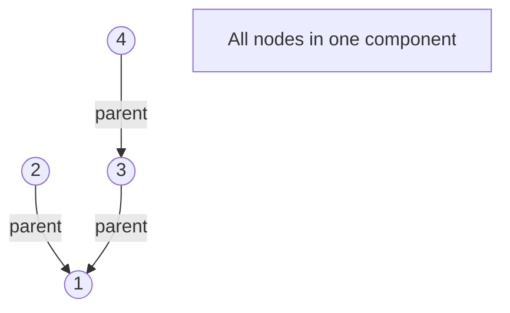
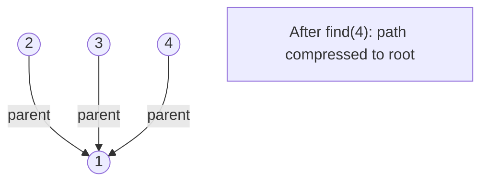

# Problem 1998: GCD Sort of an Array

**Difficulty:** Hard  
**Tags:** Array, Math, Union-Find, Sorting, Number Theory  
**Pattern:** Union-Find / Disjoint Set  
**Link:** [leetcode.com/problems/gcd-sort-of-an-array](https://leetcode.com/problems/gcd-sort-of-an-array/)

## Description

You are given an integer array `nums`, and you can perform the following operation **any** number of times on `nums`:

	- Swap the positions of two elements `nums[i]` and `nums[j]` if `gcd(nums[i], nums[j]) > 1` where `gcd(nums[i], nums[j])` is the **greatest common divisor** of `nums[i]` and `nums[j]`.

Return `true` *if it is possible to sort *`nums`* in **non-decreasing** order using the above swap method, or *`false`* otherwise.*

 

Example 1:

```

**Input:** nums = [7,21,3]
**Output:** true
**Explanation:** We can sort [7,21,3] by performing the following operations:
- Swap 7 and 21 because gcd(7,21) = 7. nums = [**21**,**7**,3]
- Swap 21 and 3 because gcd(21,3) = 3. nums = [**3**,7,**21**]

```

Example 2:

```

**Input:** nums = [5,2,6,2]
**Output:** false
**Explanation:** It is impossible to sort the array because 5 cannot be swapped with any other element.

```

Example 3:

```

**Input:** nums = [10,5,9,3,15]
**Output:** true
We can sort [10,5,9,3,15] by performing the following operations:
- Swap 10 and 15 because gcd(10,15) = 5. nums = [**15**,5,9,3,**10**]
- Swap 15 and 3 because gcd(15,3) = 3. nums = [**3**,5,9,**15**,10]
- Swap 10 and 15 because gcd(10,15) = 5. nums = [3,5,9,**10**,**15**]

```

 

**Constraints:**

	- `1 <= nums.length <= 3 * 10^4`
	- `2 <= nums[i] <= 10^5`

## Approach: Union-Find / Disjoint Set

Use Union-Find with path compression and union by rank to efficiently manage connected components. Find(x) returns the root of x's component; Union(x,y) merges two components.

## Pseudocode

```
1. parent[i] = i for all nodes (each is its own set)
2. find(x): follow parent pointers to root (with path compression)
3. union(x, y): merge sets of x and y by rank
4. Process edges/operations:
   a. For each edge (u, v): union(u, v)
5. Answer queries using find()
```

## Algorithm Flow



## Visual State Transitions

**Union-Find Step-by-Step:**

**Frame 1: Initial - each node is own parent**


**Frame 2: Union(1,2) - merge components**


**Frame 3: Union(3,4) then Union(2,3)**


**Frame 4: Path compression on find(4)**



## Complexity Analysis

- **Time:** O(n * alpha(n))
- **Space:** O(n)

## Solution (Python3)

```python
class Solution:
    def gcdSort(self, nums: List[int]) -> bool:
        # Union Find (Disjoint Set Union) - O(n * alpha(n))
        parent = list(range(len(nums) + 1 if isinstance(nums, list) else nums + 1))
        rank = [0] * len(parent)
        
        def find(x):
            if parent[x] != x:
                parent[x] = find(parent[x])
            return parent[x]
        
        def union(x, y):
            px, py = find(x), find(y)
            if px == py:
                return False
            if rank[px] < rank[py]:
                px, py = py, px
            parent[py] = px
            if rank[px] == rank[py]:
                rank[px] += 1
            return True
        
        components = len(parent)
        # Process edges/connections
        return components
```

## Solution (C++)

```cpp
#include <functional>
#include <numeric>
#include <string>
#include <vector>
using namespace std;

class Solution {
public:
    bool gcdSort(vector<int>& nums) {
        // Union Find (DSU) - O(n * alpha(n))
        int n = nums.size();
        vector<int> parent(n + 1), rnk(n + 1, 0);
        iota(parent.begin(), parent.end(), 0);
        function<int(int)> find = [&](int x) -> int {
            return parent[x] == x ? x : parent[x] = find(parent[x]);
        };
        auto unite = [&](int x, int y) -> bool {
            int px = find(x), py = find(y);
            if (px == py) return false;
            if (rnk[px] < rnk[py]) swap(px, py);
            parent[py] = px;
            if (rnk[px] == rnk[py]) rnk[px]++;
            return true;
        };
        int components = n;
        return components;
    }
};
```
