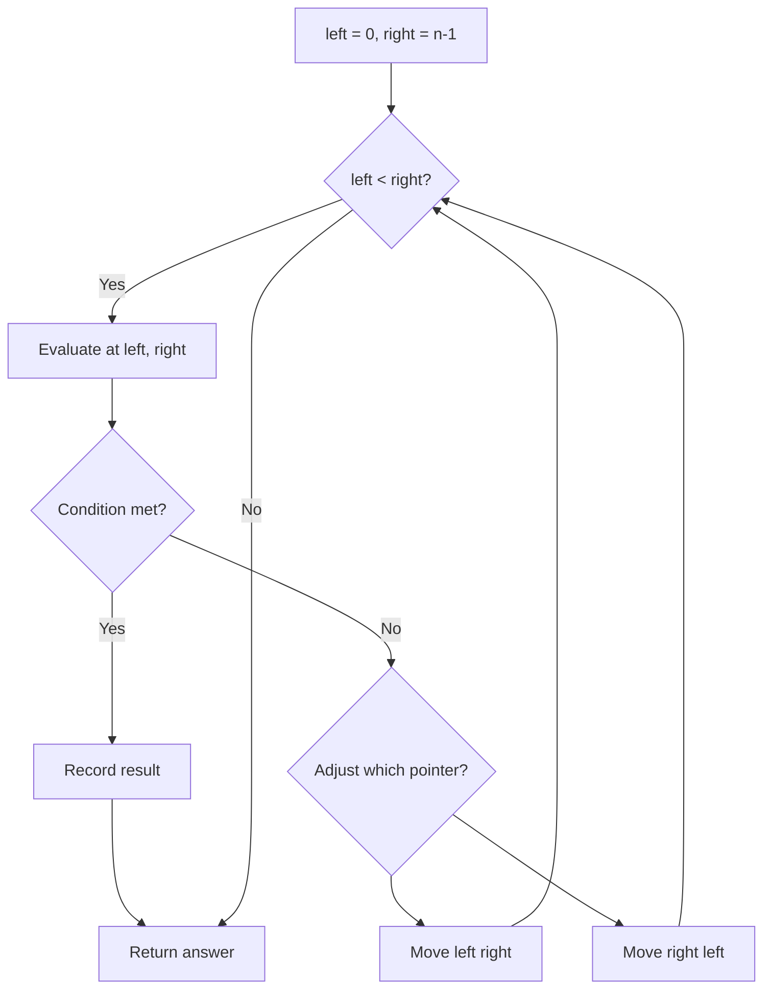
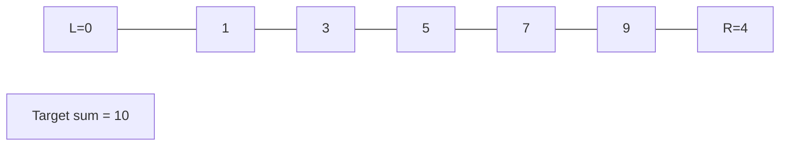
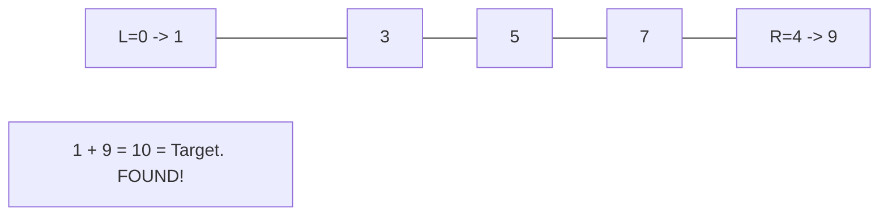

# Problem 2000: Reverse Prefix of Word

**Difficulty:** Easy  
**Tags:** Two Pointers, String, Stack  
**Pattern:** Two Pointers  
**Link:** [leetcode.com/problems/reverse-prefix-of-word](https://leetcode.com/problems/reverse-prefix-of-word/)

## Description

Given a **0-indexed** string `word` and a character `ch`, **reverse** the segment of `word` that starts at index `0` and ends at the index of the **first occurrence** of `ch` (**inclusive**). If the character `ch` does not exist in `word`, do nothing.

	- For example, if `word = "abcdefd"` and `ch = "d"`, then you should **reverse** the segment that starts at `0` and ends at `3` (**inclusive**). The resulting string will be `"dcbaefd"`.

Return *the resulting string*.

 

Example 1:

```

**Input:** word = "abcdefd", ch = "d"
**Output:** "dcbaefd"
**Explanation:** The first occurrence of "d" is at index 3. 
Reverse the part of word from 0 to 3 (inclusive), the resulting string is "dcbaefd".

```

Example 2:

```

**Input:** word = "xyxzxe", ch = "z"
**Output:** "zxyxxe"
**Explanation:** The first and only occurrence of "z" is at index 3.
Reverse the part of word from 0 to 3 (inclusive), the resulting string is "zxyxxe".

```

Example 3:

```

**Input:** word = "abcd", ch = "z"
**Output:** "abcd"
**Explanation:** "z" does not exist in word.
You should not do any reverse operation, the resulting string is "abcd".

```

 

**Constraints:**

	- `1 <= word.length <= 250`
	- `word` consists of lowercase English letters.
	- `ch` is a lowercase English letter.

## Approach: Two Pointers

Use two pointers moving through the data structure. Depending on the problem, pointers may move toward each other (converging), in the same direction (fast/slow), or independently.

## Pseudocode

```
1. Initialize left = 0, right = n-1 (or two independent pointers)
2. While pointers haven't crossed:
   a. Evaluate condition at pointer positions
   b. Move left pointer right or right pointer left
3. Return result
```

## Algorithm Flow



## Visual State Transitions

**Two Pointer Convergence:**

**Frame 1: Initialize pointers**


**Frame 2: Sum = 1+9 = 10, found!**



## Complexity Analysis

- **Time:** O(n)
- **Space:** O(1)

## Solution (Python3)

```python
class Solution:
    def reversePrefix(self, word: str, ch: str) -> str:
        # Two pointer approach - O(n) time, O(1) space
        left, right = 0, len(word) - 1
        while left < right:
            curr = word[left] + word[right]
            if curr == ch:
                return [left, right]
            elif curr < ch:
                left += 1
            else:
                right -= 1
        return ""
```

## Solution (C++)

```cpp
#include <string>
#include <vector>
using namespace std;

class Solution {
public:
    string reversePrefix(string& word, string& ch) {
        // Two pointer approach - O(n) time, O(1) space
        int left = 0, right = word.size() - 1;
        while (left < right) {
            int curr = word[left] + word[right];
            if (curr == ch) {
                return {left, right};
            } else if (curr < ch) {
                left++;
            } else {
                right--;
            }
        }
        return "";
    }
};
```
