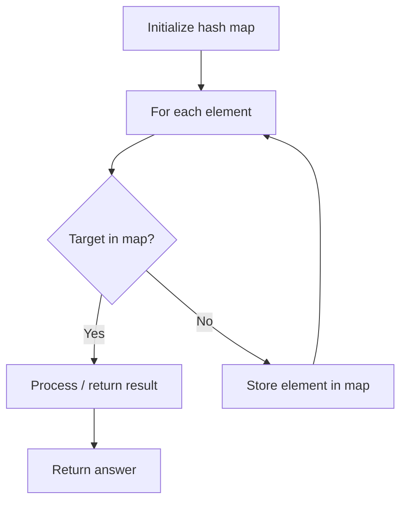

# Problem 2001: Number of Pairs of Interchangeable Rectangles

**Difficulty:** Medium  
**Tags:** Array, Hash Table, Math, Counting, Number Theory  
**Pattern:** Hash Map Lookup  
**Link:** [leetcode.com/problems/number-of-pairs-of-interchangeable-rectangles](https://leetcode.com/problems/number-of-pairs-of-interchangeable-rectangles/)

## Description

You are given `n` rectangles represented by a **0-indexed** 2D integer array `rectangles`, where `rectangles[i] = [widthi, heighti]` denotes the width and height of the `i^th` rectangle.

Two rectangles `i` and `j` (`i < j`) are considered **interchangeable** if they have the **same** width-to-height ratio. More formally, two rectangles are **interchangeable** if `widthi/heighti == widthj/heightj` (using decimal division, not integer division).

Return *the **number** of pairs of **interchangeable** rectangles in *`rectangles`.

 

Example 1:

```

**Input:** rectangles = [[4,8],[3,6],[10,20],[15,30]]
**Output:** 6
**Explanation:** The following are the interchangeable pairs of rectangles by index (0-indexed):
- Rectangle 0 with rectangle 1: 4/8 == 3/6.
- Rectangle 0 with rectangle 2: 4/8 == 10/20.
- Rectangle 0 with rectangle 3: 4/8 == 15/30.
- Rectangle 1 with rectangle 2: 3/6 == 10/20.
- Rectangle 1 with rectangle 3: 3/6 == 15/30.
- Rectangle 2 with rectangle 3: 10/20 == 15/30.

```

Example 2:

```

**Input:** rectangles = [[4,5],[7,8]]
**Output:** 0
**Explanation:** There are no interchangeable pairs of rectangles.

```

 

**Constraints:**

	- `n == rectangles.length`
	- `1 <= n <= 10^5`
	- `rectangles[i].length == 2`
	- `1 <= widthi, heighti <= 10^5`

## Approach: Hash Map Lookup

Use a hash map (dictionary) to store elements for O(1) lookup. Iterate through the input, checking membership or counting frequencies in the map.

## Pseudocode

```
1. Initialize hash map
2. Iterate through elements:
   a. Check if target/complement exists in map
   b. If found: process result
   c. Otherwise: store element in map
3. Return result
```

## Algorithm Flow



## Complexity Analysis

- **Time:** O(n)
- **Space:** O(n)

## Solution (Python3)

```python
class Solution:
    def interchangeableRectangles(self, rectangles: List[List[int]]) -> int:
        # Hash map approach - O(n) time, O(n) space
        seen = {}
        for i, val in enumerate(rectangles):
            complement = rectangles - val
            if complement in seen:
                return [seen[complement], i]
            seen[val] = i
        return 0
```

## Solution (C++)

```cpp
#include <string>
#include <unordered_map>
#include <vector>
using namespace std;

class Solution {
public:
    int interchangeableRectangles(vector<vector<int>>& rectangles) {
        // Hash map approach - O(n) time, O(n) space
        unordered_map<int, int> seen;
        for (int i = 0; i < rectangles.size(); i++) {
            int complement = rectangles - rectangles[i];
            if (seen.count(complement)) {
                return {seen[complement], i};
            }
            seen[rectangles[i]] = i;
        }
        return 0;
    }
};
```
