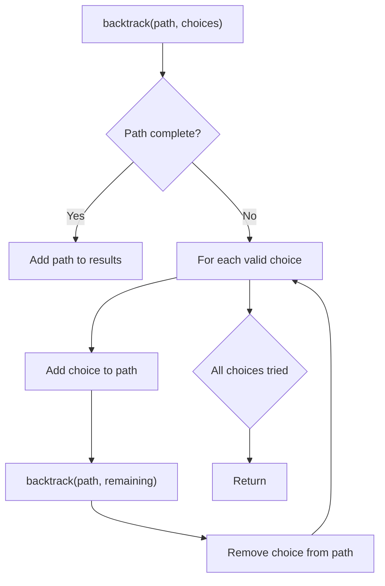
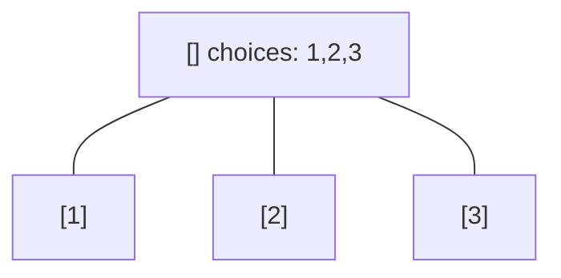
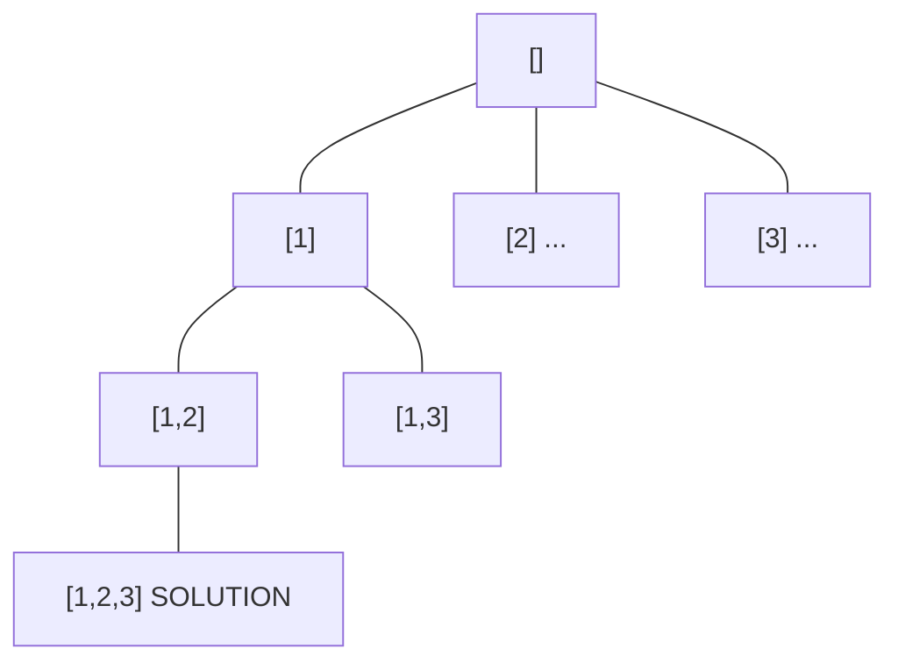
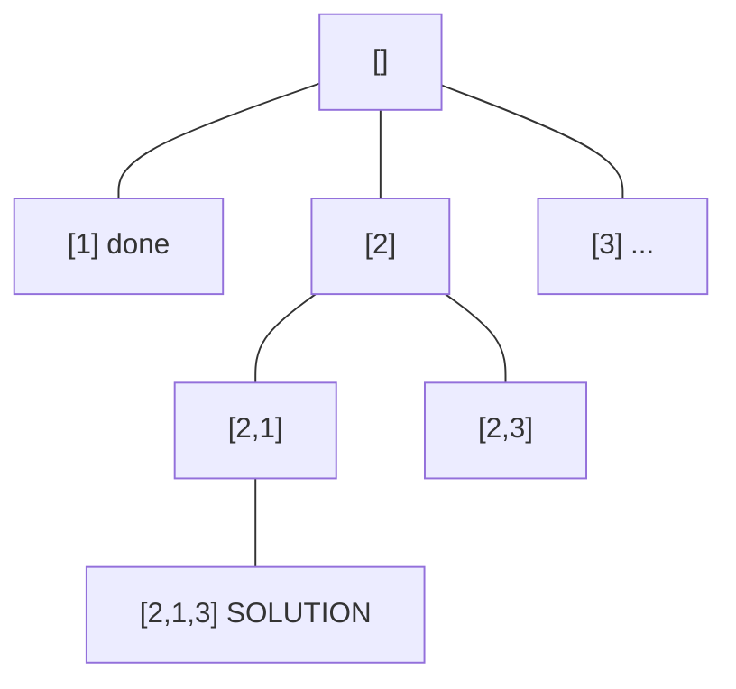
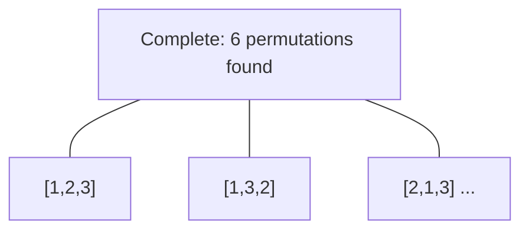

# Problem 2002: Maximum Product of the Length of Two Palindromic Subsequences

**Difficulty:** Medium  
**Tags:** String, Dynamic Programming, Backtracking, Bit Manipulation, Bitmask  
**Pattern:** Backtracking  
**Link:** [leetcode.com/problems/maximum-product-of-the-length-of-two-palindromic-subsequences](https://leetcode.com/problems/maximum-product-of-the-length-of-two-palindromic-subsequences/)

## Description

Given a string `s`, find two **disjoint palindromic subsequences** of `s` such that the **product** of their lengths is **maximized**. The two subsequences are **disjoint** if they do not both pick a character at the same index.

Return *the **maximum** possible **product** of the lengths of the two palindromic subsequences*.

A **subsequence** is a string that can be derived from another string by deleting some or no characters without changing the order of the remaining characters. A string is **palindromic** if it reads the same forward and backward.

 

Example 1:

```

**Input:** s = "leetcodecom"
**Output:** 9
**Explanation**: An optimal solution is to choose "ete" for the 1st subsequence and "cdc" for the 2nd subsequence.
The product of their lengths is: 3 * 3 = 9.

```

Example 2:

```

**Input:** s = "bb"
**Output:** 1
**Explanation**: An optimal solution is to choose "b" (the first character) for the 1st subsequence and "b" (the second character) for the 2nd subsequence.
The product of their lengths is: 1 * 1 = 1.

```

Example 3:

```

**Input:** s = "accbcaxxcxx"
**Output:** 25
**Explanation**: An optimal solution is to choose "accca" for the 1st subsequence and "xxcxx" for the 2nd subsequence.
The product of their lengths is: 5 * 5 = 25.

```

 

**Constraints:**

	- `2 <= s.length <= 12`
	- `s` consists of lowercase English letters only.

## Approach: Backtracking

Explore all possible solutions by building candidates incrementally. At each step, make a choice and recurse. If the choice leads to a dead end, undo the choice (backtrack) and try the next option.

## Pseudocode

```
1. Define backtrack(path, choices):
   a. If path is a complete solution: add to results
   b. For each choice in choices:
      - If choice is valid:
        * Add choice to path
        * backtrack(path, remaining_choices)
        * Remove choice from path (backtrack)
2. Call backtrack([], all_choices)
```

## Algorithm Flow



## Visual State Transitions

**Backtracking Decision Tree:**

**Frame 1: Root - start with empty path**


**Frame 2: Explore branch [1]**


**Frame 3: Backtrack, explore [2]**


**Frame 4: All solutions found**



## Complexity Analysis

- **Time:** O(k^n) or O(n!)
- **Space:** O(n)

## Solution (Python3)

```python
class Solution:
    def maxProduct(self, s: str) -> int:
        # Backtracking - O(2^n) or O(n!) time
        result = []
        
        def backtrack(path, start):
            result.append(path[:])
            for i in range(start, len(s)):
                path.append(s[i])
                backtrack(path, i + 1)
                path.pop()
        
        backtrack([], 0)
        return result
```

## Solution (C++)

```cpp
#include <functional>
#include <string>
#include <vector>
using namespace std;

class Solution {
public:
    int maxProduct(string& s) {
        // Backtracking - O(2^n) or O(n!) time
        vector<vector<int>> result;
        vector<int> path;
        function<void(int)> backtrack = [&](int start) {
            result.push_back(path);
            for (int i = start; i < (int)s.size(); i++) {
                path.push_back(s[i]);
                backtrack(i + 1);
                path.pop_back();
            }
        };
        backtrack(0);
        return result;
    }
};
```
