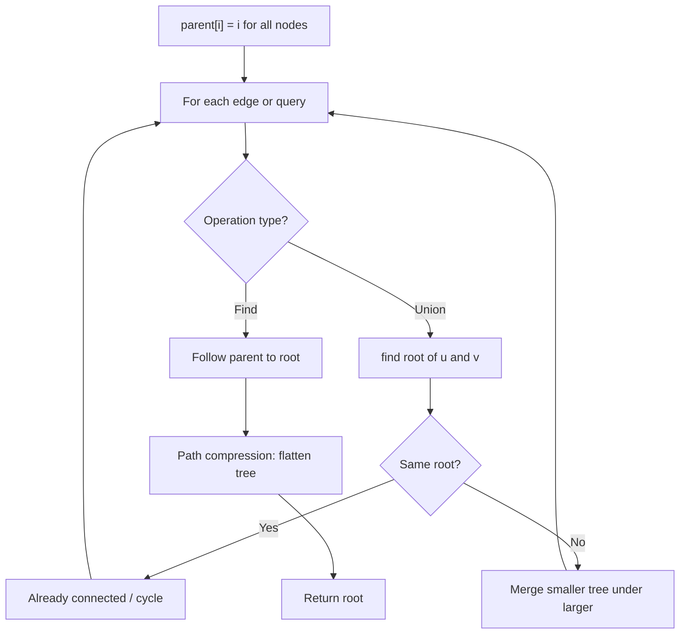
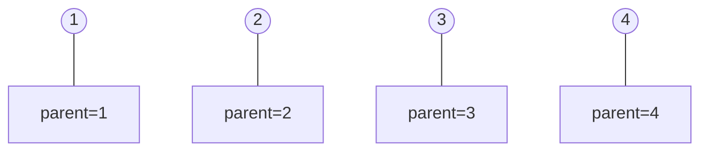
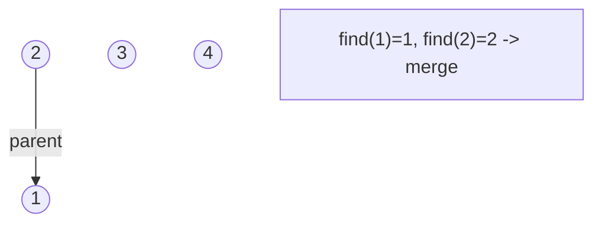
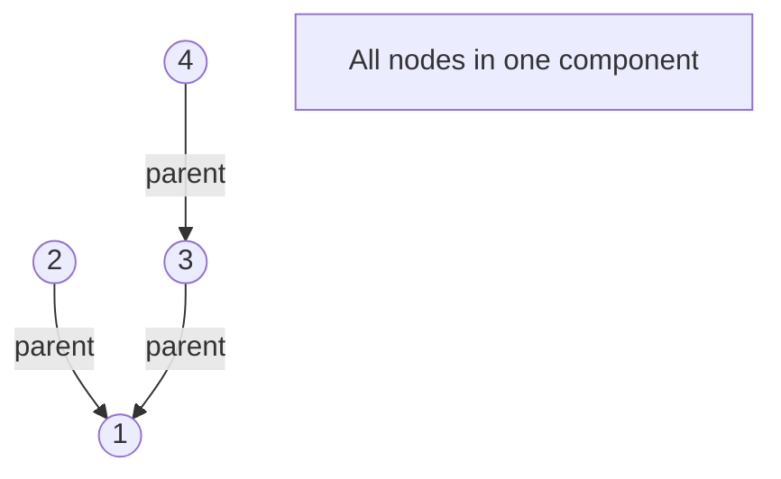
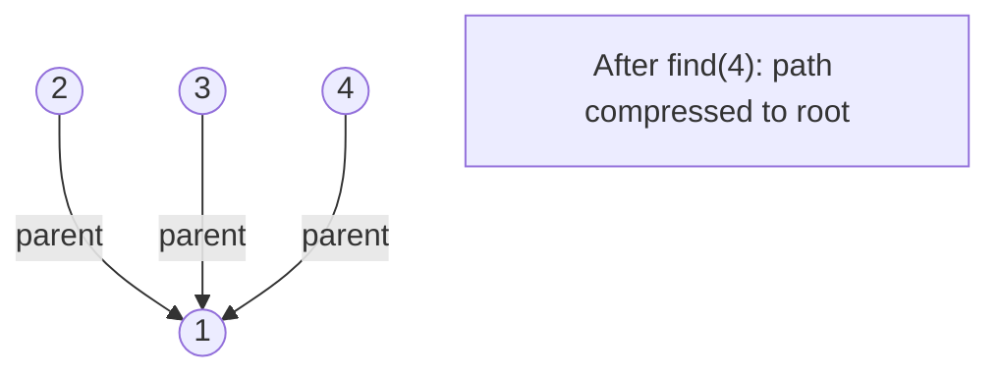

# Problem 2003: Smallest Missing Genetic Value in Each Subtree

**Difficulty:** Hard  
**Tags:** Array, Dynamic Programming, Tree, Depth-First Search, Union-Find  
**Pattern:** Union-Find / Disjoint Set  
**Link:** [leetcode.com/problems/smallest-missing-genetic-value-in-each-subtree](https://leetcode.com/problems/smallest-missing-genetic-value-in-each-subtree/)

## Description

There is a **family tree** rooted at `0` consisting of `n` nodes numbered `0` to `n - 1`. You are given a **0-indexed** integer array `parents`, where `parents[i]` is the parent for node `i`. Since node `0` is the **root**, `parents[0] == -1`.

There are `10^5` genetic values, each represented by an integer in the **inclusive** range `[1, 10^5]`. You are given a **0-indexed** integer array `nums`, where `nums[i]` is a **distinct **genetic value for node `i`.

Return *an array *`ans`* of length *`n`* where *`ans[i]`* is* *the **smallest** genetic value that is **missing** from the subtree rooted at node* `i`.

The **subtree** rooted at a node `x` contains node `x` and all of its **descendant** nodes.

 

Example 1:

```

**Input:** parents = [-1,0,0,2], nums = [1,2,3,4]
**Output:** [5,1,1,1]
**Explanation:** The answer for each subtree is calculated as follows:
- 0: The subtree contains nodes [0,1,2,3] with values [1,2,3,4]. 5 is the smallest missing value.
- 1: The subtree contains only node 1 with value 2. 1 is the smallest missing value.
- 2: The subtree contains nodes [2,3] with values [3,4]. 1 is the smallest missing value.
- 3: The subtree contains only node 3 with value 4. 1 is the smallest missing value.

```

Example 2:

```

**Input:** parents = [-1,0,1,0,3,3], nums = [5,4,6,2,1,3]
**Output:** [7,1,1,4,2,1]
**Explanation:** The answer for each subtree is calculated as follows:
- 0: The subtree contains nodes [0,1,2,3,4,5] with values [5,4,6,2,1,3]. 7 is the smallest missing value.
- 1: The subtree contains nodes [1,2] with values [4,6]. 1 is the smallest missing value.
- 2: The subtree contains only node 2 with value 6. 1 is the smallest missing value.
- 3: The subtree contains nodes [3,4,5] with values [2,1,3]. 4 is the smallest missing value.
- 4: The subtree contains only node 4 with value 1. 2 is the smallest missing value.
- 5: The subtree contains only node 5 with value 3. 1 is the smallest missing value.

```

Example 3:

```

**Input:** parents = [-1,2,3,0,2,4,1], nums = [2,3,4,5,6,7,8]
**Output:** [1,1,1,1,1,1,1]
**Explanation:** The value 1 is missing from all the subtrees.

```

 

**Constraints:**

	- `n == parents.length == nums.length`
	- `2 <= n <= 10^5`
	- `0 <= parents[i] <= n - 1` for `i != 0`
	- `parents[0] == -1`
	- `parents` represents a valid tree.
	- `1 <= nums[i] <= 10^5`
	- Each `nums[i]` is distinct.

## Approach: Union-Find / Disjoint Set

Use Union-Find with path compression and union by rank to efficiently manage connected components. Find(x) returns the root of x's component; Union(x,y) merges two components.

## Pseudocode

```
1. parent[i] = i for all nodes (each is its own set)
2. find(x): follow parent pointers to root (with path compression)
3. union(x, y): merge sets of x and y by rank
4. Process edges/operations:
   a. For each edge (u, v): union(u, v)
5. Answer queries using find()
```

## Algorithm Flow



## Visual State Transitions

**Union-Find Step-by-Step:**

**Frame 1: Initial - each node is own parent**


**Frame 2: Union(1,2) - merge components**


**Frame 3: Union(3,4) then Union(2,3)**


**Frame 4: Path compression on find(4)**



## Complexity Analysis

- **Time:** O(n * alpha(n))
- **Space:** O(n)

## Solution (Python3)

```python
class Solution:
    def smallestMissingValueSubtree(self, parents: List[int], nums: List[int]) -> List[int]:
        # Union Find (Disjoint Set Union) - O(n * alpha(n))
        parent = list(range(len(parents) + 1 if isinstance(parents, list) else parents + 1))
        rank = [0] * len(parent)
        
        def find(x):
            if parent[x] != x:
                parent[x] = find(parent[x])
            return parent[x]
        
        def union(x, y):
            px, py = find(x), find(y)
            if px == py:
                return False
            if rank[px] < rank[py]:
                px, py = py, px
            parent[py] = px
            if rank[px] == rank[py]:
                rank[px] += 1
            return True
        
        components = len(parent)
        # Process edges/connections
        return components
```

## Solution (C++)

```cpp
#include <functional>
#include <numeric>
#include <string>
#include <vector>
using namespace std;

class Solution {
public:
    vector<int> smallestMissingValueSubtree(vector<int>& parents, vector<int>& nums) {
        // Union Find (DSU) - O(n * alpha(n))
        int n = parents.size();
        vector<int> parent(n + 1), rnk(n + 1, 0);
        iota(parent.begin(), parent.end(), 0);
        function<int(int)> find = [&](int x) -> int {
            return parent[x] == x ? x : parent[x] = find(parent[x]);
        };
        auto unite = [&](int x, int y) -> bool {
            int px = find(x), py = find(y);
            if (px == py) return false;
            if (rnk[px] < rnk[py]) swap(px, py);
            parent[py] = px;
            if (rnk[px] == rnk[py]) rnk[px]++;
            return true;
        };
        int components = n;
        return components;
    }
};
```
