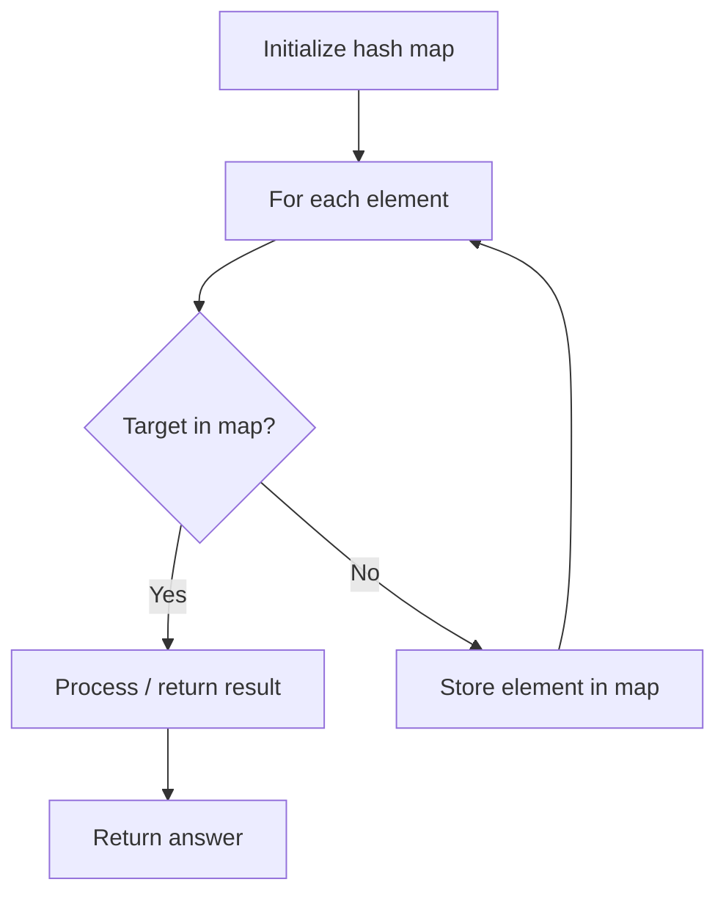

# Problem 2006: Count Number of Pairs With Absolute Difference K

**Difficulty:** Easy  
**Tags:** Array, Hash Table, Counting  
**Pattern:** Hash Map Lookup  
**Link:** [leetcode.com/problems/count-number-of-pairs-with-absolute-difference-k](https://leetcode.com/problems/count-number-of-pairs-with-absolute-difference-k/)

## Description

Given an integer array `nums` and an integer `k`, return *the number of pairs* `(i, j)` *where* `i < j` *such that* `|nums[i] - nums[j]| == k`.

The value of `|x|` is defined as:

	- `x` if `x >= 0`.
	- `-x` if `x < 0`.

 

Example 1:

```

**Input:** nums = [1,2,2,1], k = 1
**Output:** 4
**Explanation:** The pairs with an absolute difference of 1 are:
- [**1**,**2**,2,1]
- [**1**,2,**2**,1]
- [1,**2**,2,**1**]
- [1,2,**2**,**1**]

```

Example 2:

```

**Input:** nums = [1,3], k = 3
**Output:** 0
**Explanation:** There are no pairs with an absolute difference of 3.

```

Example 3:

```

**Input:** nums = [3,2,1,5,4], k = 2
**Output:** 3
**Explanation:** The pairs with an absolute difference of 2 are:
- [**3**,2,**1**,5,4]
- [**3**,2,1,**5**,4]
- [3,**2**,1,5,**4**]

```

 

**Constraints:**

	- `1 <= nums.length <= 200`
	- `1 <= nums[i] <= 100`
	- `1 <= k <= 99`

## Approach: Hash Map Lookup

Use a hash map (dictionary) to store elements for O(1) lookup. Iterate through the input, checking membership or counting frequencies in the map.

## Pseudocode

```
1. Initialize hash map
2. Iterate through elements:
   a. Check if target/complement exists in map
   b. If found: process result
   c. Otherwise: store element in map
3. Return result
```

## Algorithm Flow



## Complexity Analysis

- **Time:** O(n)
- **Space:** O(n)

## Solution (Python3)

```python
class Solution:
    def countKDifference(self, nums: List[int], k: int) -> int:
        # Hash map approach - O(n) time, O(n) space
        seen = {}
        for i, val in enumerate(nums):
            complement = k - val
            if complement in seen:
                return [seen[complement], i]
            seen[val] = i
        return 0
```

## Solution (C++)

```cpp
#include <string>
#include <unordered_map>
#include <vector>
using namespace std;

class Solution {
public:
    int countKDifference(vector<int>& nums, int k) {
        // Hash map approach - O(n) time, O(n) space
        unordered_map<int, int> seen;
        for (int i = 0; i < nums.size(); i++) {
            int complement = k - nums[i];
            if (seen.count(complement)) {
                return {seen[complement], i};
            }
            seen[nums[i]] = i;
        }
        return 0;
    }
};
```
