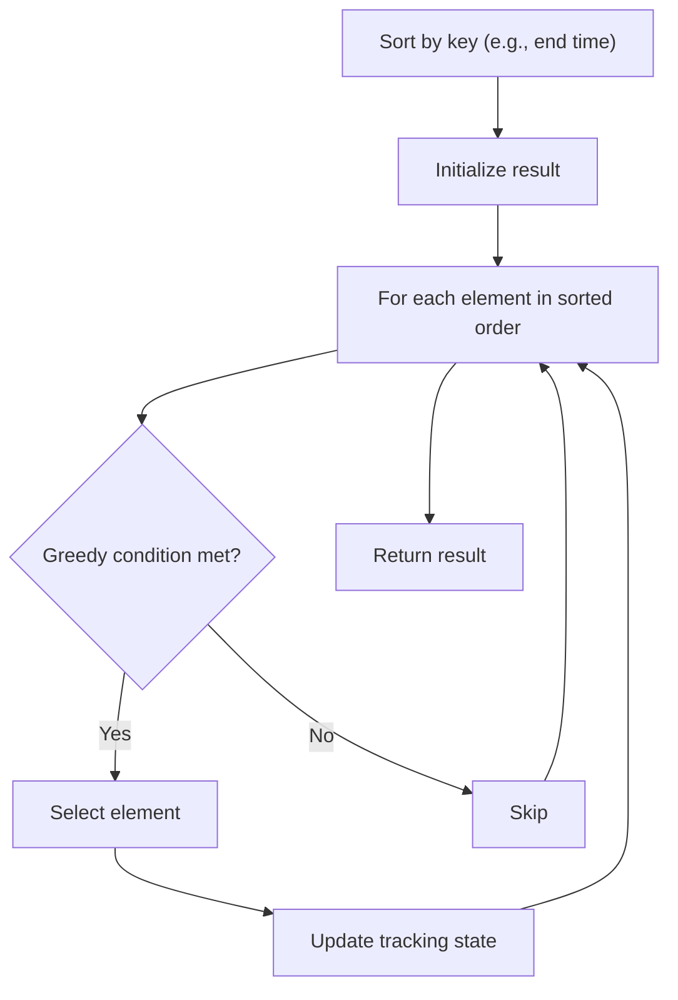

# Problem 2007: Find Original Array From Doubled Array

**Difficulty:** Medium  
**Tags:** Array, Hash Table, Greedy, Sorting  
**Pattern:** Greedy with Sorting  
**Link:** [leetcode.com/problems/find-original-array-from-doubled-array](https://leetcode.com/problems/find-original-array-from-doubled-array/)

## Description

An integer array `original` is transformed into a **doubled** array `changed` by appending **twice the value** of every element in `original`, and then randomly **shuffling** the resulting array.

Given an array `changed`, return `original`* if *`changed`* is a **doubled** array. If *`changed`* is not a **doubled** array, return an empty array. The elements in* `original` *may be returned in **any** order*.

 

Example 1:

```

**Input:** changed = [1,3,4,2,6,8]
**Output:** [1,3,4]
**Explanation:** One possible original array could be [1,3,4]:
- Twice the value of 1 is 1 * 2 = 2.
- Twice the value of 3 is 3 * 2 = 6.
- Twice the value of 4 is 4 * 2 = 8.
Other original arrays could be [4,3,1] or [3,1,4].

```

Example 2:

```

**Input:** changed = [6,3,0,1]
**Output:** []
**Explanation:** changed is not a doubled array.

```

Example 3:

```

**Input:** changed = [1]
**Output:** []
**Explanation:** changed is not a doubled array.

```

 

**Constraints:**

	- `1 <= changed.length <= 10^5`
	- `0 <= changed[i] <= 10^5`

## Approach: Greedy with Sorting

Sort the input by a key criterion, then greedily process elements in sorted order. The sorting ensures the greedy choice is always optimal.

## Pseudocode

```
1. Sort elements by key (start time, weight, etc.)
2. Initialize result, tracking variables
3. For each element in sorted order:
   a. Apply greedy selection rule
   b. Update result
4. Return result
```

## Algorithm Flow



## Complexity Analysis

- **Time:** O(n log n)
- **Space:** O(n)

## Solution (Python3)

```python
class Solution:
    def findOriginalArray(self, changed: List[int]) -> List[int]:
        # Sort + greedy - O(n log n) time
        changed.sort()
        result = 0
        curr_end = 0
        for item in changed:
            if isinstance(item, (list, tuple)):
                if item[0] >= curr_end:
                    result += 1
                    curr_end = item[1]
            else:
                result += 1
        return result
```

## Solution (C++)

```cpp
#include <algorithm>
#include <string>
#include <vector>
using namespace std;

class Solution {
public:
    vector<int> findOriginalArray(vector<int>& changed) {
        // Sort + greedy - O(n log n) time
        sort(changed.begin(), changed.end());
        int result = 0, curr_end = 0;
        for (auto& item : changed) {
            result++;
        }
        return result;
    }
};
```
