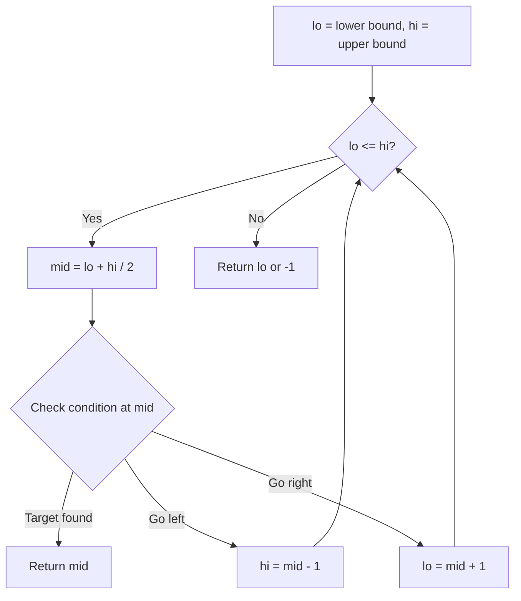
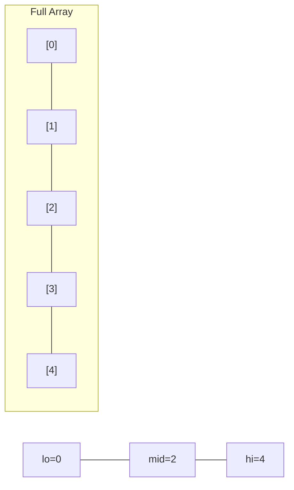
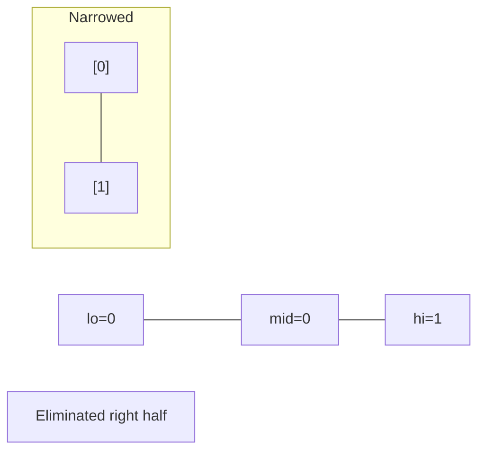
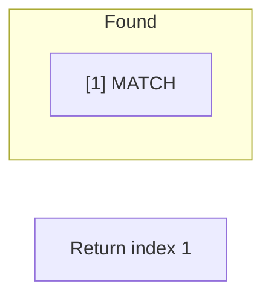

# Problem 2008: Maximum Earnings From Taxi

**Difficulty:** Medium  
**Tags:** Array, Hash Table, Binary Search, Dynamic Programming, Sorting  
**Pattern:** Binary Search  
**Link:** [leetcode.com/problems/maximum-earnings-from-taxi](https://leetcode.com/problems/maximum-earnings-from-taxi/)

## Description

There are `n` points on a road you are driving your taxi on. The `n` points on the road are labeled from `1` to `n` in the direction you are going, and you want to drive from point `1` to point `n` to make money by picking up passengers. You cannot change the direction of the taxi.

The passengers are represented by a **0-indexed** 2D integer array `rides`, where `rides[i] = [starti, endi, tipi]` denotes the `i^th` passenger requesting a ride from point `starti` to point `endi` who is willing to give a `tipi` dollar tip.

For** each **passenger `i` you pick up, you **earn** `endi - starti + tipi` dollars. You may only drive **at most one **passenger at a time.

Given `n` and `rides`, return *the **maximum** number of dollars you can earn by picking up the passengers optimally.*

**Note:** You may drop off a passenger and pick up a different passenger at the same point.

 

Example 1:

```

**Input:** n = 5, rides = [[2,5,4],[1,5,1]]
**Output:** 7
**Explanation:** We can pick up passenger 0 to earn 5 - 2 + 4 = 7 dollars.

```

Example 2:

```

**Input:** n = 20, rides = [[1,6,1],[3,10,2],[10,12,3],[11,12,2],[12,15,2],[13,18,1]]
**Output:** 20
**Explanation:** We will pick up the following passengers:
- Drive passenger 1 from point 3 to point 10 for a profit of 10 - 3 + 2 = 9 dollars.
- Drive passenger 2 from point 10 to point 12 for a profit of 12 - 10 + 3 = 5 dollars.
- Drive passenger 5 from point 13 to point 18 for a profit of 18 - 13 + 1 = 6 dollars.
We earn 9 + 5 + 6 = 20 dollars in total.
```

 

**Constraints:**

	- `1 <= n <= 10^5`
	- `1 <= rides.length <= 3 * 10^4`
	- `rides[i].length == 3`
	- `1 <= starti < endi <= n`
	- `1 <= tipi <= 10^5`

## Approach: Binary Search

Use binary search to halve the search space each iteration. Define the search range [lo, hi], compute mid, and decide which half to keep based on the problem's monotonic condition.

## Pseudocode

```
1. lo = lower_bound, hi = upper_bound
2. While lo <= hi (or lo < hi):
   a. mid = (lo + hi) // 2
   b. If condition(mid) is satisfied: record answer, search left half
   c. Else: search right half
3. Return answer
```

## Algorithm Flow



## Visual State Transitions

**Binary Search Step-by-Step:**

**Frame 1: Initial search space**


**Frame 2: Compare mid, narrow search**


**Frame 3: Found target**



## Complexity Analysis

- **Time:** O(log n)
- **Space:** O(1)

## Solution (Python3)

```python
class Solution:
    def maxTaxiEarnings(self, n: int, rides: List[List[int]]) -> int:
        # Binary search - O(log n) time, O(1) space
        lo, hi = 0, len(n) - 1
        while lo <= hi:
            mid = lo + (hi - lo) // 2
            if n[mid] == rides:
                return mid
            elif n[mid] < rides:
                lo = mid + 1
            else:
                hi = mid - 1
        return 0
```

## Solution (C++)

```cpp
#include <string>
#include <vector>
using namespace std;

class Solution {
public:
    int maxTaxiEarnings(int n, vector<vector<int>>& rides) {
        // Binary search - O(log n) time, O(1) space
        int lo = 0, hi = n.size() - 1;
        while (lo <= hi) {
            int mid = lo + (hi - lo) / 2;
            if (n[mid] == rides) {
                return mid;
            } else if (n[mid] < rides) {
                lo = mid + 1;
            } else {
                hi = mid - 1;
            }
        }
        return 0;
    }
};
```
