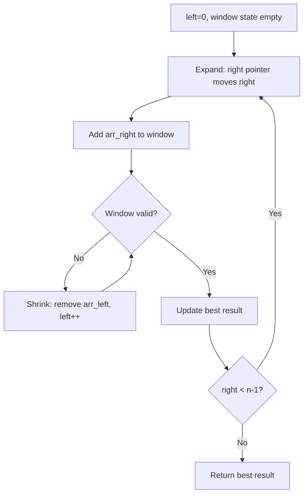
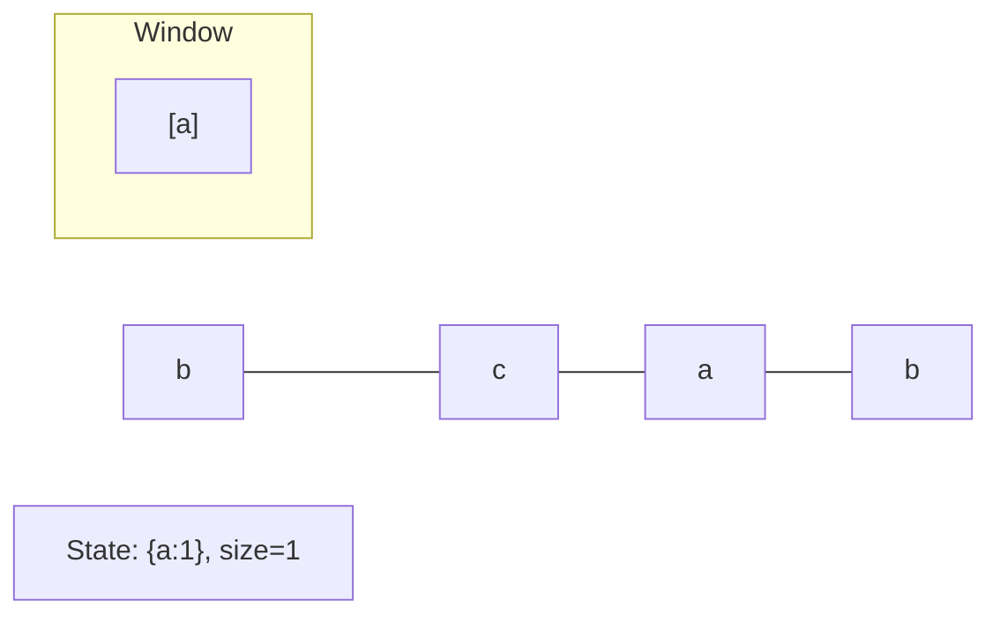
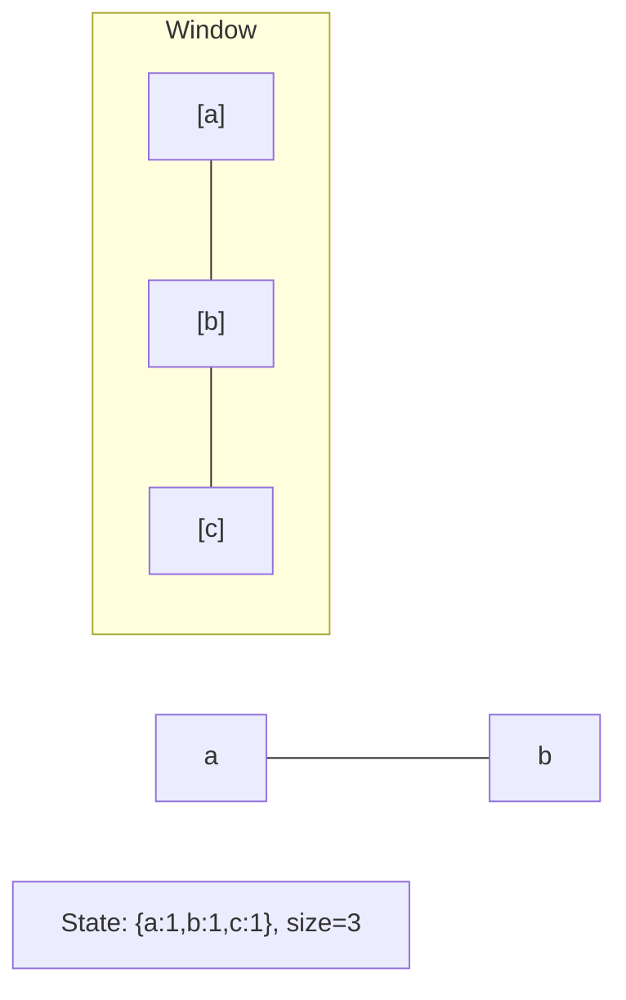
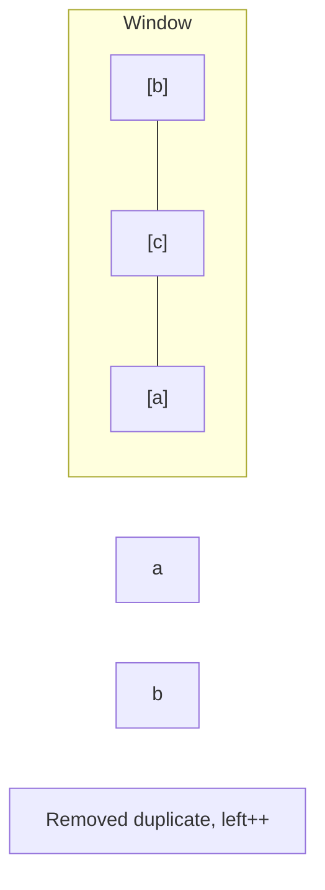
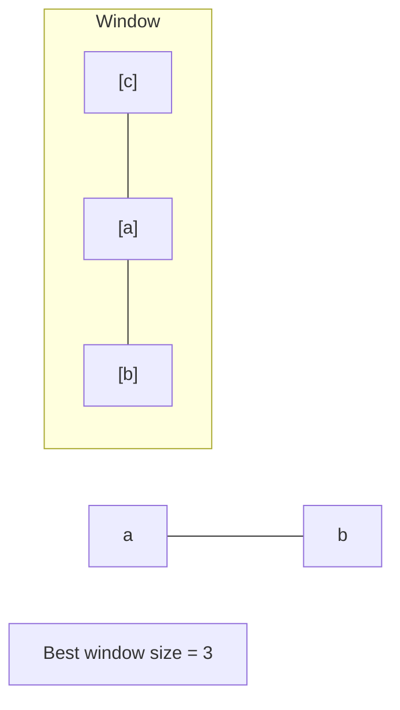

# Problem 2009: Minimum Number of Operations to Make Array Continuous

**Difficulty:** Hard  
**Tags:** Array, Hash Table, Binary Search, Sliding Window  
**Pattern:** Sliding Window  
**Link:** [leetcode.com/problems/minimum-number-of-operations-to-make-array-continuous](https://leetcode.com/problems/minimum-number-of-operations-to-make-array-continuous/)

## Description

You are given an integer array `nums`. In one operation, you can replace **any** element in `nums` with **any** integer.

`nums` is considered **continuous** if both of the following conditions are fulfilled:

	- All elements in `nums` are **unique**.
	- The difference between the **maximum** element and the **minimum** element in `nums` equals `nums.length - 1`.

For example, `nums = [4, 2, 5, 3]` is **continuous**, but `nums = [1, 2, 3, 5, 6]` is **not continuous**.

Return *the **minimum** number of operations to make *`nums`* ****continuous***.

 

Example 1:

```

**Input:** nums = [4,2,5,3]
**Output:** 0
**Explanation:** nums is already continuous.

```

Example 2:

```

**Input:** nums = [1,2,3,5,6]
**Output:** 1
**Explanation:** One possible solution is to change the last element to 4.
The resulting array is [1,2,3,5,4], which is continuous.

```

Example 3:

```

**Input:** nums = [1,10,100,1000]
**Output:** 3
**Explanation:** One possible solution is to:
- Change the second element to 2.
- Change the third element to 3.
- Change the fourth element to 4.
The resulting array is [1,2,3,4], which is continuous.

```

 

**Constraints:**

	- `1 <= nums.length <= 10^5`
	- `1 <= nums[i] <= 10^9`

## Approach: Sliding Window

Maintain a window over the data using two pointers. Expand the right boundary to include new elements, and shrink the left boundary when the window constraint is violated. Track the optimal window.

## Pseudocode

```
1. Initialize left = 0, result = initial_value
2. For right in range(n):
   a. Add element at right to window state
   b. While window is invalid:
      - Remove element at left from window state
      - left++
   c. Update result = best of (result, window size/value)
3. Return result
```

## Algorithm Flow



## Visual State Transitions

**Sliding Window Step-by-Step:**

**Frame 1: Initial window (left=0, right=0)**


**Frame 2: Expand right (right=2)**


**Frame 3: Violation - shrink left**


**Frame 4: Continue expanding**



## Complexity Analysis

- **Time:** O(n)
- **Space:** O(k)

## Solution (Python3)

```python
class Solution:
    def minOperations(self, nums: List[int]) -> int:
        # Sliding window approach - O(n) time, O(k) space
        from collections import defaultdict
        window = defaultdict(int)
        left = 0
        result = 0
        for right in range(len(nums)):
            window[nums[right]] += 1
            while len(window) > (nums if isinstance(nums, int) else len(nums)):
                window[nums[left]] -= 1
                if window[nums[left]] == 0:
                    del window[nums[left]]
                left += 1
            result = max(result, right - left + 1)
        return result
```

## Solution (C++)

```cpp
#include <algorithm>
#include <string>
#include <unordered_map>
#include <vector>
using namespace std;

class Solution {
public:
    int minOperations(vector<int>& nums) {
        // Sliding window approach - O(n) time, O(k) space
        unordered_map<char, int> window;
        int left = 0, result = 0;
        for (int right = 0; right < nums.size(); right++) {
            window[nums[right]]++;
            while ((int)window.size() > nums) {
                window[nums[left]]--;
                if (window[nums[left]] == 0)
                    window.erase(nums[left]);
                left++;
            }
            result = max(result, right - left + 1);
        }
        return result;
    }
};
```
