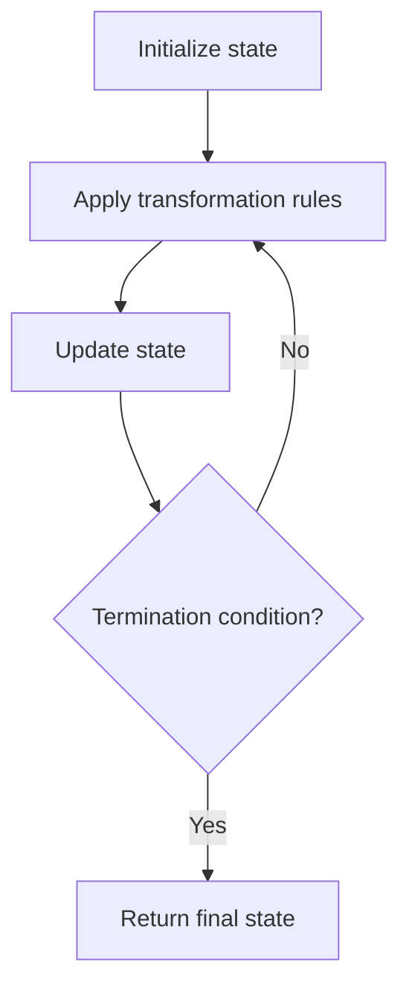

# Problem 2011: Final Value of Variable After Performing Operations

**Difficulty:** Easy  
**Tags:** Array, String, Simulation  
**Pattern:** Simulation  
**Link:** [leetcode.com/problems/final-value-of-variable-after-performing-operations](https://leetcode.com/problems/final-value-of-variable-after-performing-operations/)

## Description

There is a programming language with only **four** operations and **one** variable `X`:

	- `++X` and `X++` **increments** the value of the variable `X` by `1`.
	- `--X` and `X--` **decrements** the value of the variable `X` by `1`.

Initially, the value of `X` is `0`.

Given an array of strings `operations` containing a list of operations, return *the **final **value of *`X` *after performing all the operations*.

 

Example 1:

```

**Input:** operations = ["--X","X++","X++"]
**Output:** 1
**Explanation:** The operations are performed as follows:
Initially, X = 0.
--X: X is decremented by 1, X =  0 - 1 = -1.
X++: X is incremented by 1, X = -1 + 1 =  0.
X++: X is incremented by 1, X =  0 + 1 =  1.

```

Example 2:

```

**Input:** operations = ["++X","++X","X++"]
**Output:** 3
**Explanation: **The operations are performed as follows:
Initially, X = 0.
++X: X is incremented by 1, X = 0 + 1 = 1.
++X: X is incremented by 1, X = 1 + 1 = 2.
X++: X is incremented by 1, X = 2 + 1 = 3.

```

Example 3:

```

**Input:** operations = ["X++","++X","--X","X--"]
**Output:** 0
**Explanation:** The operations are performed as follows:
Initially, X = 0.
X++: X is incremented by 1, X = 0 + 1 = 1.
++X: X is incremented by 1, X = 1 + 1 = 2.
--X: X is decremented by 1, X = 2 - 1 = 1.
X--: X is decremented by 1, X = 1 - 1 = 0.

```

 

**Constraints:**

	- `1 <= operations.length <= 100`
	- `operations[i]` will be either `"++X"`, `"X++"`, `"--X"`, or `"X--"`.

## Approach: Simulation

Simulate the process described in the problem step by step. Follow the rules exactly, tracking state at each step.

## Pseudocode

```
1. Initialize state (grid, pointers, counters)
2. For each step / iteration:
   a. Apply the transformation rules
   b. Update state
   c. Check termination condition
3. Return final state or result
```

## Algorithm Flow



## Complexity Analysis

- **Time:** O(n) or O(n * k)
- **Space:** O(n)

## Solution (Python3)

```python
class Solution:
    def finalValueAfterOperations(self, operations: List[str]) -> int:
        # Simulation approach - follow the rules step by step
        result = 0
        for i in range(len(operations) if isinstance(operations, list) else operations):
            # Simulate each step
            pass
        return result
```

## Solution (C++)

```cpp
#include <string>
#include <vector>
using namespace std;

class Solution {
public:
    int finalValueAfterOperations(vector<string>& operations) {
        // Simulation approach
        int n = operations.size();
        for (int i = 0; i < n; i++) {
            // Simulate each step
        }
        return 0;
    }
};
```
