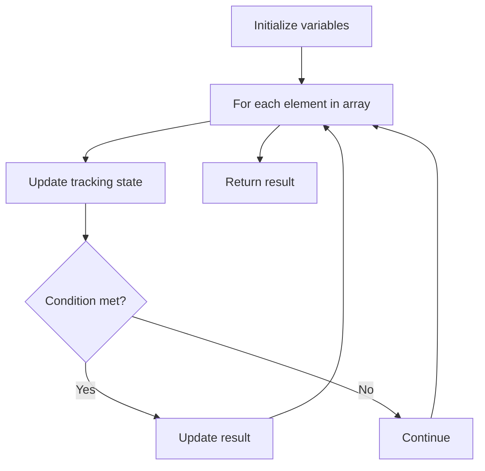

# Problem 2012: Sum of Beauty in the Array

**Difficulty:** Medium  
**Tags:** Array  
**Pattern:** Array Processing  
**Link:** [leetcode.com/problems/sum-of-beauty-in-the-array](https://leetcode.com/problems/sum-of-beauty-in-the-array/)

## Description

You are given a **0-indexed** integer array `nums`. For each index `i` (`1 <= i <= nums.length - 2`) the **beauty** of `nums[i]` equals:

	- `2`, if `nums[j] < nums[i] < nums[k]`, for **all** `0 <= j < i` and for **all** `i < k <= nums.length - 1`.
	- `1`, if `nums[i - 1] < nums[i] < nums[i + 1]`, and the previous condition is not satisfied.
	- `0`, if none of the previous conditions holds.

Return* the **sum of beauty** of all *`nums[i]`* where *`1 <= i <= nums.length - 2`.

 

Example 1:

```

**Input:** nums = [1,2,3]
**Output:** 2
**Explanation:** For each index i in the range 1 <= i <= 1:
- The beauty of nums[1] equals 2.

```

Example 2:

```

**Input:** nums = [2,4,6,4]
**Output:** 1
**Explanation:** For each index i in the range 1 <= i <= 2:
- The beauty of nums[1] equals 1.
- The beauty of nums[2] equals 0.

```

Example 3:

```

**Input:** nums = [3,2,1]
**Output:** 0
**Explanation:** For each index i in the range 1 <= i <= 1:
- The beauty of nums[1] equals 0.

```

 

**Constraints:**

	- `3 <= nums.length <= 10^5`
	- `1 <= nums[i] <= 10^5`

## Approach: Array Processing

Process the array with a linear scan, tracking state variables. Look for patterns: running maximum/minimum, counting, or transformations.

## Pseudocode

```
1. Initialize tracking variables
2. Iterate through array:
   a. Update tracking state
   b. Check conditions
   c. Update result
3. Return result
```

## Algorithm Flow



## Complexity Analysis

- **Time:** O(n)
- **Space:** O(1)

## Solution (Python3)

```python
class Solution:
    def sumOfBeauties(self, nums: List[int]) -> int:
        # Array processing - O(n) time
        result = 0
        for i in range(len(nums)):
            # Process element
            pass
        return result
```

## Solution (C++)

```cpp
#include <string>
#include <vector>
using namespace std;

class Solution {
public:
    int sumOfBeauties(vector<int>& nums) {
        // Array processing - O(n) time
        for (int i = 0; i < (int)nums.size(); i++) {
            // Process element
        }
        return 0;
    }
};
```
