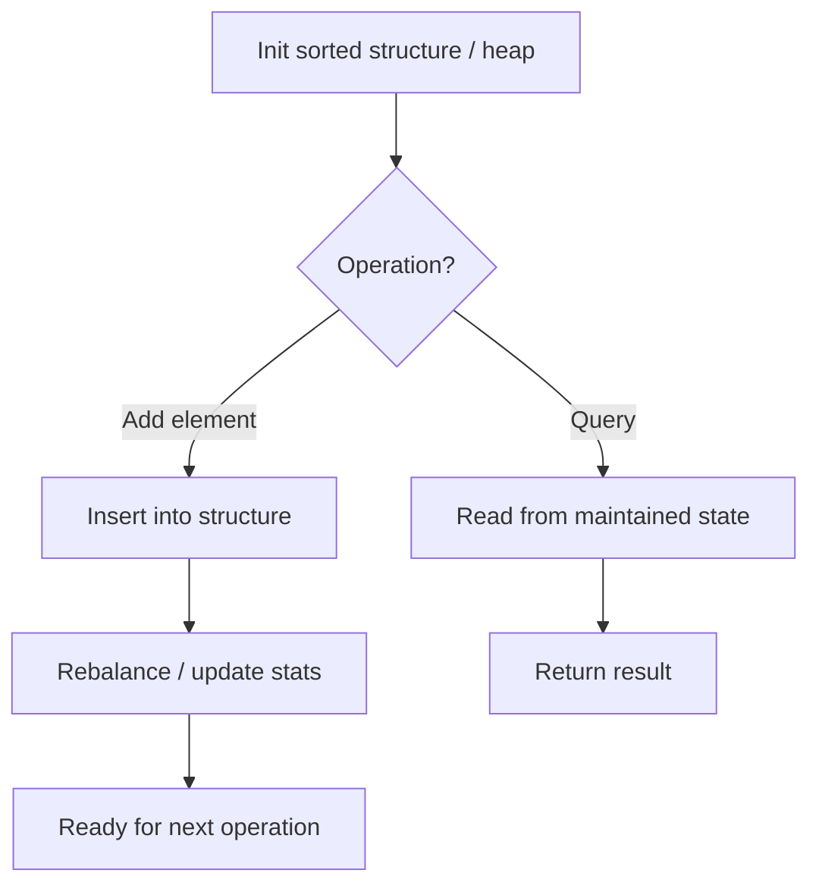

# Problem 2013: Detect Squares

**Difficulty:** Medium  
**Tags:** Array, Hash Table, Design, Counting, Data Stream  
**Pattern:** Hash Map / Design  
**Link:** [leetcode.com/problems/detect-squares](https://leetcode.com/problems/detect-squares/)

## Description

You are given a stream of points on the X-Y plane. Design an algorithm that:

	- **Adds** new points from the stream into a data structure. **Duplicate** points are allowed and should be treated as different points.
	- Given a query point, **counts** the number of ways to choose three points from the data structure such that the three points and the query point form an **axis-aligned square** with **positive area**.

An **axis-aligned square** is a square whose edges are all the same length and are either parallel or perpendicular to the x-axis and y-axis.

Implement the `DetectSquares` class:

	- `DetectSquares()` Initializes the object with an empty data structure.
	- `void add(int[] point)` Adds a new point `point = [x, y]` to the data structure.
	- `int count(int[] point)` Counts the number of ways to form **axis-aligned squares** with point `point = [x, y]` as described above.

 

Example 1:

```

**Input**
["DetectSquares", "add", "add", "add", "count", "count", "add", "count"]
[[], [[3, 10]], [[11, 2]], [[3, 2]], [[11, 10]], [[14, 8]], [[11, 2]], [[11, 10]]]
**Output**
[null, null, null, null, 1, 0, null, 2]

**Explanation**
DetectSquares detectSquares = new DetectSquares();
detectSquares.add([3, 10]);
detectSquares.add([11, 2]);
detectSquares.add([3, 2]);
detectSquares.count([11, 10]); // return 1. You can choose:
                               //   - The first, second, and third points
detectSquares.count([14, 8]);  // return 0. The query point cannot form a square with any points in the data structure.
detectSquares.add([11, 2]);    // Adding duplicate points is allowed.
detectSquares.count([11, 10]); // return 2. You can choose:
                               //   - The first, second, and third points
                               //   - The first, third, and fourth points

```

 

**Constraints:**

	- `point.length == 2`
	- `0 <= x, y <= 1000`
	- At most `3000` calls **in total** will be made to `add` and `count`.

## Approach: Hash Map / Design

For each diagonal point, check if the other two corners exist. Multiply counts for combinations.

## Pseudocode

```
1. Initialize: sorted list, heap, or aggregation state
2. addNum(val):
   - Insert into sorted structure
   - Update running stats
3. query():
   - Read from maintained state
   - Return in O(1) or O(log n)
```

## Algorithm Flow



## Complexity Analysis

- **Time:** O(n) count
- **Space:** O(n)

## Solution (Python3)

```python
class DetectSquares:
    def __init__(self):
        from collections import defaultdict
        self.points = defaultdict(int)

    def add(self, point):
        self.points[tuple(point)] += 1

    def count(self, point):
        px, py = point
        result = 0
        for (x, y), cnt in self.points.items():
            if x != px and abs(x - px) == abs(y - py):
                result += cnt * self.points.get((px, y), 0) * self.points.get((x, py), 0)
        return result
```

## Solution (C++)

```cpp
#include <string>
#include <vector>
using namespace std;

class DetectSquares {
public:
    DetectSquares() {
        // Initialize
    }

    void add(vector<int>& point) {
        return ;
    }

    int count(vector<int>& point) {
        return 0;
    }

};
```
