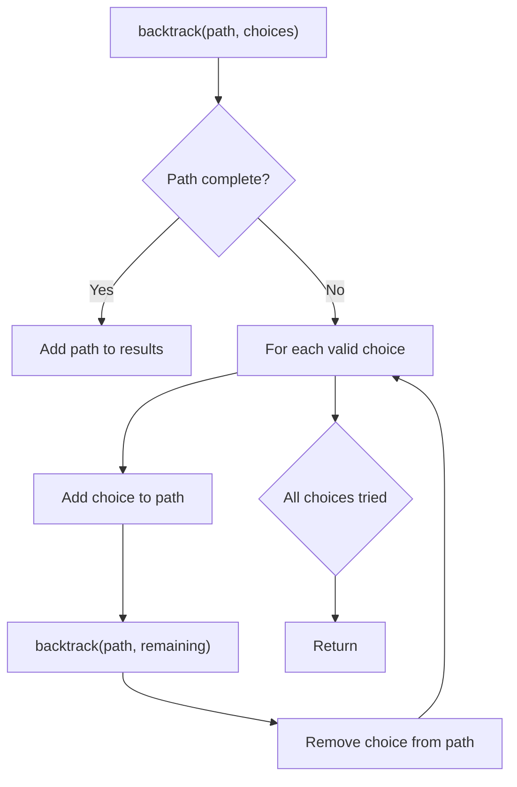
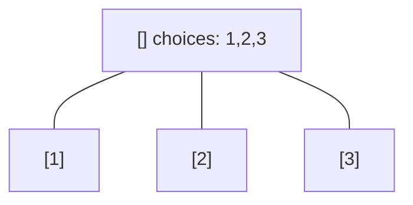
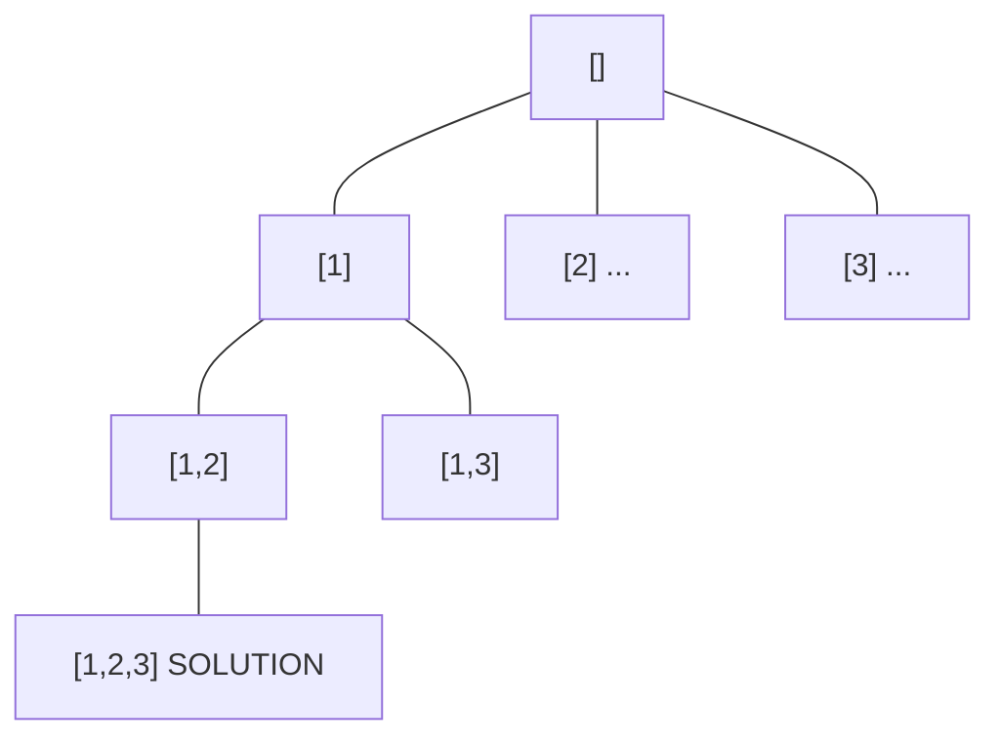
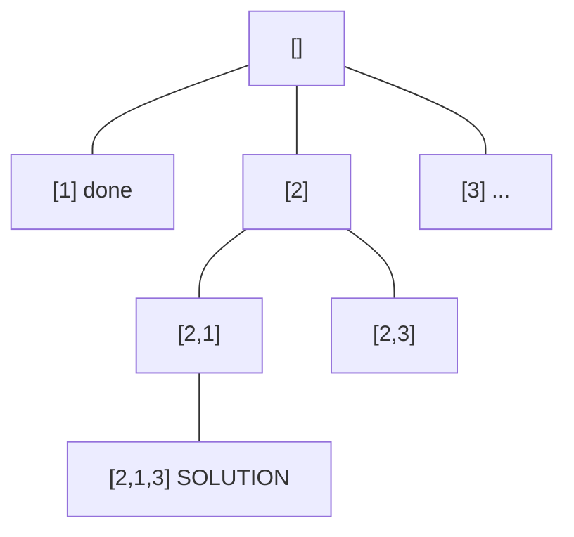
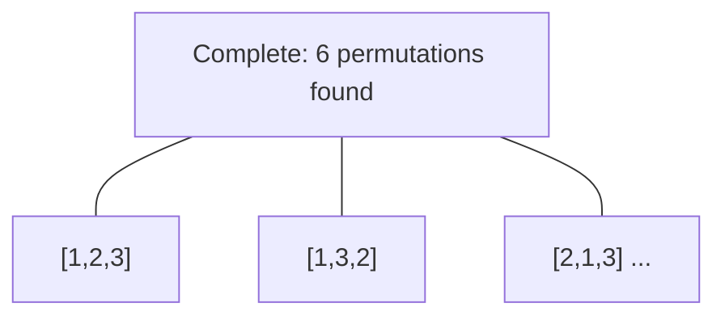

# Problem 2014: Longest Subsequence Repeated k Times

**Difficulty:** Hard  
**Tags:** Hash Table, Two Pointers, String, Backtracking, Counting, Enumeration  
**Pattern:** Backtracking  
**Link:** [leetcode.com/problems/longest-subsequence-repeated-k-times](https://leetcode.com/problems/longest-subsequence-repeated-k-times/)

## Description

You are given a string `s` of length `n`, and an integer `k`. You are tasked to find the **longest subsequence repeated** `k` times in string `s`.

A **subsequence** is a string that can be derived from another string by deleting some or no characters without changing the order of the remaining characters.

A subsequence `seq` is **repeated** `k` times in the string `s` if `seq * k` is a subsequence of `s`, where `seq * k` represents a string constructed by concatenating `seq` `k` times.

	- For example, `"bba"` is repeated `2` times in the string `"bababcba"`, because the string `"bbabba"`, constructed by concatenating `"bba"` `2` times, is a subsequence of the string `"**b**a**bab**c**ba**"`.

Return *the **longest subsequence repeated** *`k`* times in string *`s`*. If multiple such subsequences are found, return the **lexicographically largest** one. If there is no such subsequence, return an **empty** string*.

 

Example 1:

```

**Input:** s = "letsleetcode", k = 2
**Output:** "let"
**Explanation:** There are two longest subsequences repeated 2 times: "let" and "ete".
"let" is the lexicographically largest one.

```

Example 2:

```

**Input:** s = "bb", k = 2
**Output:** "b"
**Explanation:** The longest subsequence repeated 2 times is "b".

```

Example 3:

```

**Input:** s = "ab", k = 2
**Output:** ""
**Explanation:** There is no subsequence repeated 2 times. Empty string is returned.

```

 

**Constraints:**

	- `n == s.length`
	- `2 <= k <= 2000`
	- `2 <= n < min(2001, k * 8)`
	- `s` consists of lowercase English letters.

## Approach: Backtracking

Explore all possible solutions by building candidates incrementally. At each step, make a choice and recurse. If the choice leads to a dead end, undo the choice (backtrack) and try the next option.

## Pseudocode

```
1. Define backtrack(path, choices):
   a. If path is a complete solution: add to results
   b. For each choice in choices:
      - If choice is valid:
        * Add choice to path
        * backtrack(path, remaining_choices)
        * Remove choice from path (backtrack)
2. Call backtrack([], all_choices)
```

## Algorithm Flow



## Visual State Transitions

**Backtracking Decision Tree:**

**Frame 1: Root - start with empty path**


**Frame 2: Explore branch [1]**


**Frame 3: Backtrack, explore [2]**


**Frame 4: All solutions found**



## Complexity Analysis

- **Time:** O(k^n) or O(n!)
- **Space:** O(n)

## Solution (Python3)

```python
class Solution:
    def longestSubsequenceRepeatedK(self, s: str, k: int) -> str:
        # Backtracking - O(2^n) or O(n!) time
        result = []
        
        def backtrack(path, start):
            result.append(path[:])
            for i in range(start, len(s)):
                path.append(s[i])
                backtrack(path, i + 1)
                path.pop()
        
        backtrack([], 0)
        return result
```

## Solution (C++)

```cpp
#include <functional>
#include <string>
#include <vector>
using namespace std;

class Solution {
public:
    string longestSubsequenceRepeatedK(string& s, int k) {
        // Backtracking - O(2^n) or O(n!) time
        vector<vector<int>> result;
        vector<int> path;
        function<void(int)> backtrack = [&](int start) {
            result.push_back(path);
            for (int i = start; i < (int)s.size(); i++) {
                path.push_back(s[i]);
                backtrack(i + 1);
                path.pop_back();
            }
        };
        backtrack(0);
        return result;
    }
};
```
