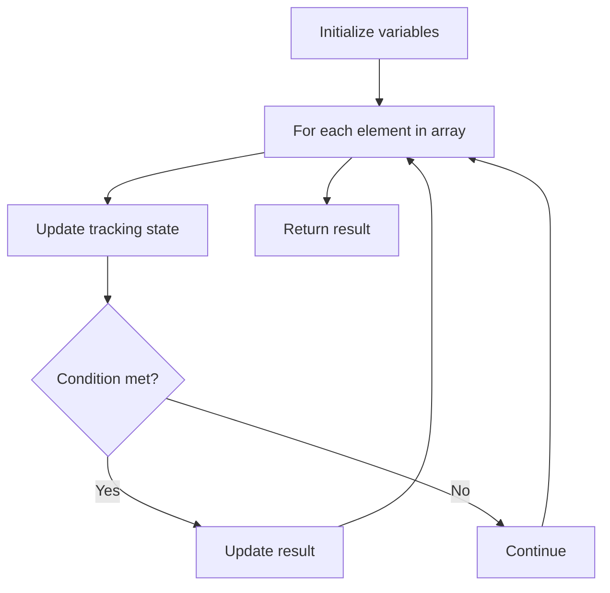

# Problem 2016: Maximum Difference Between Increasing Elements

**Difficulty:** Easy  
**Tags:** Array  
**Pattern:** Array Processing  
**Link:** [leetcode.com/problems/maximum-difference-between-increasing-elements](https://leetcode.com/problems/maximum-difference-between-increasing-elements/)

## Description

Given a **0-indexed** integer array `nums` of size `n`, find the **maximum difference** between `nums[i]` and `nums[j]` (i.e., `nums[j] - nums[i]`), such that `0 <= i < j < n` and `nums[i] < nums[j]`.

Return *the **maximum difference**. *If no such `i` and `j` exists, return `-1`.

 

Example 1:

```

**Input:** nums = [7,**1**,**5**,4]
**Output:** 4
**Explanation:**
The maximum difference occurs with i = 1 and j = 2, nums[j] - nums[i] = 5 - 1 = 4.
Note that with i = 1 and j = 0, the difference nums[j] - nums[i] = 7 - 1 = 6, but i > j, so it is not valid.

```

Example 2:

```

**Input:** nums = [9,4,3,2]
**Output:** -1
**Explanation:**
There is no i and j such that i < j and nums[i] < nums[j].

```

Example 3:

```

**Input:** nums = [**1**,5,2,**10**]
**Output:** 9
**Explanation:**
The maximum difference occurs with i = 0 and j = 3, nums[j] - nums[i] = 10 - 1 = 9.

```

 

**Constraints:**

	- `n == nums.length`
	- `2 <= n <= 1000`
	- `1 <= nums[i] <= 10^9`

## Approach: Array Processing

Process the array with a linear scan, tracking state variables. Look for patterns: running maximum/minimum, counting, or transformations.

## Pseudocode

```
1. Initialize tracking variables
2. Iterate through array:
   a. Update tracking state
   b. Check conditions
   c. Update result
3. Return result
```

## Algorithm Flow



## Complexity Analysis

- **Time:** O(n)
- **Space:** O(1)

## Solution (Python3)

```python
class Solution:
    def maximumDifference(self, nums: List[int]) -> int:
        # Array processing - O(n) time
        result = 0
        for i in range(len(nums)):
            # Process element
            pass
        return result
```

## Solution (C++)

```cpp
#include <string>
#include <vector>
using namespace std;

class Solution {
public:
    int maximumDifference(vector<int>& nums) {
        // Array processing - O(n) time
        for (int i = 0; i < (int)nums.size(); i++) {
            // Process element
        }
        return 0;
    }
};
```
