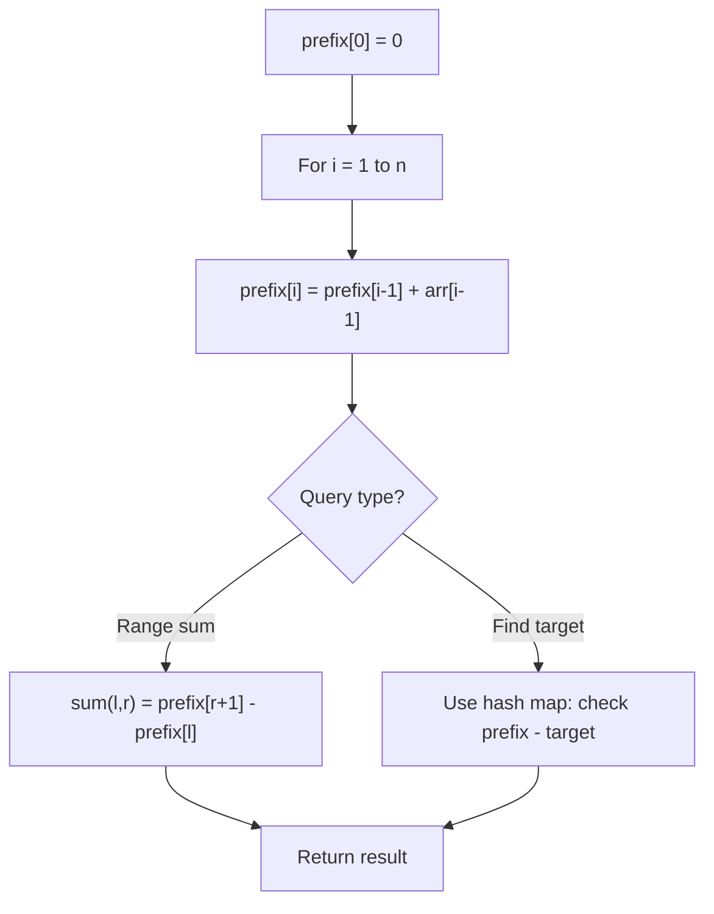

# Problem 2017: Grid Game

**Difficulty:** Medium  
**Tags:** Array, Matrix, Prefix Sum  
**Pattern:** Prefix Sum  
**Link:** [leetcode.com/problems/grid-game](https://leetcode.com/problems/grid-game/)

## Description

You are given a **0-indexed** 2D array `grid` of size `2 x n`, where `grid[r][c]` represents the number of points at position `(r, c)` on the matrix. Two robots are playing a game on this matrix.

Both robots initially start at `(0, 0)` and want to reach `(1, n-1)`. Each robot may only move to the **right** (`(r, c)` to `(r, c + 1)`) or **down **(`(r, c)` to `(r + 1, c)`).

At the start of the game, the **first** robot moves from `(0, 0)` to `(1, n-1)`, collecting all the points from the cells on its path. For all cells `(r, c)` traversed on the path, `grid[r][c]` is set to `0`. Then, the **second** robot moves from `(0, 0)` to `(1, n-1)`, collecting the points on its path. Note that their paths may intersect with one another.

The **first** robot wants to **minimize** the number of points collected by the **second** robot. In contrast, the **second **robot wants to **maximize** the number of points it collects. If both robots play **optimally**, return *the **number of points** collected by the **second** robot.*

 

Example 1:

```

**Input:** grid = [[2,5,4],[1,5,1]]
**Output:** 4
**Explanation:** The optimal path taken by the first robot is shown in red, and the optimal path taken by the second robot is shown in blue.
The cells visited by the first robot are set to 0.
The second robot will collect 0 + 0 + 4 + 0 = 4 points.

```

Example 2:

```

**Input:** grid = [[3,3,1],[8,5,2]]
**Output:** 4
**Explanation:** The optimal path taken by the first robot is shown in red, and the optimal path taken by the second robot is shown in blue.
The cells visited by the first robot are set to 0.
The second robot will collect 0 + 3 + 1 + 0 = 4 points.

```

Example 3:

```

**Input:** grid = [[1,3,1,15],[1,3,3,1]]
**Output:** 7
**Explanation: **The optimal path taken by the first robot is shown in red, and the optimal path taken by the second robot is shown in blue.
The cells visited by the first robot are set to 0.
The second robot will collect 0 + 1 + 3 + 3 + 0 = 7 points.

```

 

**Constraints:**

	- `grid.length == 2`
	- `n == grid[r].length`
	- `1 <= n <= 5 * 10^4`
	- `1 <= grid[r][c] <= 10^5`

## Approach: Prefix Sum

Build a prefix sum array where prefix[i] = sum of elements 0..i-1. Any subarray sum [l..r] = prefix[r+1] - prefix[l]. Combine with hash map for O(n) subarray sum queries.

## Pseudocode

```
1. Build prefix sum array: prefix[0]=0, prefix[i]=prefix[i-1]+arr[i-1]
2. Use prefix sums to answer queries:
   - Subarray sum [l..r] = prefix[r+1] - prefix[l]
   - Or use hash map to find prefix[j]-prefix[i] == target
3. Return result
```

## Algorithm Flow



## Complexity Analysis

- **Time:** O(n)
- **Space:** O(n)

## Solution (Python3)

```python
class Solution:
    def gridGame(self, grid: List[List[int]]) -> int:
        # Prefix sum approach - O(n) time, O(n) space
        prefix = {0: -1}
        curr_sum = 0
        result = 0
        target = grid if isinstance(grid, int) else 0
        for i, val in enumerate(grid):
            curr_sum += val
            if curr_sum - target in prefix:
                result = max(result, i - prefix[curr_sum - target])
            if curr_sum not in prefix:
                prefix[curr_sum] = i
        return result
```

## Solution (C++)

```cpp
#include <algorithm>
#include <string>
#include <unordered_map>
#include <vector>
using namespace std;

class Solution {
public:
    int gridGame(vector<vector<int>>& grid) {
        // Prefix sum approach - O(n) time, O(n) space
        unordered_map<int, int> prefix;
        prefix[0] = -1;
        int curr_sum = 0, result = 0;
        int target = grid;
        for (int i = 0; i < (int)grid.size(); i++) {
            curr_sum += grid[i];
            if (prefix.count(curr_sum - target)) {
                result = max(result, i - prefix[curr_sum - target]);
            }
            if (!prefix.count(curr_sum)) {
                prefix[curr_sum] = i;
            }
        }
        return result;
    }
};
```
