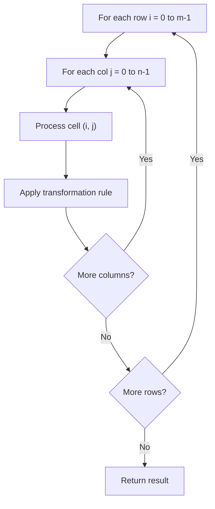

# Problem 2018: Check if Word Can Be Placed In Crossword

**Difficulty:** Medium  
**Tags:** Array, Matrix, Enumeration  
**Pattern:** Matrix / 2D Array  
**Link:** [leetcode.com/problems/check-if-word-can-be-placed-in-crossword](https://leetcode.com/problems/check-if-word-can-be-placed-in-crossword/)

## Description

You are given an `m x n` matrix `board`, representing the** current **state of a crossword puzzle. The crossword contains lowercase English letters (from solved words), `' '` to represent any **empty **cells, and `'#'` to represent any **blocked** cells.

A word can be placed** horizontally** (left to right **or** right to left) or **vertically** (top to bottom **or** bottom to top) in the board if:

	- It does not occupy a cell containing the character `'#'`.
	- The cell each letter is placed in must either be `' '` (empty) or **match** the letter already on the `board`.
	- There must not be any empty cells `' '` or other lowercase letters **directly left or right**** **of the word if the word was placed **horizontally**.
	- There must not be any empty cells `' '` or other lowercase letters **directly above or below** the word if the word was placed **vertically**.

Given a string `word`, return `true`* if *`word`* can be placed in *`board`*, or *`false`* **otherwise***.

 

Example 1:

```

**Input:** board = [["#", " ", "#"], [" ", " ", "#"], ["#", "c", " "]], word = "abc"
**Output:** true
**Explanation:** The word "abc" can be placed as shown above (top to bottom).

```

Example 2:

```

**Input:** board = [[" ", "#", "a"], [" ", "#", "c"], [" ", "#", "a"]], word = "ac"
**Output:** false
**Explanation:** It is impossible to place the word because there will always be a space/letter above or below it.
```

Example 3:

```

**Input:** board = [["#", " ", "#"], [" ", " ", "#"], ["#", " ", "c"]], word = "ca"
**Output:** true
**Explanation:** The word "ca" can be placed as shown above (right to left). 

```

 

**Constraints:**

	- `m == board.length`
	- `n == board[i].length`
	- `1 <= m * n <= 2 * 10^5`
	- `board[i][j]` will be `' '`, `'#'`, or a lowercase English letter.
	- `1 <= word.length <= max(m, n)`
	- `word` will contain only lowercase English letters.

## Approach: Matrix / 2D Array

Process the matrix row by row or column by column. Common patterns: rotation, spiral traversal, in-place modification, transposition.

## Pseudocode

```
1. For each row i:
   For each column j:
     Process cell (i, j) based on neighbors or rules
2. Handle boundary conditions
3. Return modified matrix or computed result
```

## Algorithm Flow



## Complexity Analysis

- **Time:** O(m * n)
- **Space:** O(1) extra

## Solution (Python3)

```python
class Solution:
    def placeWordInCrossword(self, board: List[List[str]], word: str) -> bool:
        # Matrix manipulation - O(m*n) time
        if not board:
            return False
        m, n = len(board), len(board[0])
        # Process matrix in-place or build result
        for i in range(m):
            for j in range(n):
                pass  # Process board[i][j]
        return False
```

## Solution (C++)

```cpp
#include <string>
#include <vector>
using namespace std;

class Solution {
public:
    bool placeWordInCrossword(vector<vector<string>>& board, string& word) {
        // Matrix manipulation - O(m*n) time
        if (board.empty()) return false;
        int m = board.size(), n = board[0].size();
        for (int i = 0; i < m; i++) {
            for (int j = 0; j < n; j++) {
                // Process matrix[i][j]
            }
        }
        return false;
    }
};
```
