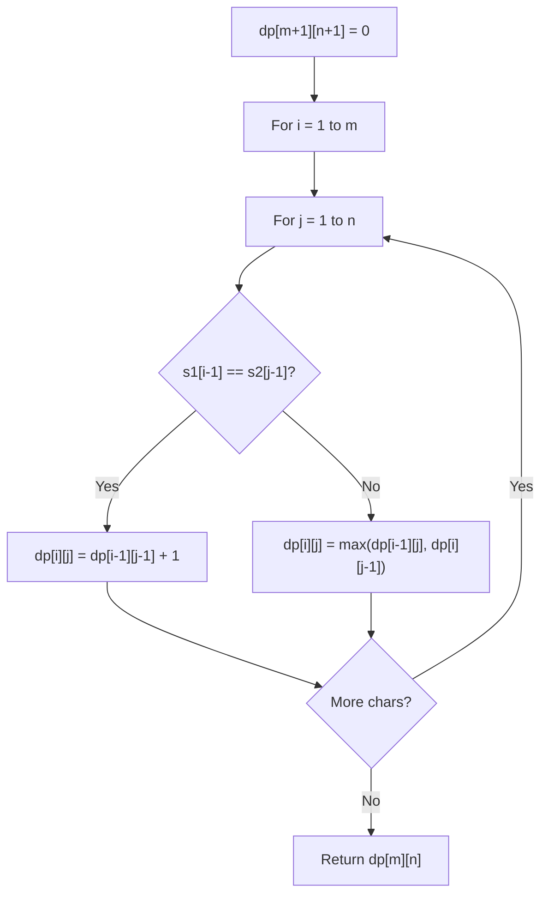

# Problem 2019: The Score of Students Solving Math Expression

**Difficulty:** Hard  
**Tags:** Array, Hash Table, Math, String, Dynamic Programming, Stack, Memoization  
**Pattern:** Dynamic Programming (String)  
**Link:** [leetcode.com/problems/the-score-of-students-solving-math-expression](https://leetcode.com/problems/the-score-of-students-solving-math-expression/)

## Description

You are given a string `s` that contains digits `0-9`, addition symbols `'+'`, and multiplication symbols `'*'` **only**, representing a **valid** math expression of **single digit numbers** (e.g., `3+5*2`). This expression was given to `n` elementary school students. The students were instructed to get the answer of the expression by following this **order of operations**:

	- Compute **multiplication**, reading from **left to right**; Then,
	- Compute **addition**, reading from **left to right**.

You are given an integer array `answers` of length `n`, which are the submitted answers of the students in no particular order. You are asked to grade the `answers`, by following these **rules**:

	- If an answer **equals** the correct answer of the expression, this student will be rewarded `5` points;
	- Otherwise, if the answer **could be interpreted** as if the student applied the operators **in the wrong order** but had **correct arithmetic**, this student will be rewarded `2` points;
	- Otherwise, this student will be rewarded `0` points.

Return *the sum of the points of the students*.

 

Example 1:

```

**Input:** s = "7+3*1*2", answers = [20,13,42]
**Output:** 7
**Explanation:** As illustrated above, the correct answer of the expression is 13, therefore one student is rewarded 5 points: [20,**13**,42]
A student might have applied the operators in this wrong order: ((7+3)*1)*2 = 20. Therefore one student is rewarded 2 points: [**20**,13,42]
The points for the students are: [2,5,0]. The sum of the points is 2+5+0=7.

```

Example 2:

```

**Input:** s = "3+5*2", answers = [13,0,10,13,13,16,16]
**Output:** 19
**Explanation:** The correct answer of the expression is 13, therefore three students are rewarded 5 points each: [**13**,0,10,**13**,**13**,16,16]
A student might have applied the operators in this wrong order: ((3+5)*2 = 16. Therefore two students are rewarded 2 points: [13,0,10,13,13,**16**,**16**]
The points for the students are: [5,0,0,5,5,2,2]. The sum of the points is 5+0+0+5+5+2+2=19.

```

Example 3:

```

**Input:** s = "6+0*1", answers = [12,9,6,4,8,6]
**Output:** 10
**Explanation:** The correct answer of the expression is 6.
If a student had incorrectly done (6+0)*1, the answer would also be 6.
By the rules of grading, the students will still be rewarded 5 points (as they got the correct answer), not 2 points.
The points for the students are: [0,0,5,0,0,5]. The sum of the points is 10.

```

 

**Constraints:**

	- `3 <= s.length <= 31`
	- `s` represents a valid expression that contains only digits `0-9`, `'+'`, and `'*'` only.
	- All the integer operands in the expression are in the **inclusive** range `[0, 9]`.
	- `1 <=` The count of all operators (`'+'` and `'*'`) in the math expression `<= 15`
	- Test data are generated such that the correct answer of the expression is in the range of `[0, 1000]`.
	- Test data are generated such that value never exceeds 10^9 in intermediate steps of multiplication.
	- `n == answers.length`
	- `1 <= n <= 10^4`
	- `0 <= answers[i] <= 1000`

## Approach: Dynamic Programming (String)

Compare or match two strings using a 2D DP table. dp[i][j] represents the answer for substrings s1[0..i-1] and s2[0..j-1]. Common patterns: LCS, edit distance, regex matching.

## Pseudocode

```
1. Create dp[m+1][n+1]
2. Initialize base cases
3. For i from 1 to m:
   For j from 1 to n:
     If s1[i-1] == s2[j-1]: dp[i][j] = dp[i-1][j-1] + 1
     Else: dp[i][j] = best of (dp[i-1][j], dp[i][j-1], dp[i-1][j-1])
4. Return dp[m][n]
```

## Algorithm Flow



## Complexity Analysis

- **Time:** O(m * n)
- **Space:** O(m * n)

## Solution (Python3)

```python
class Solution:
    def scoreOfStudents(self, s: str, answers: List[int]) -> int:
        # String DP - O(m*n) time and space
        m, n = len(s), len(answers)
        dp = [[0] * (n + 1) for _ in range(m + 1)]
        for i in range(1, m + 1):
            for j in range(1, n + 1):
                if s[i-1] == answers[j-1]:
                    dp[i][j] = dp[i-1][j-1] + 1
                else:
                    dp[i][j] = max(dp[i-1][j], dp[i][j-1])
        return dp[m][n]
```

## Solution (C++)

```cpp
#include <algorithm>
#include <string>
#include <vector>
using namespace std;

class Solution {
public:
    int scoreOfStudents(string& s, vector<int>& answers) {
        // String DP - O(m*n) time and space
        int m = s.size(), n = answers.size();
        vector<vector<int>> dp(m + 1, vector<int>(n + 1, 0));
        for (int i = 1; i <= m; i++) {
            for (int j = 1; j <= n; j++) {
                if (s[i-1] == answers[j-1])
                    dp[i][j] = dp[i-1][j-1] + 1;
                else
                    dp[i][j] = max(dp[i-1][j], dp[i][j-1]);
            }
        }
        return dp[m][n];
    }
};
```
