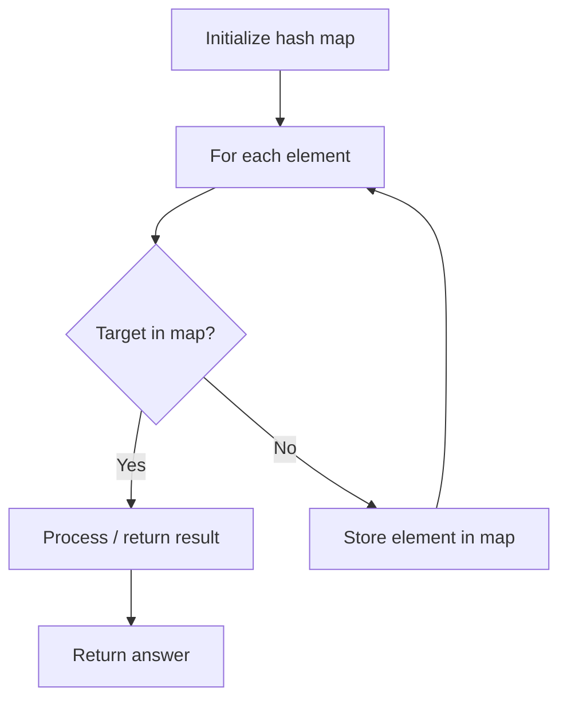

# Problem 2023: Number of Pairs of Strings With Concatenation Equal to Target

**Difficulty:** Medium  
**Tags:** Array, Hash Table, String, Counting  
**Pattern:** Hash Map Lookup  
**Link:** [leetcode.com/problems/number-of-pairs-of-strings-with-concatenation-equal-to-target](https://leetcode.com/problems/number-of-pairs-of-strings-with-concatenation-equal-to-target/)

## Description

Given an array of **digit** strings `nums` and a **digit** string `target`, return *the number of pairs of indices *`(i, j)`* (where *`i != j`*) such that the **concatenation** of *`nums[i] + nums[j]`* equals *`target`.

 

Example 1:

```

**Input:** nums = ["777","7","77","77"], target = "7777"
**Output:** 4
**Explanation:** Valid pairs are:
- (0, 1): "777" + "7"
- (1, 0): "7" + "777"
- (2, 3): "77" + "77"
- (3, 2): "77" + "77"

```

Example 2:

```

**Input:** nums = ["123","4","12","34"], target = "1234"
**Output:** 2
**Explanation:** Valid pairs are:
- (0, 1): "123" + "4"
- (2, 3): "12" + "34"

```

Example 3:

```

**Input:** nums = ["1","1","1"], target = "11"
**Output:** 6
**Explanation:** Valid pairs are:
- (0, 1): "1" + "1"
- (1, 0): "1" + "1"
- (0, 2): "1" + "1"
- (2, 0): "1" + "1"
- (1, 2): "1" + "1"
- (2, 1): "1" + "1"

```

 

**Constraints:**

	- `2 <= nums.length <= 100`
	- `1 <= nums[i].length <= 100`
	- `2 <= target.length <= 100`
	- `nums[i]` and `target` consist of digits.
	- `nums[i]` and `target` do not have leading zeros.

## Approach: Hash Map Lookup

Use a hash map (dictionary) to store elements for O(1) lookup. Iterate through the input, checking membership or counting frequencies in the map.

## Pseudocode

```
1. Initialize hash map
2. Iterate through elements:
   a. Check if target/complement exists in map
   b. If found: process result
   c. Otherwise: store element in map
3. Return result
```

## Algorithm Flow



## Complexity Analysis

- **Time:** O(n)
- **Space:** O(n)

## Solution (Python3)

```python
class Solution:
    def numOfPairs(self, nums: List[str], target: str) -> int:
        # Hash map approach - O(n) time, O(n) space
        seen = {}
        for i, val in enumerate(nums):
            complement = target - val
            if complement in seen:
                return [seen[complement], i]
            seen[val] = i
        return 0
```

## Solution (C++)

```cpp
#include <string>
#include <unordered_map>
#include <vector>
using namespace std;

class Solution {
public:
    int numOfPairs(vector<string>& nums, string& target) {
        // Hash map approach - O(n) time, O(n) space
        unordered_map<int, int> seen;
        for (int i = 0; i < nums.size(); i++) {
            int complement = target - nums[i];
            if (seen.count(complement)) {
                return {seen[complement], i};
            }
            seen[nums[i]] = i;
        }
        return 0;
    }
};
```
