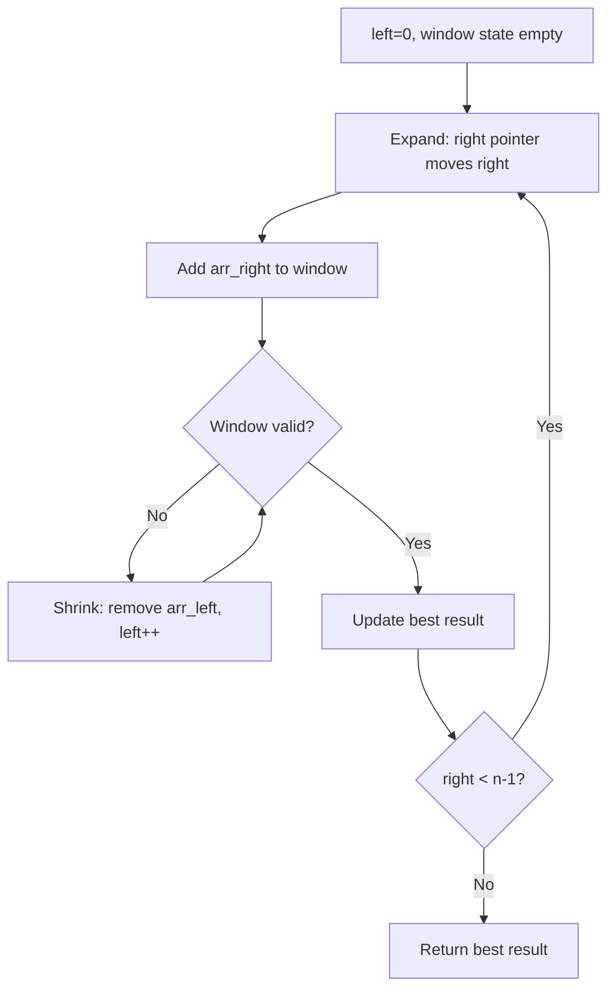
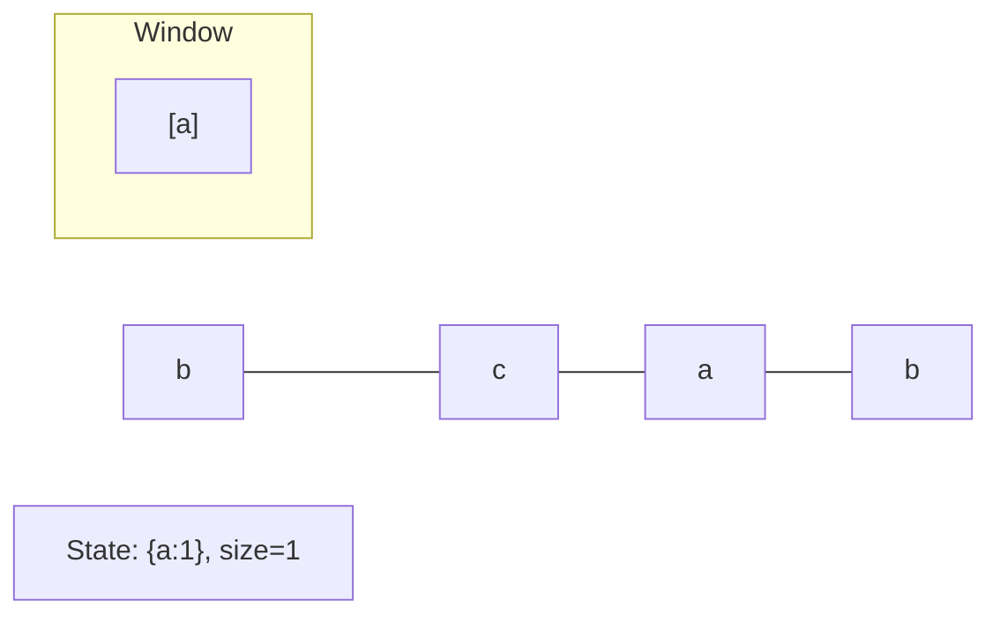
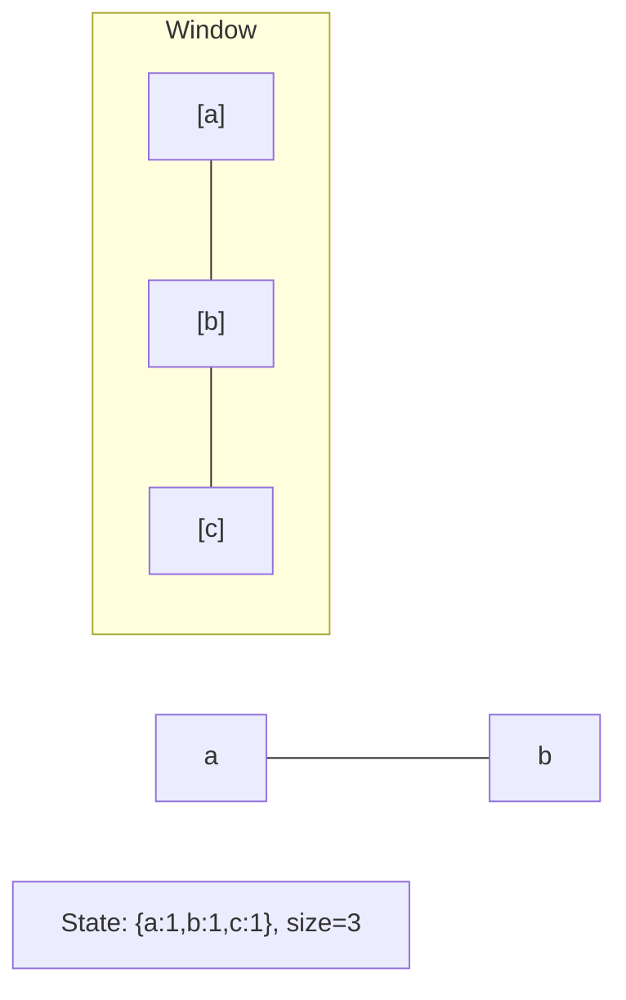
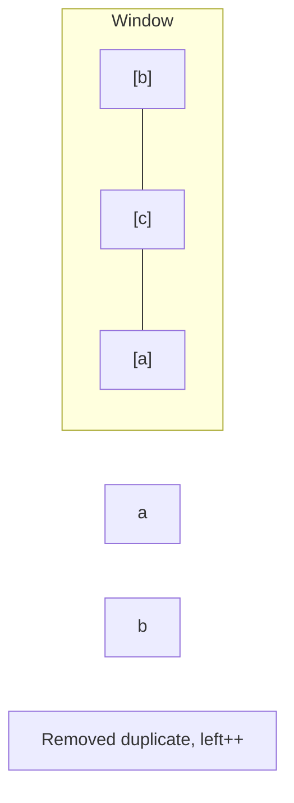
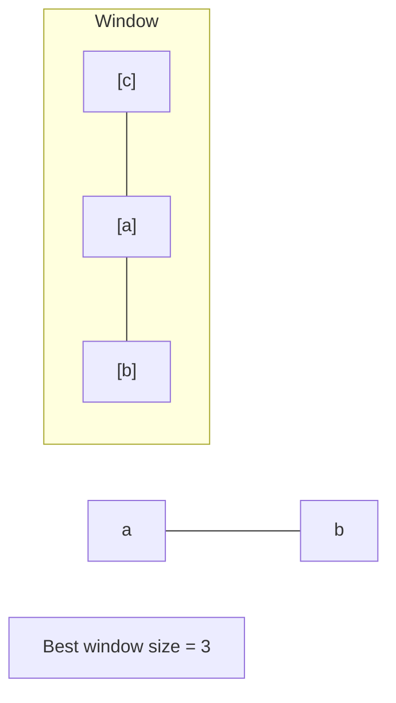

# Problem 2024: Maximize the Confusion of an Exam

**Difficulty:** Medium  
**Tags:** String, Binary Search, Sliding Window, Prefix Sum  
**Pattern:** Sliding Window  
**Link:** [leetcode.com/problems/maximize-the-confusion-of-an-exam](https://leetcode.com/problems/maximize-the-confusion-of-an-exam/)

## Description

A teacher is writing a test with `n` true/false questions, with `'T'` denoting true and `'F'` denoting false. He wants to confuse the students by **maximizing** the number of **consecutive** questions with the **same** answer (multiple trues or multiple falses in a row).

You are given a string `answerKey`, where `answerKey[i]` is the original answer to the `i^th` question. In addition, you are given an integer `k`, the maximum number of times you may perform the following operation:

	- Change the answer key for any question to `'T'` or `'F'` (i.e., set `answerKey[i]` to `'T'` or `'F'`).

Return *the **maximum** number of consecutive* `'T'`s or `'F'`s *in the answer key after performing the operation at most* `k` *times*.

 

Example 1:

```

**Input:** answerKey = "TTFF", k = 2
**Output:** 4
**Explanation:** We can replace both the 'F's with 'T's to make answerKey = "TTTT".
There are four consecutive 'T's.

```

Example 2:

```

**Input:** answerKey = "TFFT", k = 1
**Output:** 3
**Explanation:** We can replace the first 'T' with an 'F' to make answerKey = "FFFT".
Alternatively, we can replace the second 'T' with an 'F' to make answerKey = "TFFF".
In both cases, there are three consecutive 'F's.

```

Example 3:

```

**Input:** answerKey = "TTFTTFTT", k = 1
**Output:** 5
**Explanation:** We can replace the first 'F' to make answerKey = "TTTTTFTT"
Alternatively, we can replace the second 'F' to make answerKey = "TTFTTTTT". 
In both cases, there are five consecutive 'T's.

```

 

**Constraints:**

	- `n == answerKey.length`
	- `1 <= n <= 5 * 10^4`
	- `answerKey[i]` is either `'T'` or `'F'`
	- `1 <= k <= n`

## Approach: Sliding Window

Maintain a window over the data using two pointers. Expand the right boundary to include new elements, and shrink the left boundary when the window constraint is violated. Track the optimal window.

## Pseudocode

```
1. Initialize left = 0, result = initial_value
2. For right in range(n):
   a. Add element at right to window state
   b. While window is invalid:
      - Remove element at left from window state
      - left++
   c. Update result = best of (result, window size/value)
3. Return result
```

## Algorithm Flow



## Visual State Transitions

**Sliding Window Step-by-Step:**

**Frame 1: Initial window (left=0, right=0)**


**Frame 2: Expand right (right=2)**


**Frame 3: Violation - shrink left**


**Frame 4: Continue expanding**



## Complexity Analysis

- **Time:** O(n)
- **Space:** O(k)

## Solution (Python3)

```python
class Solution:
    def maxConsecutiveAnswers(self, answerKey: str, k: int) -> int:
        # Sliding window approach - O(n) time, O(k) space
        from collections import defaultdict
        window = defaultdict(int)
        left = 0
        result = 0
        for right in range(len(answerKey)):
            window[answerKey[right]] += 1
            while len(window) > (k if isinstance(k, int) else len(answerKey)):
                window[answerKey[left]] -= 1
                if window[answerKey[left]] == 0:
                    del window[answerKey[left]]
                left += 1
            result = max(result, right - left + 1)
        return result
```

## Solution (C++)

```cpp
#include <algorithm>
#include <string>
#include <unordered_map>
#include <vector>
using namespace std;

class Solution {
public:
    int maxConsecutiveAnswers(string& answerKey, int k) {
        // Sliding window approach - O(n) time, O(k) space
        unordered_map<char, int> window;
        int left = 0, result = 0;
        for (int right = 0; right < answerKey.size(); right++) {
            window[answerKey[right]]++;
            while ((int)window.size() > k) {
                window[answerKey[left]]--;
                if (window[answerKey[left]] == 0)
                    window.erase(answerKey[left]);
                left++;
            }
            result = max(result, right - left + 1);
        }
        return result;
    }
};
```
