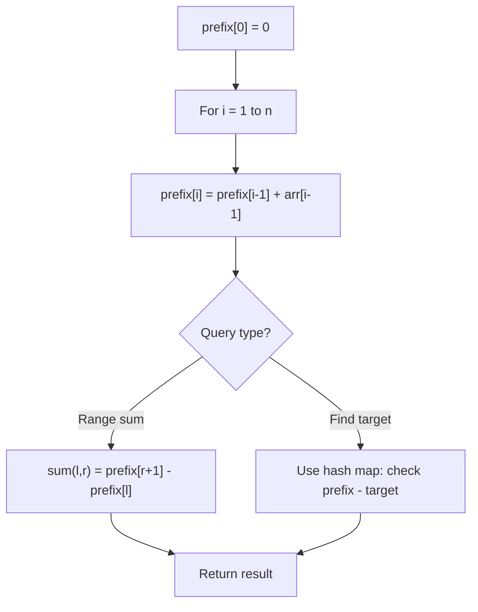

# Problem 2025: Maximum Number of Ways to Partition an Array

**Difficulty:** Hard  
**Tags:** Array, Hash Table, Counting, Enumeration, Prefix Sum  
**Pattern:** Prefix Sum  
**Link:** [leetcode.com/problems/maximum-number-of-ways-to-partition-an-array](https://leetcode.com/problems/maximum-number-of-ways-to-partition-an-array/)

## Description

You are given a **0-indexed** integer array `nums` of length `n`. The number of ways to **partition** `nums` is the number of `pivot` indices that satisfy both conditions:

	- `1 <= pivot < n`
	- `nums[0] + nums[1] + ... + nums[pivot - 1] == nums[pivot] + nums[pivot + 1] + ... + nums[n - 1]`

You are also given an integer `k`. You can choose to change the value of **one** element of `nums` to `k`, or to leave the array **unchanged**.

Return *the **maximum** possible number of ways to **partition** *`nums`* to satisfy both conditions after changing **at most** one element*.

 

Example 1:

```

**Input:** nums = [2,-1,2], k = 3
**Output:** 1
**Explanation:** One optimal approach is to change nums[0] to k. The array becomes [**3**,-1,2].
There is one way to partition the array:
- For pivot = 2, we have the partition [3,-1 | 2]: 3 + -1 == 2.

```

Example 2:

```

**Input:** nums = [0,0,0], k = 1
**Output:** 2
**Explanation:** The optimal approach is to leave the array unchanged.
There are two ways to partition the array:
- For pivot = 1, we have the partition [0 | 0,0]: 0 == 0 + 0.
- For pivot = 2, we have the partition [0,0 | 0]: 0 + 0 == 0.

```

Example 3:

```

**Input:** nums = [22,4,-25,-20,-15,15,-16,7,19,-10,0,-13,-14], k = -33
**Output:** 4
**Explanation:** One optimal approach is to change nums[2] to k. The array becomes [22,4,**-33**,-20,-15,15,-16,7,19,-10,0,-13,-14].
There are four ways to partition the array.

```

 

**Constraints:**

	- `n == nums.length`
	- `2 <= n <= 10^5`
	- `-10^5 <= k, nums[i] <= 10^5`

## Approach: Prefix Sum

Build a prefix sum array where prefix[i] = sum of elements 0..i-1. Any subarray sum [l..r] = prefix[r+1] - prefix[l]. Combine with hash map for O(n) subarray sum queries.

## Pseudocode

```
1. Build prefix sum array: prefix[0]=0, prefix[i]=prefix[i-1]+arr[i-1]
2. Use prefix sums to answer queries:
   - Subarray sum [l..r] = prefix[r+1] - prefix[l]
   - Or use hash map to find prefix[j]-prefix[i] == target
3. Return result
```

## Algorithm Flow



## Complexity Analysis

- **Time:** O(n)
- **Space:** O(n)

## Solution (Python3)

```python
class Solution:
    def waysToPartition(self, nums: List[int], k: int) -> int:
        # Prefix sum approach - O(n) time, O(n) space
        prefix = {0: -1}
        curr_sum = 0
        result = 0
        target = k if isinstance(k, int) else 0
        for i, val in enumerate(nums):
            curr_sum += val
            if curr_sum - target in prefix:
                result = max(result, i - prefix[curr_sum - target])
            if curr_sum not in prefix:
                prefix[curr_sum] = i
        return result
```

## Solution (C++)

```cpp
#include <algorithm>
#include <string>
#include <unordered_map>
#include <vector>
using namespace std;

class Solution {
public:
    int waysToPartition(vector<int>& nums, int k) {
        // Prefix sum approach - O(n) time, O(n) space
        unordered_map<int, int> prefix;
        prefix[0] = -1;
        int curr_sum = 0, result = 0;
        int target = k;
        for (int i = 0; i < (int)nums.size(); i++) {
            curr_sum += nums[i];
            if (prefix.count(curr_sum - target)) {
                result = max(result, i - prefix[curr_sum - target]);
            }
            if (!prefix.count(curr_sum)) {
                prefix[curr_sum] = i;
            }
        }
        return result;
    }
};
```
