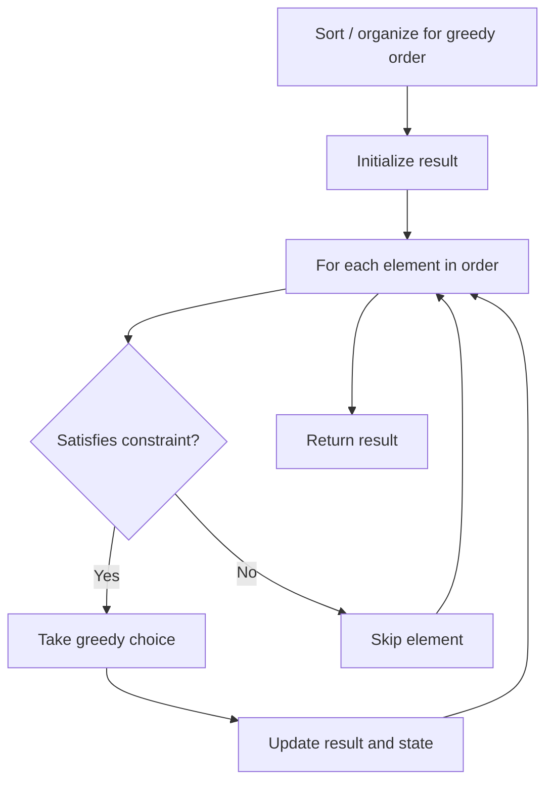

# Problem 2027: Minimum Moves to Convert String

**Difficulty:** Easy  
**Tags:** String, Greedy  
**Pattern:** Greedy  
**Link:** [leetcode.com/problems/minimum-moves-to-convert-string](https://leetcode.com/problems/minimum-moves-to-convert-string/)

## Description

You are given a string `s` consisting of `n` characters which are either `'X'` or `'O'`.

A **move** is defined as selecting **three** **consecutive characters** of `s` and converting them to `'O'`. Note that if a move is applied to the character `'O'`, it will stay the **same**.

Return *the **minimum** number of moves required so that all the characters of *`s`* are converted to *`'O'`.

 

Example 1:

```

**Input:** s = "XXX"
**Output:** 1
**Explanation:** XXX -> OOO
We select all the 3 characters and convert them in one move.

```

Example 2:

```

**Input:** s = "XXOX"
**Output:** 2
**Explanation:** XXOX -> OOOX -> OOOO
We select the first 3 characters in the first move, and convert them to `'O'`.
Then we select the last 3 characters and convert them so that the final string contains all `'O'`s.
```

Example 3:

```

**Input:** s = "OOOO"
**Output:** 0
**Explanation:** There are no `'X's` in `s` to convert.

```

 

**Constraints:**

	- `3 <= s.length <= 1000`
	- `s[i]` is either `'X'` or `'O'`.

## Approach: Greedy

Make the locally optimal choice at each step, trusting it leads to a global optimum. Greedy works when the problem has the greedy-choice property and optimal substructure.

## Pseudocode

```
1. Sort or organize data for greedy ordering
2. Initialize result
3. For each element in greedy order:
   a. If element satisfies constraint:
      - Take the greedy choice
      - Update result and state
4. Return result
```

## Algorithm Flow



## Complexity Analysis

- **Time:** O(n log n)
- **Space:** O(1)

## Solution (Python3)

```python
class Solution:
    def minimumMoves(self, s: str) -> int:
        # Greedy approach - O(n) time
        result = 0
        curr_max = 0
        for i in range(len(s)):
            if isinstance(s[i], int):
                curr_max = max(curr_max, s[i])
                result = max(result, curr_max)
            else:
                result += 1
        return result
```

## Solution (C++)

```cpp
#include <algorithm>
#include <string>
#include <vector>
using namespace std;

class Solution {
public:
    int minimumMoves(string& s) {
        // Greedy approach - O(n) time
        int result = 0, curr_max = 0;
        for (int i = 0; i < (int)s.size(); i++) {
            curr_max = max(curr_max, s[i]);
            result = max(result, curr_max);
        }
        return result;
    }
};
```
