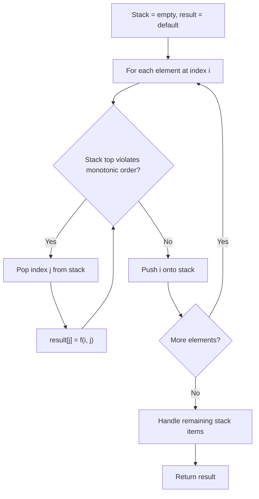
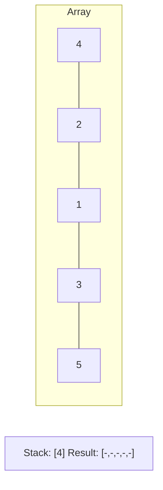
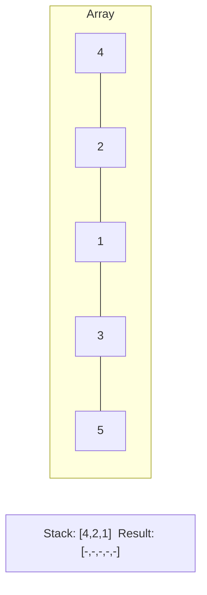
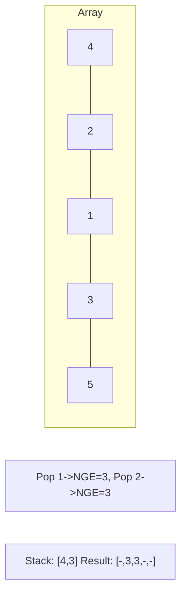
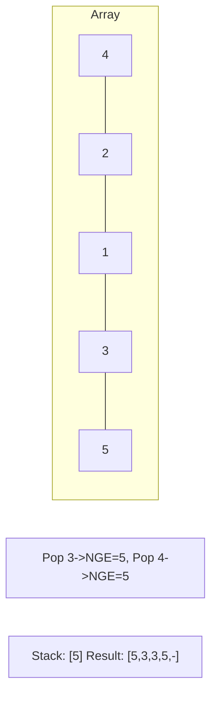

# Problem 2030: Smallest K-Length Subsequence With Occurrences of a Letter

**Difficulty:** Hard  
**Tags:** String, Stack, Greedy, Monotonic Stack  
**Pattern:** Monotonic Stack  
**Link:** [leetcode.com/problems/smallest-k-length-subsequence-with-occurrences-of-a-letter](https://leetcode.com/problems/smallest-k-length-subsequence-with-occurrences-of-a-letter/)

## Description

You are given a string `s`, an integer `k`, a letter `letter`, and an integer `repetition`.

Return *the **lexicographically smallest** subsequence of* `s`* of length* `k` *that has the letter* `letter` *appear **at least*** `repetition` *times*. The test cases are generated so that the `letter` appears in `s` **at least** `repetition` times.

A **subsequence** is a string that can be derived from another string by deleting some or no characters without changing the order of the remaining characters.

A string `a` is **lexicographically smaller** than a string `b` if in the first position where `a` and `b` differ, string `a` has a letter that appears earlier in the alphabet than the corresponding letter in `b`.

 

Example 1:

```

**Input:** s = "leet", k = 3, letter = "e", repetition = 1
**Output:** "eet"
**Explanation:** There are four subsequences of length 3 that have the letter 'e' appear at least 1 time:
- "lee" (from "**lee**t")
- "let" (from "**le**e**t**")
- "let" (from "**l**e**et**")
- "eet" (from "l**eet**")
The lexicographically smallest subsequence among them is "eet".

```

Example 2:

```

**Input:** s = "leetcode", k = 4, letter = "e", repetition = 2
**Output:** "ecde"
**Explanation:** "ecde" is the lexicographically smallest subsequence of length 4 that has the letter "e" appear at least 2 times.

```

Example 3:

```

**Input:** s = "bb", k = 2, letter = "b", repetition = 2
**Output:** "bb"
**Explanation:** "bb" is the only subsequence of length 2 that has the letter "b" appear at least 2 times.

```

 

**Constraints:**

	- `1 <= repetition <= k <= s.length <= 5 * 10^4`
	- `s` consists of lowercase English letters.
	- `letter` is a lowercase English letter, and appears in `s` at least `repetition` times.

## Approach: Monotonic Stack

Maintain a stack where elements are always in monotonic order (increasing or decreasing). When a new element violates the monotonic property, pop elements and compute results (e.g., next greater/smaller element, spans, areas).

## Pseudocode

```
1. Initialize empty stack, result array
2. For each element (index i):
   a. While stack not empty and arr[i] breaks monotonic order:
      - Pop index j from stack
      - result[j] = compute(i, j)
   b. Push i onto stack
3. Handle remaining elements in stack
4. Return result
```

## Algorithm Flow



## Visual State Transitions

**Monotonic Stack (Next Greater Element):**

**Frame 1: Process first elements**


**Frame 2: Push smaller elements**


**Frame 3: Element 3 pops 1 and 2**


**Frame 4: Element 5 pops all**



## Complexity Analysis

- **Time:** O(n)
- **Space:** O(n)

## Solution (Python3)

```python
class Solution:
    def smallestSubsequence(self, s: str, k: int, letter: str, repetition: int) -> str:
        # Monotonic stack - O(n) time, O(n) space
        n = len(s)
        result = [0] * n
        stack = []  # indices
        for i in range(n):
            while stack and s[i] > s[stack[-1]]:
                idx = stack.pop()
                result[idx] = i - idx
            stack.append(i)
        return result
```

## Solution (C++)

```cpp
#include <stack>
#include <string>
#include <vector>
using namespace std;

class Solution {
public:
    string smallestSubsequence(string& s, int k, string& letter, int repetition) {
        // Monotonic stack - O(n) time, O(n) space
        int n = s.size();
        vector<int> result(n, 0);
        stack<int> st;
        for (int i = 0; i < n; i++) {
            while (!st.empty() && s[i] > s[st.top()]) {
                int idx = st.top(); st.pop();
                result[idx] = i - idx;
            }
            st.push(i);
        }
        return result;
    }
};
```
