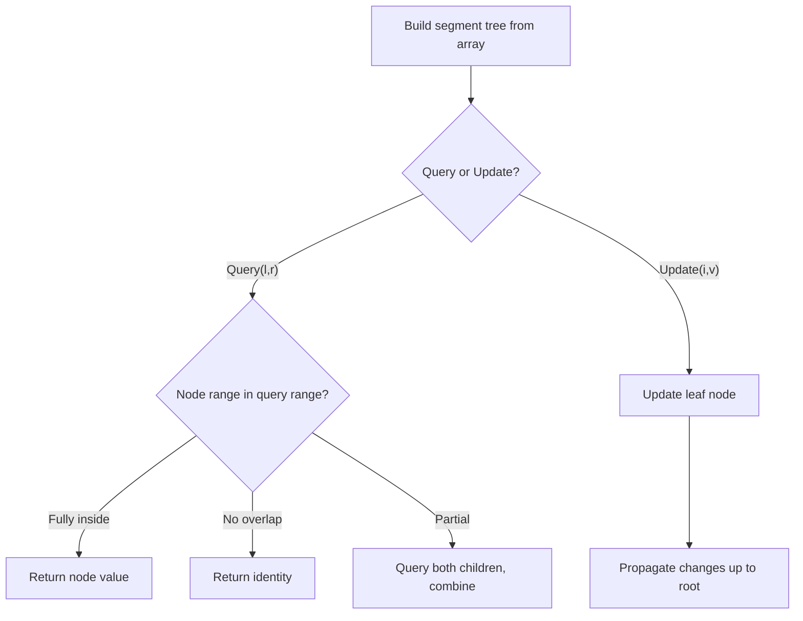

# Problem 2031: Count Subarrays With More Ones Than Zeros

**Difficulty:** Medium  
**Tags:** Array, Hash Table, Binary Search, Divide and Conquer, Binary Indexed Tree, Segment Tree, Merge Sort, Ordered Set  
**Pattern:** Segment Tree  
**Link:** [leetcode.com/problems/count-subarrays-with-more-ones-than-zeros](https://leetcode.com/problems/count-subarrays-with-more-ones-than-zeros/)

## Description

*(Premium problem -- description requires LeetCode subscription)*

## Approach: Segment Tree

Build a segment tree for range queries (sum, min, max) with point or range updates. Each node covers a range; queries are answered by combining relevant segments.

## Pseudocode

```
1. Build segment tree from array (O(n))
2. Query(l, r):
   - If node range within [l,r]: return node value
   - If no overlap: return identity
   - Else: combine query(left_child) and query(right_child)
3. Update(i, val): update leaf and propagate up
```

## Algorithm Flow



## Complexity Analysis

- **Time:** O(n log n) build, O(log n) query/update
- **Space:** O(n)

## Solution (Python3)

```python
class Solution:
    pass
```

## Solution (C++)

```cpp
class Solution {
public:
    // Design problem stub
};
```
