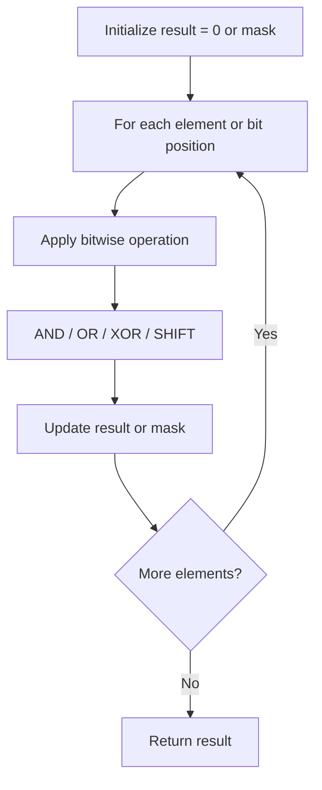

# Problem 2032: Two Out of Three

**Difficulty:** Easy  
**Tags:** Array, Hash Table, Bit Manipulation  
**Pattern:** Bit Manipulation  
**Link:** [leetcode.com/problems/two-out-of-three](https://leetcode.com/problems/two-out-of-three/)

## Description

Given three integer arrays `nums1`, `nums2`, and `nums3`, return *a **distinct** array containing all the values that are present in **at least two** out of the three arrays. You may return the values in **any** order*.
 

Example 1:

```

**Input:** nums1 = [1,1,3,2], nums2 = [2,3], nums3 = [3]
**Output:** [3,2]
**Explanation:** The values that are present in at least two arrays are:
- 3, in all three arrays.
- 2, in nums1 and nums2.

```

Example 2:

```

**Input:** nums1 = [3,1], nums2 = [2,3], nums3 = [1,2]
**Output:** [2,3,1]
**Explanation:** The values that are present in at least two arrays are:
- 2, in nums2 and nums3.
- 3, in nums1 and nums2.
- 1, in nums1 and nums3.

```

Example 3:

```

**Input:** nums1 = [1,2,2], nums2 = [4,3,3], nums3 = [5]
**Output:** []
**Explanation:** No value is present in at least two arrays.

```

 

**Constraints:**

	- `1 <= nums1.length, nums2.length, nums3.length <= 100`
	- `1 <= nums1[i], nums2[j], nums3[k] <= 100`

## Approach: Bit Manipulation

Operate on individual bits using bitwise operators (AND, OR, XOR, shift). Common tricks: x & (x-1) removes lowest set bit, x ^ x = 0, XOR all elements to find unique.

## Pseudocode

```
1. Apply bitwise operations:
   - XOR all elements to cancel paired bits
   - Use bitmask to track state
   - Shift and mask to extract/set individual bits
2. Return result
```

## Algorithm Flow



## Complexity Analysis

- **Time:** O(n) or O(log n)
- **Space:** O(1)

## Solution (Python3)

```python
class Solution:
    def twoOutOfThree(self, nums1: List[int], nums2: List[int], nums3: List[int]) -> List[int]:
        # Bit manipulation - O(n) time, O(1) space
        result = 0
        for val in nums1:
            result ^= val
        return result
```

## Solution (C++)

```cpp
#include <string>
#include <vector>
using namespace std;

class Solution {
public:
    vector<int> twoOutOfThree(vector<int>& nums1, vector<int>& nums2, vector<int>& nums3) {
        // Bit manipulation - O(n) time, O(1) space
        int result = 0;
        for (int val : nums1) {
            result ^= val;
        }
        return result;
    }
};
```
