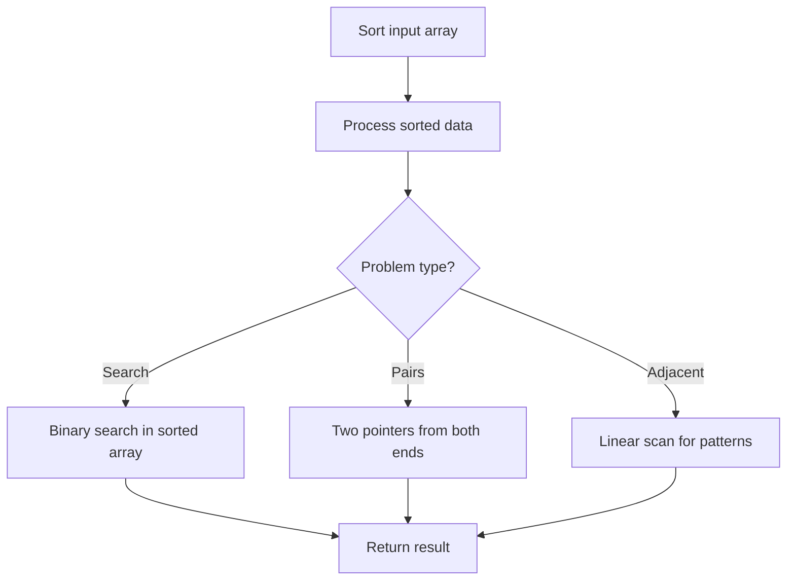

# Problem 2033: Minimum Operations to Make a Uni-Value Grid

**Difficulty:** Medium  
**Tags:** Array, Math, Sorting, Matrix  
**Pattern:** Sorting  
**Link:** [leetcode.com/problems/minimum-operations-to-make-a-uni-value-grid](https://leetcode.com/problems/minimum-operations-to-make-a-uni-value-grid/)

## Description

You are given a 2D integer `grid` of size `m x n` and an integer `x`. In one operation, you can **add** `x` to or **subtract** `x` from any element in the `grid`.

A **uni-value grid** is a grid where all the elements of it are equal.

Return *the **minimum** number of operations to make the grid **uni-value***. If it is not possible, return `-1`.

 

Example 1:

```

**Input:** grid = [[2,4],[6,8]], x = 2
**Output:** 4
**Explanation:** We can make every element equal to 4 by doing the following: 
- Add x to 2 once.
- Subtract x from 6 once.
- Subtract x from 8 twice.
A total of 4 operations were used.

```

Example 2:

```

**Input:** grid = [[1,5],[2,3]], x = 1
**Output:** 5
**Explanation:** We can make every element equal to 3.

```

Example 3:

```

**Input:** grid = [[1,2],[3,4]], x = 2
**Output:** -1
**Explanation:** It is impossible to make every element equal.

```

 

**Constraints:**

	- `m == grid.length`
	- `n == grid[i].length`
	- `1 <= m, n <= 10^5`
	- `1 <= m * n <= 10^5`
	- `1 <= x, grid[i][j] <= 10^4`

## Approach: Sorting

Sort the data to enable efficient processing. After sorting, use techniques like binary search, two pointers, or linear scan to solve the problem.

## Pseudocode

```
1. Sort the input array
2. Process sorted data:
   - Use binary search for lookups
   - Use two pointers for pair finding
   - Scan for adjacent patterns
3. Return result
```

## Algorithm Flow



## Complexity Analysis

- **Time:** O(n log n)
- **Space:** O(n)

## Solution (Python3)

```python
class Solution:
    def minOperations(self, grid: List[List[int]], x: int) -> int:
        # Sort-based approach - O(n log n) time
        grid.sort(key=lambda x: x[0] if isinstance(x, (list, tuple)) else x)
        result = [grid[0]]
        for i in range(1, len(grid)):
            curr = grid[i]
            if isinstance(curr, (list, tuple)) and isinstance(result[-1], (list, tuple)):
                if curr[0] <= result[-1][1]:
                    result[-1] = [result[-1][0], max(result[-1][1], curr[1])]
                else:
                    result.append(curr)
            else:
                result.append(curr)
        return result
```

## Solution (C++)

```cpp
#include <algorithm>
#include <string>
#include <vector>
using namespace std;

class Solution {
public:
    int minOperations(vector<vector<int>>& grid, int x) {
        // Sort-based approach - O(n log n) time
        sort(grid.begin(), grid.end());
        vector<vector<int>> result;
        result.push_back(grid[0]);
        for (int i = 1; i < (int)grid.size(); i++) {
            if (grid[i][0] <= result.back()[1]) {
                result.back()[1] = max(result.back()[1], grid[i][1]);
            } else {
                result.push_back(grid[i]);
            }
        }
        return result;
    }
};
```
