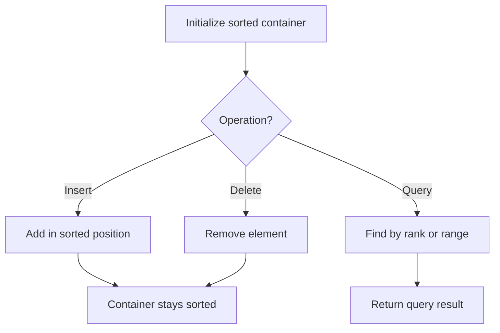

# Problem 2034: Stock Price Fluctuation 

**Difficulty:** Medium  
**Tags:** Hash Table, Design, Heap (Priority Queue), Data Stream, Ordered Set  
**Pattern:** Ordered Set / SortedList  
**Link:** [leetcode.com/problems/stock-price-fluctuation](https://leetcode.com/problems/stock-price-fluctuation/)

## Description

You are given a stream of **records** about a particular stock. Each record contains a **timestamp** and the corresponding **price** of the stock at that timestamp.

Unfortunately due to the volatile nature of the stock market, the records do not come in order. Even worse, some records may be incorrect. Another record with the same timestamp may appear later in the stream **correcting** the price of the previous wrong record.

Design an algorithm that:

	- **Updates** the price of the stock at a particular timestamp, **correcting** the price from any previous records at the timestamp.
	- Finds the **latest price** of the stock based on the current records. The **latest price** is the price at the latest timestamp recorded.
	- Finds the **maximum price** the stock has been based on the current records.
	- Finds the **minimum price** the stock has been based on the current records.

Implement the `StockPrice` class:

	- `StockPrice()` Initializes the object with no price records.
	- `void update(int timestamp, int price)` Updates the `price` of the stock at the given `timestamp`.
	- `int current()` Returns the **latest price** of the stock.
	- `int maximum()` Returns the **maximum price** of the stock.
	- `int minimum()` Returns the **minimum price** of the stock.

 

Example 1:

```

**Input**
["StockPrice", "update", "update", "current", "maximum", "update", "maximum", "update", "minimum"]
[[], [1, 10], [2, 5], [], [], [1, 3], [], [4, 2], []]
**Output**
[null, null, null, 5, 10, null, 5, null, 2]

**Explanation**
StockPrice stockPrice = new StockPrice();
stockPrice.update(1, 10); // Timestamps are [1] with corresponding prices [10].
stockPrice.update(2, 5);  // Timestamps are [1,2] with corresponding prices [10,5].
stockPrice.current();     // return 5, the latest timestamp is 2 with the price being 5.
stockPrice.maximum();     // return 10, the maximum price is 10 at timestamp 1.
stockPrice.update(1, 3);  // The previous timestamp 1 had the wrong price, so it is updated to 3.
                          // Timestamps are [1,2] with corresponding prices [3,5].
stockPrice.maximum();     // return 5, the maximum price is 5 after the correction.
stockPrice.update(4, 2);  // Timestamps are [1,2,4] with corresponding prices [3,5,2].
stockPrice.minimum();     // return 2, the minimum price is 2 at timestamp 4.

```

 

**Constraints:**

	- `1 <= timestamp, price <= 10^9`
	- At most `10^5` calls will be made **in total** to `update`, `current`, `maximum`, and `minimum`.
	- `current`, `maximum`, and `minimum` will be called **only after** `update` has been called **at least once**.

## Approach: Ordered Set / SortedList

Maintain elements in sorted order for efficient insertion, deletion, and rank queries. Use balanced BST, skip list, or sorted container.

## Pseudocode

```
1. Initialize sorted container
2. For each operation:
   - Insert: add element in sorted position O(log n)
   - Delete: remove element O(log n)
   - Query: find kth element, count, or range O(log n)
3. Return results
```

## Algorithm Flow



## Complexity Analysis

- **Time:** O(n log n)
- **Space:** O(n)

## Solution (Python3)

```python
class StockPrice:
    def __init__(self):
        # Initialize data structure
        pass

    def update(self, timestamp: int, price: int) -> None:
        return None

    def current(self) -> int:
        return 0

    def maximum(self) -> int:
        return 0

    def minimum(self) -> int:
        return 0

```

## Solution (C++)

```cpp
#include <algorithm>
#include <set>
#include <string>
#include <vector>
using namespace std;

class StockPrice {
public:
    StockPrice() {
        // Initialize
    }

    void update(int timestamp, int price) {
        return ;
    }

    int current() {
        return 0;
    }

    int maximum() {
        return 0;
    }

    int minimum() {
        return 0;
    }

};
```
